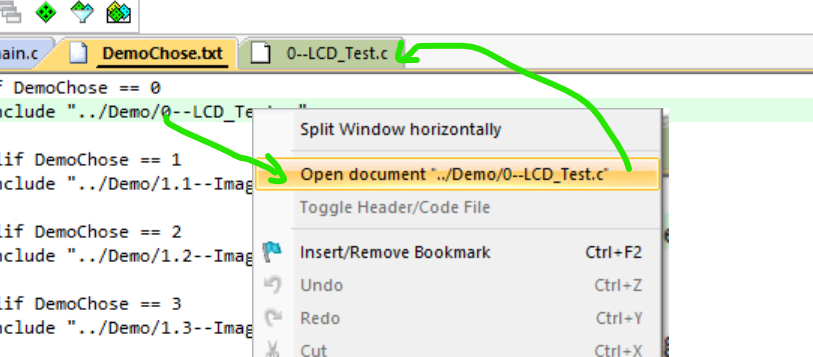

# YMCV简介

库名中文简称 **妖米CV**，英文全称 **your mini computer vision**，意为你的迷你计算机视觉，含义有双重，第一重含义是：一个迷你的CV库；第二重含义是：可用于迷你计算机（如嵌入式计算机）的视觉库。

这个库是跨平台的，源码由C语言编写，可以在任意平台编译，这个库也可以通过选择开启部分功能从而实现将库裁剪到你所必须的大小，降低对小型计算机的源码空间占用


## 项目起源

起源于我的个人需要，于2019年暑假完成了YMKV图像处理库编写，当时主要为了运行在stm32上，编写环境是MDK。

而后为了方便验证算法，将其移植到PC环境上开发，除了算法以外，诸如显示，鼠标位置获取，输入等这些交互的内容，借用EGE库来完成。老粉估计知道，最初我使用CodeBlocks开发，但考虑很多人不怎么用它，后面换到了vs2019上进行开发。目前提供了windows环境下的X86和STM32版本的Demo，以及Linux环境下的ubuntu20.04-amd64以及esp32版本的Demo，大家可以自行测试。

> 需要说明一下，windows版本的Demo中文件编码默认编码是gbk/gb2312，而Linux版本用的是utf-8编码，如果要在工程中创建文件，需要确保文件编码格式一致

## 项目架构

这个项目的架构经过多次改良，目前确定了一款耦合度最小的架构，方便与任意平台兼容；另一方面为了方便大家使用，和原始的库相比，采用面向对象的方式进行了重构。


项目分为三层架构，顶层是用户层，它是对核心层的包裹，方便用户对他进行调用，核心层的内容为左边那列内容，其中黑体的QRcode是二维码相关的编码和解码功能，这部分我是将第三方库进行了压缩打包，底层congfig是配置信息，内存管理以及IO文件接口的定义。

> 文件接口是由宏定义来完成，由于读写图片，如果移植到嵌入式可用我之前发布的uFatfs文件系统，他是基于Fatfs的封装，以便兼容c标准库stdio的文件系统。图中右侧文件IO以及Debug都是独立于核心层的，只依赖底层的配置。

## 项目代码命名规则

为了方便辨认数据类型，我约定的命名规则，平台通用数据类型用全小写

```
int8，int16，uint8，uint16，uint32，float32,.....
```

自定义数据类型的话，需要加CV头：

> 结构体采用CV+小写
> 
> ```c
> //图像
> typedef struct 
> {
>     uint16 width;
>     uint16 height;
>     CVImgType type;
>     _color8_t* data;
> }CVimage;
> ```
> 
> 结构体指针采用CV+大写
> 
> ```c
> typedef CVimage* CVIMAGE;
> ```
> 
> 枚举类型CV+大小写混合（单词首字大写）
> 
> ```c
> //图像类型
> typedef enum
> {
>     CVBinaryType = 1,// 二值图
>     CVTrimapType,//三色图
>     CVGrayType,//灰度图
>     CVRgb16Type,//RGB565
>     CVFGrayType,//float gray
>     CVIGrayType,//int gray
>     CVCGrayType,//complex gray
> }CVImgType;
> ```
> 
> 函数名： YMCV+首字母大写
> 
> ```c
> //创建一张空图像
> CVIMAGE YMCV_Creat_Img_Creat(uint16 width,uint16 height, CVImgType Imgform)
> {
>     ....
>     ....
> }
> ```

## 项目文件分布说明

打开项目我们能看到如下几个文件夹，其中最重要的是YMCV部分，移植库只需要该部分

> -- EGELIB ：交互和显示的库
> -- EGE_LCD：基于ege库，搭建用于YMCV的显示和交互功能 函数
> -- ImageSource：用于演示的图片数据，这里是c的数组文件
> 
> -- Demo：用于演示库的使用例程，里面有大部分函数的使用方法。我为这个库配备了150多个Demo供大家使用参考
> 
> -- YMCV：算法库的源码部分

打开YMCV文件夹，文件列表如下：

> -- -- CONFIG：算法库的配置，移植其他平台的话只需要修改该文件夹的内容
> 
> -- -- OPOBJ：算法使用到的对象管理，对象创建和销毁
> 
> -- -- CORE：算法核心源码部分
> 
> -- -- USER：用户层封装，可以使用 YMCV.funName(...) 方式调用函数
> 
> -- -- DEBUG：调试工具，可以提示错误信息
> 
> -- -- IOFILE：和文件相关的操作，该库使用到的文件读写部分都在这边，比如图片和视频的读写
> 
> -- -- Code：jpeg，avi，gif等的编码和解码
> 
> -- -- QRCODE：条码，二维码，AprilTag相关的内容

# 项目使用说明

## 运行windows-X86示例demo

首先你需要安装一下vs2019，然后下载这个项目并打开（x86-Debug模式），配置你的EGE库路径(目前已经换成相对路径，下载完不配置也可以运行，如果要移植到你个人的项目中才需要做下面的配置)：

> 选择YMCV项目，右键，选择属性
> 
> 更换附加包含目录，我的文件下载下来放在D:\Documents\GitFiles\YMCV_LIB，所以配置如下图所示
> 
> 同样更换附加库目录
> 
> 注意这里有两个路径，可以通过编辑展开看到：
> 

然后就配置完了，接着选择相应的demo运行，展开demo筛选器：


如先运行环境测试，鼠标移到 0、EGE_Test.c上，右键，并选择属性，就能看到


然后将 **是**  改成  **否**  即可，然后点击运行，能出现如下画面即可：


测试完成后，将其属性重新设置为从生成中排除，选择你要运行的Demo，将排除属性选择否即可。

## 运行windows-stm32示例demo

首先你需要安装一下Keil-MDK5，然后下载这个项目并打开，配置你的路径(目前已经换成相对路径，下载完不配置也可以运行，如果要移植到你个人的项目中才需要做下面的配置)：

> 

也就是和配置相关的头文件路径添加，YMCV内部采用相对路径，可以不需要添加和YMCV文件夹相关的路径

选择要运行的Demo编号

> 
> 所有的Demo文件名都放置在DemoChose.txt中，可以通过它浏览具体运行的是哪个Demo

查看当前Demo源码

> 

选择对应的Demo，右键即可打开，会自动跳转到相应文件中

运行Demo

> 这个我就不细说了吧，能看到这里相信你应该不是小白了，具体情况请去看stm32的教程

## 运行ubuntu-amd64示例demo

首先你需要安装一个Ubuntu系统，我的是Ubuntu20.04，然后你克隆这个项目到本地上。这里我提供了两种方式运行，其中一种是需要安装一个vscode，然后用vscode打开目录所在文件夹

> 左上角->文件->打开文件夹->选择Linux-YMCV文件夹，然后打开就可以了

选择Demo并运行（当然前提是你需要去安装一下C/C++开发环境的插件，这个大家自己网上查一下怎么安装吧，安装很简单的）

> 直接点击Demo展开，点击一下你要运行的Demo，它会跳到窗口上，然后点击运行
> 
> 之所以要这么做，是由.vscode下面的task.json文件决定的
> 

其中绿色的箭头就是我们上面要选择的调试器的名称，红色的箭头即是将当前活动窗口的文件添加编译，若没有选择Demo则会报错，所以当你查看其他文件以后，要运行整个项目前需要先将活动窗口切换回Demo文件

运行成功之后便会得到如下画面

> 

另一种是直接使用CMakeLists.txt运行，你只需要运行脚本文件makefast.sh，并且后面跟上要运行的Demo即可，命令如下：

> sh ./makefast.sh  ./Demo/xxxdemo.c
> (小提示：xxxdemo不用完全自己输入，比如选择1.1、xxxdemo.c，只要输入“1.1、”然后按Tab键即可自动补全)
> 

## 运行ubuntu-esp32示例demo

首先，你需要安装一下乐鑫的ESP32开发环境，ubuntu20.04安装我参考的是[Ubuntu20.04下ESP32环境搭建_Fpits的博客-CSDN博客](https://blog.csdn.net/weixin_41594119/article/details/121364800) 

然后在你的VScode上配置开发环境，这些我就详细说了。环境安装好了以后，你可以克隆本项目到本地，然后用vscode打开目录所在文件夹

> 左上角->文件->打开文件夹->选择ESP32-YMCV文件夹，然后打开就可以了

将你的LCD连接到板子上，我使用的安可信的esp32-cam板子，对应LCD连接引脚为：

> CLK ->IO12
> 
> SDIN ->IO13
> 
> RST ->IO15
> 
> DC ->IO14
> 
> BLK ->IO2
> 
> 另外需要注意的是，安可信的板子上：
> 
> IO0实际上是作为摄像头的xclk，所以使用摄像头时该引脚务必悬空
> 
> IO4是摄像头LED引脚，该端口也不能接其他器件

选择Demo并运行（这个移植的STM32版本的Demo，怎么选择可以参考那边，即下图的箭头1处）

> 

然后点击箭头2所指的圆桶进行编译。编译结束后可以箭头3所指的小闪电下载到你的esp32上。

> 当然，下载时会有一些细节，比如说选择对应的USB端口，波特率，以及需要IO0端口接地然后按复位键等等，大家自行参考ESP32官方资料

顺带一提，YMCV库位于ESP32工程的组件目录下。

## demo分类及说明

0 - 基础环境测试

> 0、EGE_Test : YMCV基础环境测试，EGE依赖测试

1 - 基础图像操作

> 1.1、ImageShowTest : 图像显示测试
> 
> 1.2、ImageCopyTest : 图像拷贝测试
> 
> 1.3、ImageFormChange : 图像格式转换
> 
> 1.4、ImageAreaFill : 图像区域填充
> 
> 1.5、ImageSeedFill : 图像种子填充
> 
> 1.6、ImageRead : 图像文件读取

2 - 图像通道渲染

> 2.1、ChannelGray2binTest : 灰度图像二值化
> 
> 2.2、ChannelGrayExposeAndColorTo : 灰度图曝光与染色
> 
> 2.3、ChannelGrayInversAndBright : 灰度图反色与亮度增强
> 
> 2.4、ChannelGrayContractAndLiner : 灰度图对比度增强与分段线性增强
> 
> 2.5、ChannelGrayLogAndExp : 灰度图log对数、exp指数增强
> 
> 2.6、ChannelGrayGamaAndScurve : 灰度图γ曲线，S曲线增强
> 
> 2.7、ChannelGrayCstomAndHeatPalette : 灰度图自定义染色函数增强与热力图调色板渲染
> 
> 2.8、ChannelRgb2binTest : 彩色图像二值化
> 
> 2.9、ChannelRgbExposeAndColor : 彩色图像曝光与染色
> 
> 2.10、ChannelRgbInversAndBright : 彩色图像反色与亮度增强
> 
> 2.11、ChannelRgbContractAndLiner :  彩色图像对比度增强与分段线性增强
> 
> 2.12、ChannelRgbLogAndExp : 彩色图像log对数、exp指数增强
> 
> 2.13、ChannelRgbGamaAndScurve : 彩色图像γ曲线，S曲线增强
> 
> 2.14、ChannelRgbCstom : 彩色图像自定义染色函数增强
> 
> 2.15、ChannelRgbInversAndBright_1Param : 单通道渲染器(反色、亮度增强)渲染彩色图像
> 
> 2.16、ChannelRgbContractAndLiner_1Param : 单通道渲染器(对比度增强、分段线性增强)渲染彩色图像
> 
> 2.17、ChannelRgbLogAndExp_1Param : 单通道渲染器(log对数、exp指数增强)渲染彩色图像
> 
> 2.18、ChannelRgbGamaAndScurve_1Param : 单通道渲染器(γ曲线，S曲线增强)渲染彩色图像

3 - 图像直方图

> 3.1、HistGrayHistEq : 灰度图直方图均衡化
> 
> 3.2、HistGrayLocalHistEq : 灰度图局部直方图均衡化
> 
> 3.3、HistGrayHistMapTo : 灰度图直方图规定化
> 
> 3.4、HistRgbHistEq : 彩色图像直方图均衡化
> 
> 3.5、HistRgbHistMapTo : 彩色图像直方图规定化
> 
> 3.6、HistBackProject : 灰度图直方图反投影

4 - 图像空域渲染

> 4.1、SpaceGrayGaussFilter : 灰度图空域高斯滤波
> 
> 4.2、SpaceGrayLogFilter : 灰度图空域拉普拉斯-高斯滤波
> 
> 4.3、SpaceGrayBilateralFilter : 灰度图空域双边滤波
> 
> 4.4、SpaceGrayLocalMSEFilter : 灰度图空域局部均方差滤波
> 
> 4.5、SpaceGrayAverAndMedFilter : 灰度图空域均值与中值滤波
> 
> 4.6、SpaceGrayMinAndMaxFilter : 灰度图空域极大值与极小值滤波
> 
> 4.7、SpaceGrayModeAndMidPointFilter : 灰度图空域众数与中点滤波
> 
> 4.8、SpaceGrayMeanShiftFilter : 灰度图空域均值漂移滤波
> 
> 4.9、SpaceGraySurfaceBlurFilter : 灰度图空域表面模糊滤波
> 
> 4.10、SpaceGrayGuideFilter : 灰度图空域导向滤波
> 
> 4.11、SpaceGrayCustomKernelFilter : 灰度图空域均自定义滤波核滤波
> 
> 4.12、SpaceBinaryMorpRateFilter : 二值图形态学滤波

5 - 图像频域渲染

> 5.1、FreqGrayFFTAndIFFT : 灰度图像频域FFT与IFFT变换
> 
> 5.2、FreqGrayGaussHFilter : 灰度图像频域高斯高通滤波
> 
> 5.3、FreqGrayGaussLFilter : 灰度图像频域高斯低通滤波
> 
> 5.4、FreqGrayButtterWorthHFilter : 灰度图像频域巴特沃斯高通滤波
> 
> 5.5、FreqGrayButterWorthLFilter : 灰度图像频域巴特沃斯低通滤波
> 
> 5.6、FreqGrayBandPassFilter : 灰度图像频域带通滤波
> 
> 5.7、FreqGrayBandStopFilter : 灰度图像频域带阻滤波
> 
> 5.8、FreqGrayDCTAndIDCT : 灰度图像频域DCT和IDCT变换
> 
> 5.9、FreqGrayHarrDWTAndIDWT : 灰度图像频域Harr小波变换DWT和IDWT
> 
> 5.10、FreqGrayHarrHardThreshold : 灰度图像频域Harr小波硬阈值去噪

6 - 图像几何变换

> 6.1、GeomGrayStretch : 灰度图像最邻近插值拉伸
> 
> 6.2、GeomGrayStretchL2 : 灰度图像线性插值拉伸
> 
> 6.3、GeomGrayRotateWauto : 灰度图像旋转(自适应动态窗口输出)
> 
> 6.4、GeomGrayRotateWconst : 灰度图像旋转(固定窗口输出)
> 
> 6.5、GeomGrayLinerPolarAndInverse : 灰度图像线性极坐标变换及其逆变换
> 
> 6.6、GeomGrayLogPolarAndInverse : 灰度图像对数极坐标变换及其逆变换
> 
> 6.7、GeomGrayPerspective : 灰度图像透视投影变换

7 - 图像分割

> 7-1.1、BinaryGraySingleThresh : 灰度图像单阈值二值化
> 
> 7-1.2、BinaryGrayDoubleThresh : 灰度图像双阈值二值化
> 
> 7-1.3、BinaryGrayHistThresh : 灰度图像直方图Otsu阈值二值化
> 
> 7-1.4、BinaryGrayIntegralThresh : 灰度图像积分图二值化
> 
> 7-1.5、BinaryRGBDoubleThresh : 彩色图像RGB双阈值二值化
> 
> 7-1.6、BinaryLABDoubleThresh : 彩色图像LAB双阈值二值化
> 
> 7-1.7、BinaryLogicCal : 二值图逻辑运算(与、或、非 )
> 
> 7-1.8、BinaryMaskCal : 二值图掩码保留

> 7-2.1、EdgeGraySobel : 灰度图像二值化Sobel边缘检测
> 
> 7-2.2、EdgeGrayLog : 灰度图像 拉普拉斯-高斯 边缘检测
> 
> 7-2.3、EdgeGrayLaplace : 灰度图像拉普拉斯边缘检测
> 
> 7-2.4、EdgeGrayCanny : 灰度图像Canny边缘检测
> 
> 7-2.5、EdgeGraySobelConnect : 灰度图像Sobel边缘检测(带局部相似连接)

> 7-3.1、RegionGrayGrowing : 灰度图像区域生长
> 
> 7-3.2、RegionGraySplitandAndMerge : 灰度图像区域分裂与合并
> 
> 7-3.3、RegionGrayKmeansSegment : 灰度图像 Kmeans聚类
> 
> 7-3.4、RegionGrayGMMSegment : 灰度图像 GMM聚类
> 
> 7-3.5、RegionGrayDistanceTransform : 灰度图像距离变换
> 
> 7-3.6、RegionGrayTriMap : 灰度图像Trimap三色图生成
> 
> 7-3.7、RegionGrayWatershed : 灰度图像分水岭分割
> 
> 7-3.8、RegionGraySnake : 灰度图像snake轮廓提取
> 
> 7-3.9、RegionGrayGrabCut : 灰度图像grabCut图割
> 
> 7-3.10、RegionBinaryXY_AxisProjSeg : 二值图xy轴投影分割

8 - 图像特征提取

> 8.1、ImageColorBoxFind : 图像双阈值色块提取(一个色块)
> 
> 8.2、ImageColorBolosFind : 图像双阈值色块提取(多个色块，最多8种色块)
> 
> 8.3、BinaryAreaSave : 二值图大面积区域保留
> 
> 8.4、BinaryWormFindLine : 二值图Worm直线查找(支持1像素断裂)
> 
> 8.5、ImageEDFindEdge : 灰度图ED边缘检测
> 
> 8.6、ImageEDFindShape : 灰度图ED形状识别
> 
> 8.7、ImageEDFindLines : 灰度图ED直线检测
> 
> 8.8、ImageGrayHogFind : 灰度图HOG描述符提取
> 
> 8.9、ImageGrayFaceLbpDesc : 灰度图人脸LBP直方图描述符提取
> 
> 8.10、BinaryLinerRegressCal : 二值图像素回归(最小二乘、泰尔森、RANSAC)
> 
> 8.11、BinaryBoneThinAndCut : 二值图骨架细化与剪枝
> 
> 8.12、BinaryEdgeTrance : 二值图边界跟踪
> 
> 8.13、ImageFeatureMap : 灰度图特征图提取(LBP、MRLBP、USAN)
> 
> 8.14、GrayFeaturePointGet : 灰度图特征点提取(susan、fast-9、agast、harris)
> 
> 8.15、GrayFeatureDescribeGet : 灰度图brief特征描述符提取 
> 
> 8.16、BinaryHoughGet : 二值图霍夫变换
> 
> 8.17、GrayRandonGet : 灰度图拉东变换及其逆变换
> 
> 8.18、GrayStereoLM : 灰度图立体匹配LineMatching

9 - 图像目标匹配

> 9.1、ImageGraySSIMCal : 灰度图结构相似性匹配
> 
> 9.2、ImageGrayTemplate : 灰度图模板匹配
> 
> 9.3、ImageGrayFaceCascade : 灰度图人脸cascade
> 
> 9.4、ImageGrayLBPClassify : 灰度图人脸LBP特征分类
> 
> 9.5、ImageBinaryNumberDecisonTree : 灰度图数字决策树分类
> 
> 9.6、ImageGrayPhaseCorrelate : 灰度图相位相关匹配
> 
> 9.7、ImageFeatureDescribeMatch : 灰度图brief描述符匹配与单应性矩阵矫正
> 
> 9.8、ImageGrayMeanShift : 灰度图MeanShift跟踪
> 
> 9.9、ParticleFilterTracking : 灰度图粒子滤波跟踪
> 
> 9.10、ImageGrayFacePointDect : 灰度图40点人脸特征点检测

10 - 修复&特效

> 10.1、GrayRemovalFog : 灰度图何凯明暗通道去雾
> 
> 10.2、BadImageColor : 灰度图污渍效果
> 
> 10.3、GrayInPainting : 灰度图inpaint修复
> 
> 10.4、ImageFishEye : 灰度图鱼眼效果及其矫正
> 
> 10.5、ImageCartoon : 灰度图卡通效果
> 
> 10.6、ImageRigidDeformation : 灰度图刚性变形效果

11 - 数据处理&机器学习

> 11.1、FFT1d_Test : 一维FFT及IFFT处理数据测试
> 
> 11.2、DCT1d_Test : 一维DCT及IDCT处理数据测试
> 
> 11.3、DWT1d_Test : 一维Harr小波DWT及IDWT处理数据测试
> 
> 11.4、FMat_Test : 矩阵运算测试(转置、乘法、逆、伪逆、雅可比旋转法特征值和特征向量、Cholesky 分解、快速自乘法、初等变换、SVD分解等等)
> 
> 11.5、KmeansTest : Kmeans数据分类训练和测试
> 
> 11.6、GMM_Test : GMM数据分类训练和测试
> 
> 11.7、DecisionTree_Test : ID3决策树数据分类训练和测试
> 
> 11.8、LineSegmentsMerge : 线段合并测试
> 
> 11.9、DelauneyTriangle : 由点集创建Delauney三角形

12 - 条码&二维码识别

> 12.1、AprilTagDecode : 灰度图四月标签(AprilTag)识别
> 
> 12.2、DataMatrixDecode : 灰度图DM码识别
> 
> 12.3、QRDecode : 灰度图QR码(二维码)识别
> 
> 12.4、BarDecode : 灰度图bar码(条形码)识别
> 
> 12.5、QR_Encode : 灰度图QR码编码(二维码生成)

13 - 其他项目应用

> 13.1、Scoring_System : 得分系统，自动判卷系统
> 
> 13.2、Table_Recognize : 表格识别，表格线提取
> 
> 13.3、Calibrating_Data : 40点人脸特征点数据标定
> 
> 13.4、FacePoint_Train : 40点人脸特征点数据模型训练

## demo运行结果展示

我把所有demo的运行结果示例都录成一个简短的视频，放在“例程测试结果”文件夹下，大家可以自行对照查看


另外，大家可以先看看0-1.MP4，这里面有demo切换的示例，从demo0切换到demo1如何配置（这个切换后面我就给切了，后面就没有了）。

## 移植其他平台

如移植stm32平台，首先需要将YMCV文件夹拷贝走

添加到你的项目下

然后打开CONFIG文件夹下的文件进行修改

首先我们打开YMCV_Mem.c文件，该文件管理则YMCV库的动态计算内存，我们将其改为自己的内存函数

然后我们打开YMCV_PubDefine.h文件，该文件管理着一些常数定义，如果我们用到文件操作，需要修改文件系统定义部分，换成我们自己平台下的文件系统函数（若使用Fatfs，可以使用我封装过的uFatfs）

最后打开YMCV_PubType.h文件看一眼，大部分时候该文件都不会需要修改

最后我们直接编译即可
....


**当然，这里我直接提供了STM32平台的Demo，大家不用自己移植了，可以照着Demo移植到其他平台上，需要移植其他平台也可以联系我**，当然我有时间可以帮忙移植，大家一起共筑应用生态，完结撒花。


## 更多教程

[哔哩哔哩 - 妖米猫人主页](https://space.bilibili.com/314022084)

我比较懒，估计更新的比较慢，帮我剪视频的小伙伴工作了时间也不多，更新的就更慢了。。。我自己剪的比较拉跨，也没什么太大动力感觉。
