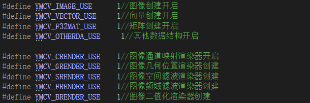
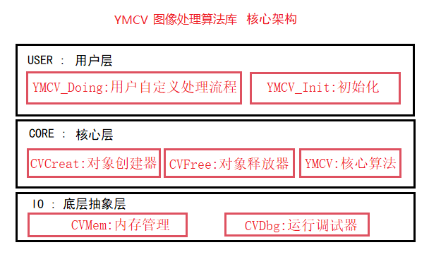

# YMCV简介

库名中文简称 **妖米CV**，英文全称 **your mini computer vision**，意为你的迷你计算机视觉库，含义有双重，第一重含义是：这是一个迷你的CV库；第二重含义是：可用于迷你计算机（如嵌入式计算机）的视觉库。视频教程更新地址：[B站主页：妖米猫人](https://space.bilibili.com/314022084)


## 项目起源

起源于我的个人需要，于2019年暑假完成了YMKV图像处理库编写，当时主要为了运行在stm32上，编写环境是MDK。后面为了方便验证算法，将其移植到PC环境上开发，更名为YMCV，除了算法以外，诸如显示，鼠标位置获取，输入等这些交互的内容，借用EGE库来完成。老粉丝估计知道，最初我使用CodeBlocks开发，但后面考虑很多人不怎么用它，换到了vs2019上进行开发。第一版YMKV中的很多算法，将在YMCV中弃用，如霍夫变换直线检测等等，但在第二版中也加入了很多其他算法，并对第一版的速度进行优化和升级。

## 支持的运算

目前它支持基本的**图像处理**，如：

> **基础操作**：图像格式转换，区域拷贝，
> 
> **通道渲染**(二值化，曝光，染色，反色，亮度增强，分段线性增强，对比度增强，伽马变换，Log变换，exp变换，s曲线变换，自定义其他变换)，
> 直方图渲染(直方图均衡化，直方图规定化，直方图映射)，
> 
> **空域渲染**(高斯滤波，拉普拉斯-高斯滤波，双边滤波，局部均方差滤波，均值、中值、最大值、最小值滤波，中点滤波，众数滤波，均值漂移滤波，表面模糊滤波，引导滤波，自定义其他滤波核滤波)
> 
> **频域渲染**(FFT: 高斯高通、低通滤波，巴特沃斯高、低通滤波，带通、带阻滤波,自定义其他滤波; DCT:自定义其他滤波;DWT:硬阈值降噪，自定义其他滤波)
> 
> **几何渲染**(最邻近插值伸缩变换，双线性插值伸缩变换，旋转变换，线性极坐标、对数极坐标正逆变换，透视变换)
> 
> **图像分割**(二值化：通道单、双阈值，直方图阈值，LAB阈值，与、或、非逻辑运算；边缘检测：sobel，拉普拉斯，拉普拉斯-高斯，Canny;区域分割：区域生长，区域分裂、合并，Kmeans聚类，GMM聚类，距离变换，TriMap，分水岭，Snake轮廓，GrabCut分割)
> 
> **特征提取**(单一色块查找，多色块同时查找，大面积区域保留，蠕虫直线查找，ED系列：边缘查找、直线查找、多边形查找，HOG特征提取，人脸LBP特征描述提取，二值图直线回归：泰尔森回归、RANSAC回归、最小二乘回归，骨架细化，骨架剪枝，边界跟踪，特征图提取：LBP、MRLBP、USAN，特征点检测：SUSAN、FAST、AGAST，特征描述提取：Brief特征描述子)
> 
> **目标匹配&分类**(SSIM结构相似计算，模板匹配：MAD、SSDA、NCC，CasCade人脸检测，LBP人脸分类，ID3决策树数字识别，相位相关匹配，特征描述子匹配，单应性变换计算，MeanShift跟踪，粒子滤波跟踪)
> 
> **修复&特效滤镜**(Inpaint修复，暗通道去雾，旧图像风格，鱼眼效果，透镜矫正)
> 
> **条码、二维码生成识别**(libqr、QRencode、Zbar、Dmtx、Apriltag、Qrcode)

它支持常用的**频域数学计算**,如：

> 快速傅里叶变换(FFT),快速傅里叶逆变换(IFFT)
> 离散余弦变换(DCT),离散余弦逆变换(IDCT)
> harr小波变换(DWT),harr小波逆变换(IDWT)

它支持常用的**矩阵运算**,如：

> 矩阵乘法(Mult)，矩阵转置(Trans)，矩阵行列式计算(Det)，逆矩阵求解(Inverse):伴随矩阵法、高斯消元法、，伪逆矩阵求解(Pseudo-Inverse)，雅可比法求特征值和特征向量(Jacobi)，矩阵下三角分解(Cholesky)，矩阵奇异值分解（SVD），矩阵自乘($A^TA$ 、$AA^T$ )，增广矩阵行化简求解X(RowSimplified-X)，初等变换求主元列(PrimaryColumn)，初始化为单位矩阵(OneUnitMat)

## 跨平台特性

所有源码都由C语言编写，可以在任意平台编译。其实准确来说使用的是Clean C，这就意味着无论使用C编译器还是C++编译器都是可以正确工作的，老粉丝可能注意到之前我在codeblocks上面运行的时候，所有文件都是cpp文件，运行也是没有问题的。另外，编写过程中我使用了一些C99的特性，所以在移植时务必开启C99选项再进行编译。

## 可裁剪特性

对于小型计算机，可以在编译时通过**功能选项关闭**完成所需功能的裁剪。当然，整个算法库源码并不多，像stm32等单片机移植起来绰绰有余，除非您已经占用了大量空间，否则并不需要进行功能裁剪。

实际上，YMCV的核心算法源码也才5k ~ 1w行左右，加上各种外围的诊断，封装，整体约在1w ~ 2w行，所以编译以后的文件是非常小的，不会导致很大的空间占用。另外如非必要请勿进行裁剪，否则缺少相关数据结构很多算法可能将不能工作。

## 可调试特性

有时可能您未注意说明书上的使用说明，输入错误的参数导致得不到想要结果，对此可以在编译时开启调试项，这样一旦输入不符合条件的参数，将会停止运行并提示相关错误信息，以便您调试。

```c
#define YMCV_DEBUG_MODE   1 //调试模式默认为开启
#define YMCV_DEBUG_PRINT  1 //打印功能开启
```

虽然它能检测错误的传入参数，但还需要您仔细阅读使用说明，尽量避免错误发生，毕竟它只能从类型上进行判断，详细的参数信息是无法判断的，若是由于参数错误导致的运行错误则需要您自行检查了。

# YMCV架构

这个项目的架构经过多次改良，目前确定了一款耦合度相对最小的架构，方便与任意平台兼容；另一方面为了方便大家使用，和原始的库相比，采用面向对象的方式进行了重构,并对计算过程进行了深度优化，同时兼顾了内存占用和计算效率。

  ----------------------

项目分为三层架构，user层，core层，IO层:

其中user层是对核心层的算法进行封装，方便您调用库中的函数，分类管理能让您快速找到所需函数。

core层包含了各种算法和计算对象，同时包含一个对象创建器和对象销毁器，**若您自己使用对象创建器创建的变量**，使用完**需要使用销毁器手动销毁**，否则会导致内存泄漏。若**使用对象指针进行函数返回变量承接**，使用完变量**也需要进行手动销毁**。

IO层是最底层涉及的资源调度分配，如内存管理等，跨平台移植主要就是修改这一层的内容。

# YMCV命名规则约定

为了方便您快速辨认数据类型，我约定了平台命名规则，通用数据类型用全小写

>   int8，int16，uint8，uint16，uint32,  float32,.....

自定义数据类型的话，需要加CV头：

> **结构体**采用CV+小写
> 
> ```c
> //图像
> typedef struct 
> {
>     uint16 width;
>     uint16 height;
>     CVImgType type;
>     _color8_t* data;
> }CVimage;
> ```
> 
> **结构体指针**采用CV+大写
> 
> ```c
> typedef CVimage* CVIMAGE;
> ```
> 
> **枚举类型**采用CV+大小写混合（单词首字大写）
> 
> ```c
> //图像类型
> typedef enum
> {
>     CVBinaryType = 1,// 二值图
>     CVTrimapType,//三色图
>     CVGrayType,//灰度图
>     CVRgb16Type,//RGB565
>     CVFGrayType,//float gray
>     CVIGrayType,//int gray
>     CVCGrayType,//complex gray
> }CVImgType;
> ```
> 
> **函数名**采用 YMCV+首字母大写
> 
> ```c
> //创建一张空图像
> CVIMAGE YMCV_Creat_Img_Creat(uint16 width,uint16 height, CVImgType Imgform)
> {
>     ....
>     ....
> }
> ```
