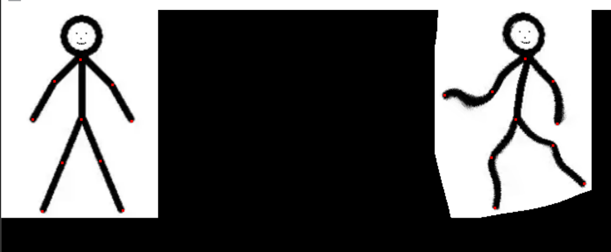

# 图像特效：

图像特效包含了去雾、自动填充修复、鱼眼、卡通、变形等等。

## 暗通道去雾：

首先我们需要获取暗通道图像：
```c
CVIMAGE YMCV_Gray_Image_GetDarkChannel(CVIMAGE myimg, uint8 kernel_r);//获取暗通道
```
`myimg`是输入的灰度图，`kernel_r`是形态学运算的半径。

然后我们需要进行大气光照估计：
```c
uint8  YMCV_Gray_Image_GetAtmosphericlighting(CVIMAGE myimg, CVIMAGE darkimg);//计算大气光照
```
`myimg`是输入的灰度图，`darkimg`是之前的暗通道图。返回的是大气光照强度值。

取得大气光照强度后，就可以去雾了：
```c
CVIMAGE YMCV_Gray_Image_RemovalFog(CVIMAGE myimg, CVIMAGE darkimg, uint8 AtmosValue, float32 omiga);//暗通道去雾
```
`myimg`是输入的灰度图，`darkimg`是之前的暗通道图，`AtmosValue`是大气光照强度，`omiga`是除雾率，取值范围在[0.0 ~ 1.0]。返回的是去雾后的图像。

实例：获取灰度图myIMG的暗通道图与大气光照强度值，并进行暗通道去雾：

```c
CVIMAGE myIMG;
.....
YMCV_PADDING_VAL = 125;//设置边界填充值，获取暗通道时的形态学会用上

//获得暗通道图
CVIMAGE darkImg = YMCV_Gray_Image_GetDarkChannel(myIMG, 1);

//计算大气光照A
uint8 AtmosValue = YMCV_Gray_Image_GetAtmosphericlighting(myIMG, darkImg);

//设置出雾率 为0.5，得到去雾图像
CVIMAGE resultImg = YMCV_Gray_Image_RemovalFog(myIMG, darkImg, AtmosValue,0.5);
```

上图摘至demo例程10.1运行结果，除雾率设置的越高，图像看着会越清楚，但同时也会变暗，如果想后续提高图像的亮度，可以尝试进行通道渲染提升亮度。

## InPaint修复
该算法是从周围的区域中搜索一块与抠图边缘位置最匹配的区域，将该区域（patch）覆盖到要修复的位置。
```c
void YMCV_Gray_Exemplar_Based_Inpainting(CVIMAGE myimg,CVIMAGE mask,uint8 patch_r,uint16 search_r);
```
`myimg`是输入的灰度图，`mask`是要抠除的区域掩码图，`patch_r`修复过程中采用的patch半径，`search_r`是修复时的搜索半径。


上图摘至demo例程10.3运行结果，patch大小要根据实际图像上的物体可分辨程度决定。这个可以配合抠图算法（如grabcut等，具体参考图像分割章节）使用，将物体扣去以后，可以使用该算法进行一定程度的背景修复。

## 鱼眼特效 与 鱼眼矫正
```c
CVIMAGE YMCV_Gray_FishEye_Effect(CVIMAGE myimg, uint16 imgOutw, uint16 imgOuth);//鱼眼特效
```
该函数是将图像变成鱼眼效果，`myimg`是输入图像，`imgOutw`、`imgOuth`是输出图像的宽和高，返回的鱼眼特效图。

鱼眼矫正可以用如下函数进行：
```c
CVIMAGE YMCV_Gray_invFishEye_Effect(CVIMAGE myimg, float32 strength, float32 scalex ,float32 scaley);
```
`myimg`是待矫正的图像，`strength`是整体的矫正强度，`scalex`、`scaley`是xy的矫正系数。矫正时需要设置`YMCV_PADDING_VAL`值填充空白边界。


上图摘至demo例程10.4运行结果，在做鱼眼特效时，可以将图像裁剪为正方形后再做鱼眼特效，这样就能和矫正图效果一致了。

## 图片剪裁，复制，截取：

```c
CVIMAGE YMCV_Gray_Cartoon_Effect(CVIMAGE myimg, uint8 kernel_r);//卡通特效
```
其中myimg是源图像，kernel_r是滤波半径。

上图摘至demo例程10.5运行结果，滤波半径要取大一些效果会更好。

## 图片刚性变形
该方法需要有控制点，利用控制点的变形来完成图像变形
```c
CVIMAGE YMCV_Gray_RigidDeformation_Effect(CVIMAGE myimg, CVVECTORS_F32 pList, CVVECTORS_F32 qList);//控制点刚性变换 p -> q
```
`myimg`是待变形的图像，`pList`是控制点在图像上的初始位置，`qList`是控制点变换后的目标位置。需要注意的是`pList`和`qList`都是控制点序列，且存在一一对应关系。

上图摘至demo例程10.6运行结果，左图是控制点初始位置，右图是变换后的位置。

