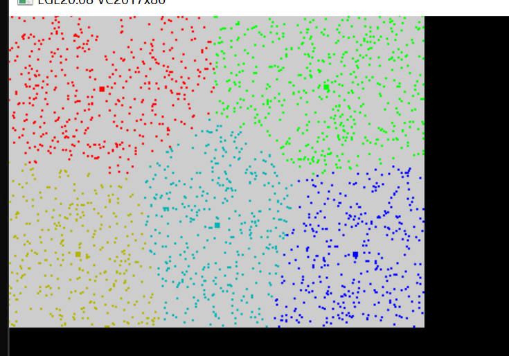

# 数据处理与机器学习：

数据处理包含了 FFT、DCT、DWT以及矩阵运算等。机器学习包含了KMeans、GMM、ID3决策树等等。

## 1D数据的 FFT 与 IFFT
FFT-1D运算渲染器的创建如下
```c
CVFFT_RENDER YMCV_Creat_FFT_Render_Creat(int16 processnum, uint16 data_step,uint8 ToAF);
```
`processnum` 是待处理的数据总个数，`data_step`是数据步幅，`ToAF`表示处理完后是否将结果从复数变换为 幅度+相位，返回的是一个FFT运算渲染器。如果数据只有实部如【数据1，数据2，数据3】则`data_step`参数则为1，如果数据是复数【实部1，虚部1，实部2，虚部2】，则`data_step`参数则为2，以此类推。

创建好FFT渲染器，就可以进行FFT、FFTShift、IFFT运算了，FFT运算和IFFT运算可以使用如下函数：
```c
void YMCV_FFT_Data_Cal(CVFFT_RENDER render, float32 realin[], float32 imagin[], float32 realout[], float32 imagout[]);
void YMCV_IFFT_Data_Cal(CVFFT_RENDER render, float32 realin[], float32 imagin[], float32 realout[], float32 imagout[]);
```
`render` 是FFT运算渲染器，`realin` 、`imagin` 是待处理的数据实部和虚部的起始地址，如在复数【实部1，虚部1，实部2，虚部2】中，`realin`是`实部1`的地址，`imagin`是`虚部1`的地址，，`realout`、`imagout` 是实部和虚部的输出。需要注意的是`realout`和`imagout`数组的区间不能有重叠区域，也就是他们**必须是两个独立的数组**，而`realin` 和`imagin`允许重叠。

由于FFT运算渲染器的运算长度确定为偶数个，所以FFT-shift运算和IFFT-shift运算实际上是相同的，均采用以下函数：
```c
void YMCV_FFTShift_Data_Cal(CVFFT_RENDER render, float32 realin[], float32 imagin[], float32 realout[], float32 imagout[]);
```
`render` 是FFT运算渲染器，`realin` 、`imagin` 是待处理的数据实部和虚部的起始地址，`realout`、`imagout` 是实部和虚部的输出起始地址。如果创建`render`时`data_step`选1，则`realin` 、`imagin`、`realout`、`imagout`都必须是独立数组；若`data_step`选2，则输入的数据复数格式【实部1，虚部1，实部2，虚部2】中，`realin`是`实部1`的地址，`imagin`是`虚部1`的地址，输出的数据格式也必须相同：【实部c1，虚部c1，实部c2，虚部c2】，`realout`是`实部c1`的地址，`imagout`是`虚部c1`的地址。


使用完FFT运算渲染器，可以用下列函数销毁渲染器
```c
void YMCV_Free_FFT_RenderFree(CVFFT_RENDER pthis);//CVFFT_Render 渲染器内存释放
```
实例可参考demo例程11.1。


## 1D数据的 DCT 与 IDCT
首先要创建一个DCT渲染器
```c
CVDCT_RENDER YMCV_Creat_DCT_Render_Creat(int16 processnum, uint16 data_step)
```
`processnum` 是待处理的数据总个数，`data_step`是数据步幅，返回的是一个DCT运算渲染器。如果数据只有实部如【数据1，数据2，数据3】则`data_step`参数则为1，如果数据是复数【实部1，虚部1，实部2，虚部2】，只取实部进行运算则`data_step`参数则为2，以此类推。


创建好DCT渲染器，就可以进行DCT、IDCT运算了，可以使用如下函数：
```c
void YMCV_DCT_Data_Cal(CVDCT_RENDER render, float32 datain[], float32 Calbuff1[], float32 dataout[], float32 Calbuff2[]);
void YMCV_IDCT_Data_Cal(CVDCT_RENDER render, float32 datain[], float32 Calbuff1[], float32 dataout[], float32 Calbuff2[]);
```
`render` 是DCT运算渲染器，`datain`是待处理的数据的起始地址，`dataout` 用于输出数据数组，其长度与`render` 的`danum`参数相同，`Calbuff1`和`Calbuff2`是计算缓存，长度也与`danum`同。


使用完DCT运算渲染器，可以使用如下函数进行销毁
```c
void YMCV_Free_DCT_RenderFree(CVDCT_RENDER pthis);//CVDCT_Render 渲染器内存释放
```

## 1D数据的 DWT 与 IDWT
首先要创建一个DWT渲染器，它默认采用的是**haar小波**运算
```c
CVDWT_RENDER  YMCV_Creat_DWT_Render_Creat(int16 processnum, uint16 data_step, uint8 gradenum);
```
`processnum` 是待处理的数据总个数，`data_step`是数据步幅，`gradenum`表示小波级数，返回的是一个DWT运算渲染器。如果数据只有实部如【数据1，数据2，数据3】则`data_step`参数则为1，如果数据是复数【实部1，虚部1，实部2，虚部2】，只取实部进行运算则`data_step`参数则为2，以此类推。


创建好DWT渲染器，就可以进行DWT、IDWT运算了，可以使用如下函数：
```c
void YMCV_DWT_Data_Cal(CVDWT_RENDER render, float32 datain[], float32 dataout[]);
void YMCV_IDWT_Data_Cal(CVDWT_RENDER render, float32 datain[], float32 dataout[]);
```
`render` 是DWT运算渲染器，`datain`是待处理的数据的起始地址，`dataout` 用于输出数据数组，其长度与`render` 的`danum`参数相同。


使用完DWT运算渲染器，可以使用如下函数进行销毁
```c
void YMCV_Free_DWT_RenderFree(CVDWT_RENDER pthis);//CVDWT_Render 渲染器内存释放
```

## 矩阵创建与销毁
```c
CVFMAT YMCV_Creat_FMAT_Creat(uint16 row, uint16 col);
```
`row`、`col`是矩阵的行数和列数，返回的一个`row×col`大小的矩阵。

矩阵使用完，可以用如下函数销毁：
```c
void YMCV_Free_FMatFree(CVFMAT pthis);//浮点矩阵内存释放
```
## 单位矩阵
```c
void YMCV_FMat_InitTo_OneUnitMat_Cal(CVFMAT mat1);//初始化为单位矩阵
```
`mat1` 是一个`N×N`大小的正方形矩阵，该函数可以将其初始化成单位矩阵。

## 矩阵乘法
```c
CVFMAT YMCV_FMat_Mult_Cal(CVFMAT mat2, CVFMAT mat1);//矩阵乘法 mat2 * mat1
```
`mat2`、`mat1` 是两个输入矩阵。其返回的矩阵是`mat2 * mat1`运算后的结果。
```c
//  mat2  * mat1
//  x y z   a        o
//        * b    =
//          c   
```

特殊的矩阵乘法，如$A^TA$、$AA^T$、$A^TB$则可以使用下列函数进行快速计算，而不需要先求转置再做乘法：
```c
CVFMAT YMCV_FMat_ATxA_Cal(CVFMAT matA); //计算 A' * A 
CVFMAT YMCV_FMat_AxAT_Cal(CVFMAT matA); //计算 A  * A' 
CVFMAT YMCV_FMat_ATxB_Cal(CVFMAT matA, CVFMAT matB);//计算 A' * B
```

## 矩阵转置
```c
CVFMAT YMCV_FMat_Trans_Cal(CVFMAT mat1);//转置
```
`mat1` 是原始矩阵，返回的是其转置矩阵。

## 矩阵行列式det
```c
float32 YMCV_FMat_Det_Cal(CVFMAT mat1);//行列式计算
```
`mat1` 是一个`N×N`大小的正方形矩阵，返回的是其矩阵行列式det值。

## 余子式的矩阵
也就是删除了某行某列后得到的矩阵
```c
CVFMAT YMCV_FMat_Del_RowAndCol_Cal(CVFMAT mat1, uint16 row, uint16 col);//除了某行某列的矩阵
```
`mat1` 是一个`N×N`大小的正方形矩阵，`row`、`col`是需要删除的矩阵行数和列数。返回的是一个`N-1 × N-1`大小的方阵。
## 矩阵的逆
在矩阵不是很大的情况下，推荐使用伴随矩阵法，矩阵较大时，推荐使用初等行变换法。
```c
CVFMAT YMCV_FMat_Inverse_Cal(CVFMAT mat1);//伴随矩阵法求逆矩阵
CVFMAT YMCV_FMat_RowOperation_Inverse_Cal(CVFMAT mat1);//初等变换求逆矩阵
```
`mat1` 是待求逆的方阵，返回的是其逆矩阵。


若需要同时求行列式det值与逆矩阵，可用如下函数
```c
CVFMAT YMCV_FMat_DetAndInverse_Cal(CVFMAT mat1, float32* detval);//同时计算逆矩阵和行列式
```
`mat1` 是待求逆的方阵，`detval` 是矩阵行列式det值输出地址，返回的是其逆矩阵。

## 矩阵的伪逆
当矩阵不是`N×N`的方阵时，可以用下面函数求其伪逆
```c
CVFMAT YMCV_FMat_Pseudo_Inverse_Cal(CVFMAT matA);//最小二乘求解伪逆矩阵
```
`matA` 是待求伪逆的方阵，返回的是其伪逆矩阵。

## 矩阵行化简
```c
CVFMAT YMCV_FMat_AugMat_RowSimplified_X_Cal(CVFMAT mat1);//增广矩阵行化简
```
`mat1` 是待化简的矩阵，返回的是一个上三角矩阵。

## 矩阵主元提取
```c
void YMCV_FMat_PrimaryColumn_Cal(CVFMAT mat1, int16* PrimaryFlagArray, uint16 arrayLen);//计算各列的主元行号，某列无主元则为-1
```
`mat1` 是待处理的矩阵，`PrimaryFlagArray`主元行号的缓存数组，其长度与矩阵的列数相同，`arrayLen` 是`PrimaryFlagArray`数组的长度。若某一列没有主元，则对应的`PrimaryFlagArray`数组元素值为-1，否则为相应的行号。

## 矩阵Cholesky分解
对矩阵A进行Cholesky分解会得到一个下三角矩阵 L  ，且有 $A = L * L^T$，可用如下函数求L矩阵
```c
CVFMAT YMCV_FMat_Cholesky_Cal(CVFMAT matA);//计算Cholesky分解得到 L 下三角矩阵 ，其中 A = L * L'
```
`matA` 是待分解的矩阵，返回的是一个下三角矩阵。

## 矩阵特征值与特征向量
```c
CVFMAT YMCV_FMat_Jacobi_Eigen_ValAndVec_Cal(CVFMAT mat1, float32* eigenValArray, uint8 arrayLen);//雅可比法求特征值和特征向量
```
`mat1` 是待求正方形矩阵，`eigenValArray` 是特征值输出缓存数组，其元素个数与矩阵列相同，`arrayLen` 是`eigenValArray`数组的长度。返回的是一个矩阵，其每列都表示一个特征向量，而`eigenValArray`对应列的元素值则为其特征值。


## 矩阵SVD分解
对矩阵A进行SVD分解，会有 $A=USV^T$
```c
void YMCV_FMat_SVD_USVT_Cal(CVFMAT matA_S, CVFMAT matU, CVFMAT matVT);//矩阵SVD分解 A=USV^T
```
`matA_S` 是输入待分解的A矩阵，将A分解为$U$，$S$，$V^T$三个矩阵后，$S$矩阵会覆盖到`matA_S`中，`matU`、`matVT`则是对应的$U$，$V^T$矩阵的结果。$U$，$V^T$矩阵需要事先创建好，他们都是正方形矩阵，$U$矩阵大小N×N，其N与A矩阵的行数相同，$V^T$矩阵大小M×M，其M与A矩阵的列数相同。

## KMeans 训练 & 分类
KMeans聚类后，可用获得各个类别的数据中心，我们把这个过程称为训练：
```c
//提取数据中心,若传入label，则会传出聚类后的数据label
void YMCV_FVector_Kmeans_GetCenter(CVVECTORS_F32 fvecp, uint8* dataLabel, CVVECTORS_F32 kCenterp, uint16 maxIter);
```
`fvecp` 是浮点向量集合，`dataLabel` 是用于输出各个向量的类别标签数组，其长度要与`fvecp`向量个数相同，若无需输出标签类别，则该参数取`NULL`即可；`kCenterp` 是k个数据中心的输出缓存，需要事先创建好，其向量维度与数据样本的维度相同，`maxIter` 是最大迭代次数。

获得数据中心后，我们可用其对输入的其他数据进行分类，将离输入数据最近的数据中心作为其类别，可以用如下函数进行
```c
//计算数据标签
void YMCV_FVector_Kmeans_Classify(CVVECTORS_F32 fvecp, CVVECTORS_F32 kCenterp, uint8* dataLabelout);
```
`fvecp` 是待分类的浮点向量集合，`kCenterp` 是训练好的k个数据中心的输出缓存，`dataLabelout` 是用于输出`fvecp` 中各向量类别标签的数组，其长度要与`fvecp`向量个数相同。



上图摘自demo例程11.5运行结果，各个类别的数据中心绘制了一个小方块。

## GMM 训练 & 分类
Kmeans是自动聚类，而GMM训练时需要事先指定样本数据的类别，若是没有设定类别我们则可用Kmeans来获取样本数据类别。

首先，我们需要创建一个GMMS模型对象
```c
CVGMMS YMCV_Creat_Gmms_Creat(uint8 dataDim, uint8 componentsNum);
```
`dataDim` 是待分类的数据向量的维度，`componentsNum` 是高斯分布的个数（类别个数）。返回的是一个GMMS模型对象。

数据训练可用用如下函数：
```c
//dataLabel元素的取值范围是[0,labelNum) ,每个标签都有一个分布
void YMCV_Fdata_GMMs_Learning(CVGMMS gmms, CVVECTORS_F32 fvecp, uint8* dataLabel);
```
`gmms` 是之前创建好的GMMS模型对象，`fvecp` 是用于训练的样本集，`dataLabel` 是用于训练的样本标签。

训练好GMMS模型后，可用用它来对数据分类，只需求得待分类数据属于哪个高斯分布即可
```
int YMCV_Fdata_GMMs_belongWhichComponent(CVGMMS gmms, float32* vec, uint8 dim);//求取属于高斯模型的哪个分量
```
`gmms` 是之前训练好的GMMS模型对象，`vec` 是待分类的向量地址，`dim`待分类的向量维度。

## ID3决策树 训练 & 分类

请参考 `图像目标匹配`章节讲解，这里不再重复

## 线段合并
```c
//直线合并 -- 遍历方式，斜率根据长度加权合并
void YMCV_Merge_LineSegments(CVVECTORS_U16 lines, uint16 disThresh, uint16 angerErr);
```
`lines` 是待合并的直线段集合，`disThresh` 是合并的线段距离阈值，`angerErr`合并的线段角度阈值。若两个线段的距离低于距离阈值，且夹角也低于角度阈值，则将其合并，斜率则根据两个线段的长度进行加权获得。合并后的线段覆盖到`lines`中 。

##  Delauney三角网格生成
由一些列控制点，则可以生成三角网格，可用于live2D的动画创建。

```c
CVVECTORS_F32 YMCV_DelauneyTriangle_Construct(CVVECTORS_F32 fpointList);
```
`fpointList` 是控制点的集合，生成三角网格后，会将其组成三角形的集合返回。

