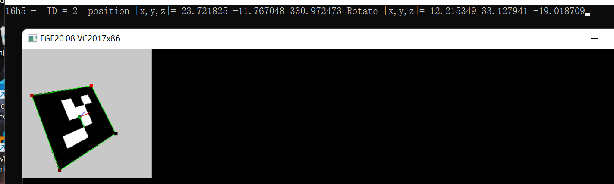
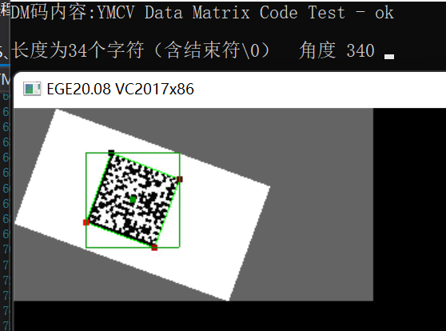
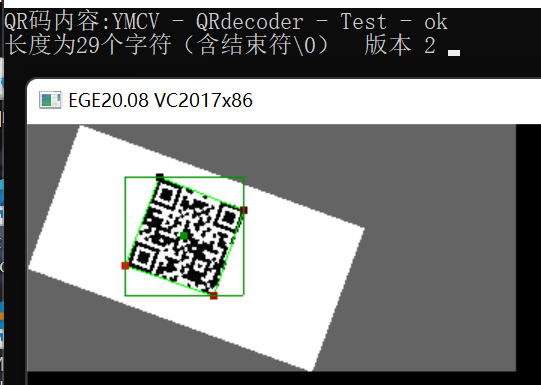
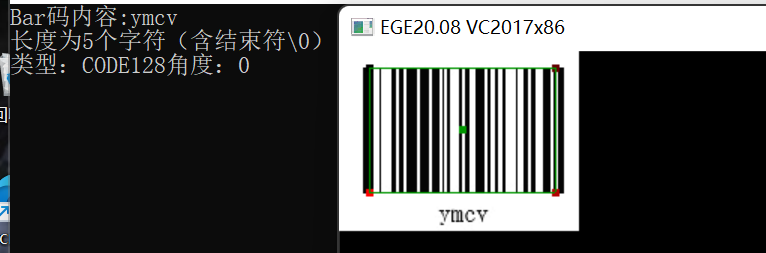

# 条码&二维码

基本操作包括了：二维码（QR码）生成与识别，DM码识别， AprilTag识别，条形码识别。

## AprilTag识别
```c
CVVECTORS_U16 YMCV_Gray_Find_AprilTags(CVIMAGE gray, CV_apriltag_detect_info detect_info);
```
`gray` 为灰度格式图片， `detect_info` 为检测器的信息，返回的是四月标签（AprilTag）信息数组。检测器信息参数很多，检测码类型`types`参数如下：
```c
    CV_AprilTag16H5 
    CV_AprilTag25H7 
    CV_AprilTag25H9 
    CV_AprilTag36H10 
    CV_AprilTag36H11 
    CV_ArToolKit 
```
如果要同时支持`CV_AprilTag16H5`和`CV_AprilTag25H7`，types参数可设置为`CV_AprilTag16H5+CV_AprilTag25H7`，以此类推，需要检测的类型都直接用`+`号进行连接即可。

上图摘自demo例程12.1， 标签的四个角点顺序依次为0 -> 1 -> 2 -> 3 ，对应的颜色顺序是: 黑，灰（褐），浅红，红。

## DM码识别
```c
CVVECTORS_U16 YMCV_Gray_Find_DataMatrices(CVIMAGE gray, int max_iterations);
```
`gray`是输入的灰度图，`max_iterations`是最大的迭代次数，返回的是DM码信息数组。



## 二维码（QR码）识别
```c
CVVECTORS_U16 YMCV_Gray_Find_QRCode(CVIMAGE gray);
```
`gray`是输入的灰度图，返回的是QR码信息数组。




## 条形码识别
```c
CVVECTORS_U16 YMCV_Gray_Find_BarCode(CVIMAGE gray);
```
`gray`是输入的灰度图，返回的是条形码信息数组。



## 二维码（QR码）编码
```c
CVIMAGE YMCV_QRCode_EncodeToGrayImg(const char* str,uint8 padw);
```

`gray`是输入的灰度图，`padw`是二维码图像的边界填充空白区宽度（单位为像素），返回的是二维码灰度图像。输出的图像实际上很小，可自行采用用几何变换进行放大显示。

