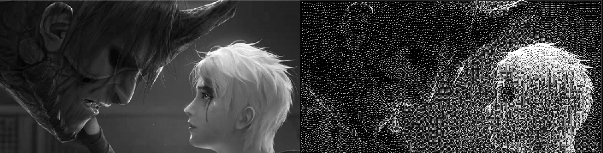
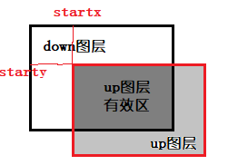
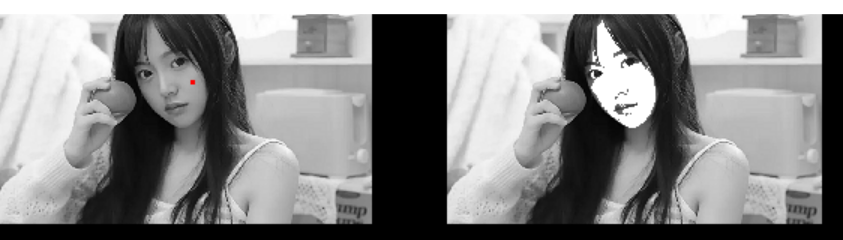

# 基本图像操作：

基本图像操作包括了：图片的创建与内存释放，将数组数据封装为图片，从源图像中复制或裁剪一部分作为新的图像，图像显示，图像格式转换等。

## 图片格式：

预设的图片格式(`CVImgType`)有7种，分别为    

```c
    CVBinaryType,// 二值图
    CVTrimapType,//三色图
    CVGrayType,//灰度图
    CVRgb16Type,//RGB565
    CVFGrayType,//float gray
    CVIGrayType,//int gray
    CVCGrayType,//complex gray
```

常用的是前面几种， `CVGrayType` 为灰度格式图片， `CVRgb16Type` 为RGB565彩色格式图片。在图片中，可通过`type`参数来判断。

实例：判断myIMG的图片是彩色图还是灰度图：

```c
CVIMAGE myIMG；
.....
switch(myIMG->type)
{
    case CVGrayType: 
        //灰度图
        break;
    case CVRgb16Type: 
        //彩色图
        break;
}
```

## 创建图片空间，图片内存申请与释放：

```c
CVIMAGE YMCV_Creat_Img_Creat(uint16 width,uint16 height, CVImgType Imgform);
```

`width`，`height`是待创建的图片宽度和高度。Imgform是需要创建的图片格式，常用图片格式有`CVBinaryType`,`CVGrayType` , `CVRgb16Type` , `CVFGrayType` 等，该函数支持所有图像格式。**但凡使用YMCV_Creat_xx创建的数据对象，使用完都需使用YMCV_Free_xx进行手动释放**，imgxx图片释放内存空间可用

```c
void YMCV_Free_ImgFree(CVIMAGE pthis);
```

**实例**：为myIMG创建一张30宽，60高的灰度图片内存空间，并释放该图片空间：

```c
CVIMAGE myIMG = NULL；
.....
myIMG = YMCV_Creat_Img_Creat(30,60,CVGrayType);
YMCV_Free_ImgFree(myIMG);
```

## 图片数据封装：

```c
CVIMAGE YMCV_Creat_DataToImg(uint8* data,uint16 width,uint16 height, CVImgType Imgform);
```

该函数是将**裸数据**封装为图片格式，参数data是数据源，为uint8类型数组，`width`，`height`是需要创建的图片宽度和高度。Imgform是需要创建的图片格式，取决于data数组中像素的格式。使用该方法时，图片数据地址引用的data地址，若使用完图片后进行对象释放，则data数组也将被释放。所以使用前，建议**使用CV_malloc1**创建一份data数组的副本(`注意:不可使用CV_malloc0`)，然后将副本地址作为参数传入进行图片创建。

**实例**：将uint8数组pic_data[400]创建为一张20宽，20高的灰度图片，并释放该图片空间：

```c
CVIMAGE myIMG = NULL；
uint8 pic_data[400]；
.....
//为了不破坏原始数据，重新申请数据内存
uint8* myData = CV_malloc1(sizeof(pic_data));//必须采用CV_malloc1为图片数据申请内存
myIMG = YMCV_Creat_DataToImg(myData,20,20,CVGrayType);
.....
YMCV_Free_ImgFree(myIMG);
```

## 图片剪裁，复制，截取：

```c
CVIMAGE YMCV_Creat_ImgCopyTo(CVIMAGE myimg,uint16 startw,uint16 starth,uint16 width,uint16 height);
```

其中myimg是源图像，startw，starth是在myimg中复制起点的横纵坐标，width，height是将要复制出来的图片的宽度和高度。该函数支持rgb565彩色格式（CVRgb16Type）、灰度格式（CVGrayType）、二值格式（CVBinaryType）图片。

若使用ROI进行拷贝，ROI中也含有上述4个参数，描述同上：

```c
CVIMAGE YMCV_Creat_ImgROICopyTo(CVIMAGE myimg, CVrect* myroi)
```

实际上ROI拷贝函数底层调用的也是YMCV_Creat_ImgCopyTo函数。

**实例**：将myIMG全部截取备份到Newimg：

```c
CVIMAGE myIMG；
CVIMAGE Newimg；
.....
Newimg = YMCV_Creat_ImgCopyTo(myIMG,0,0,myIMG->width,myIMG->height);
```

## 图片备份：

```c
CVIMAGE YMCV_Creat_Img_BackUp(CVIMAGE myimg);
```

其中myimg是源图像，该函数将源图像所有数据都复制出来作为一张新图像，之后对myimg图像进行操作时，将不影响该备份图像。

实例：将myIMG图像备份出来，并释放该备份的图片空间：

```c
CVIMAGE myIMG；
CVIMAGE newIMG = NULL；
.....
newIMG = YMCV_Creat_Img_BackUp(myIMG);
.....
YMCV_Free_ImgFree(newIMG);
```

## 图像显示：

```c
void LCD_show_image(uint16 x, uint16 y, CVIMAGE myimg);
```

其中 x，y是LCD上的起始点坐标，myimg是所需要显示在LCD上的图片，该函数支持CVRgb16Type彩色图、CVGrayType灰度图、CVTrimapType三色图、CVBinaryType二值图的显示。严格上来说，**该函数不属于YMCV库的内容**，您也可以参照我给的例程实现自己的显示函数。

**实例**：将myIMG显示到LCD上：

```c
CVIMAGE myIMG；
.....
LCD_show_image(0,0,myIMG);
```

## 图像格式转换

```c
void YMCV_Image_Pix_Change_Form(CVIMAGE Imgin, CVIMAGE Imgout, CVPIXCFORM CForm);
```

Imgin为待转换的图像，Imgout为输出图像(需要事先创建好图片空间)，支持的函数转换格式CForm有5类：rgb565转其他格式，gray转其他格式，binary转其他格式，fgray转其他格式，cgray转其他格式，详细如下：

```c
    CV_Rgb16ToGray,  //Rgb565灰度化
    CV_Rgb16ToBinary,//Rgb565二值化

    CV_GrayToRgb16,  //Gray升三通道图
    CV_GrayToBinary,//Gray二值化
    CV_GrayToDotBinary,//灰度转二值点图
    CV_GrayToCGray,//Gray升complex gray
    CV_GrayToFGray,//Gray升float gray

    CV_BinaryToRgb16,  //Binary升三通道图
    CV_BinaryToGray,//Binary灰度化


    CV_IGrayToGray,  //IGray 转Gray图 有效部分截断
    CV_IGrayToGray2,  //IGray 转Gray图 自适应拉伸

    CV_FGrayToGray,  //FGray 转Gray图 绝对值有效部分截断
    CV_FGrayToGray2,  //FGray 转Gray图自适应拉伸

    CV_CGrayToGray,   //complex gray 转 灰度 取实部截断
    CV_CGrayToGray2,   //频域complex 转 灰度 区域自适应拉伸
```

将任意格式转二值图时，采用的默认分割阈值是127： `pix = (val > 127)? 255 : 0;`
另外要注意，使用该函数时CForm参数要与Imgin和Imgout格式相匹配。如使用参数为 `CV_GrayToBinary`，则输入图像格式必须为灰度图(CVGrayType)，输出格式必须为二值图(CVBinaryType)

**实例**：将灰度图myIMG转为 **二值点图**：

```c
CVIMAGE myIMG;
CVIMAGE dotBinary;
.....
dotBinary = YMCV_Creat_Img_Creat(myIMG->width,myIMG->height,CVBinaryType);//创建等大的空二值图像

YMCV_Image_Pix_Change_Form(myIMG, dotBinary, CV_GrayToDotBinary);//转二值点图
```



上图摘自demo例程1.3运行结果，二值点图本质上就是二值图，不过它可以**根据灰度强度不同，让白点的密度随之变化**，从而让人产生有色阶的错觉。这种图适合用在那种只能显示黑白两种颜色的水墨屏上，使其能够显示出灰度效果。

## 图像区域填充

```c
void YMCV_Img_Scanline_AreaFill(CVIMAGE pthis, CVpoint* ring, uint32 pointNum, CVcolor fillcolor);
```

pthis为待填充的图像(可为二值图，三色图，灰度图，彩色图)，ring为组成一个环形区域的点集数组，pointNum是数组长度，fillcolor为填充的颜色(CVcolor类型为通用颜色类型，可为rgb565或gray，具体那种类型要和待填充图像的格式一致)。

**实例**：在灰度图myIMG绘制一块灰色的矩形区域，灰度值为128：

```c
CVIMAGE myIMG;
.....
    //矩形区域的x,y坐标
    uint16 xpoint[] = { 121, 141, 141, 121};
    uint16 ypoint[] = { 45, 45, 97, 97 };
    uint16 num = sizeof(xpoint) / 2;

    //创建为点集数组
    CVpoint* myPoint = (CVpoint*)CV_malloc1(num * sizeof(CVpoint));//点集
    for (int i = 0; i < num; i++)
    {
        CVpoint* thiscolor = myPoint + i;
        thiscolor->x = xpoint[i];
        thiscolor->y = ypoint[i];
    }

    CVcolor fillval;
    fillval.gray = 128;//填充值
    //对myIMG进行区域填充
    YMCV_Img_Scanline_AreaFill(myIMG, myPoint, num, fillval);

    //使用完需释放点集内存
    CV_free1(myPoint);
```

## 图像完全填充

```c
void YMCV_Image_FullFill(CVIMAGE myimg, CVcolor fillval);//全部填充
```

该函数和区域填充的区别在于，它是将整幅图像填充为fillval值，而区域填充只有指定的闭环多边形区域会被填充为fillval值

## 图像覆盖填充

```c
void YMCV_Image_CoverFill(CVIMAGE down, CVIMAGE up, uint16 startx, uint16 starty);//图像覆盖填充
```

该函数相当于图层覆盖，以down图像为基准，将up图像对准其(startx,starty)坐标，然后将up图像中的有效区域填充到down图像中。


## 图像合并覆盖

```c
void YMCV_Image_Cover(CVIMAGE upimg, CVIMAGE downimg,uint16 upx,uint16 upy);
```

`upimg`是上图层图像，`downimg`是下图层图像，`upx`、`upy`是上图层相对于下图层的偏移。覆盖结果直接覆盖`downimg`。

该函数支持的图像类型比 `图像覆盖填充` 多，后续可能两者会合并。

## 图像掩码填充

```c
void YMCV_Image_MaskFill(CVIMAGE myimg, CVIMAGE mask, CVcolor fillval);//掩码填充
```

myimg是待填充的图片（格式可为二值图，三色图，灰度图，彩色图），mask是二值图掩码。该函数作用是取mask中像素为白色的部分，将myimg中相应区域填充为fillval值。

## 图像种子填充

```c
void YMCV_Image_ScanLine_SeedFill(CVIMAGE myimg, CVpoint seed, int8 errorMax, CVcolor fillval);//种子填充
```

也可以叫做区域生长，myimg是待填充图像，seed是在图像上选取的种子点坐标，errorMax是生长的阈值（如果某个方向像素点误差超过该值，就停止往该方向生长），fillval是生长过程中填充的颜色。


上图摘自demo例程1.5运行结果

## 图像文件读取

```c
CVIMAGE YMCV_Image_Read(const char* filepath, CVImgType outType);
```

filepath是文件路径，outType是读出的类型，可以选择CVRgb16Type和CVGrayType，若选择灰度类型则会自动进行图像灰度化。当然，使用该函数的前提是必须得有文件系统，若是stm32上，可以使用我之前封装好的ufatfs文件系统。目前，该函数支持jpeg和bmp格式图片读取。另外，读取gif动图和avi视频中的图像，自行参考demo1.6中的函数示例。


由于GIF由多张图片组成，所以需要逐帧读取，首先需要创建解析器，参数fname是文件路径：

```c
 gd_GIF* gd_prepare_from_file(const char* fname);
```
当然，如果没有文件系统，可以将GIF文件转为数组，然后使用如下函数解析读取
```c
gd_GIF* gd_prepare_from_data(const void* data);
```
然后就可以使用如下函数进行逐帧图像获取了，默认图像格式为rgb565
```c
//获取下一帧图像
void gd_next_frame(gd_GIF* gif);
```
当获取到结尾时，解析器中的`is_finished`参数会置1，然后我们若没有退出则会重头开始获取图像。

退出后可用用如下方式释放解析器：
```c
//退出解码器
void gd_quit(gd_GIF *gif);
```

AVI视频文件（jpeg编码）的读取会相对复杂一些：
```c
avi_t *AVI_open_input_file(const char *filename, int getIndex);//打开文件并创建avi解析器

long AVI_video_frames(avi_t *AVI);//获取总帧数

float AVI_frame_rate(avi_t *AVI);//获取帧率

int AVI_set_video_position(avi_t *AVI, long frame);//设置当前帧的位置

int YMCV_AVI_Decode_Next_Jpeg_Frame(avi_t* myavi, CVIMAGE outimg);//获取下一帧图片

int AVI_close(avi_t *AVI);//关闭文件并销毁avi解析器
```