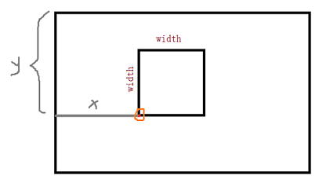

# 通道渲染
首先，我们要明确一下什么是**通道**，通道数实际上取决于像素点的维数，比如一个彩色像素是由3个值构成的3维向量`(r,g,b)`，每一维就是一个通道，所以是3通道。对于灰度图，它只有1个通道；而对于rgb彩色图，它则有3个通道,分别为`R`通道，`G`通道，`B`通道。
## 渲染器工作流程
**想要渲染器能正确工作，需要三步**：
1. 创建渲染器
2. 渲染器参数加载
3. 对图像进行渲染

**如果需要调整渲染参数，则需要重新进行参数加载**，渲染器才能用新的参数进行渲染。**若没有进行参数调整，无需重新进行参数加载**，以便批量处理图片时能达到高速运行。此外，使用完渲染器对象，则需要进行对象销毁。

## 渲染器创建与销毁
```c
CVPIX_RENDER YMCV_Creat_PixRender_Creat(CVPXPMap rendform, PIXChannelNum channelnum);//像素通道渲染器创建
```
参数rendform代表渲染类型，channelnum代表通道数。channelnum参数可选有单通道(`PIXChannelNum1`)，三通道(`PIXChannelNum3`)，代表待渲染器的通道数，渲染单通道图片则渲染器需要一个通道，渲染三通道图片，渲染器需要三个通道。
渲染参数rendform可选类型有15种：
```c
	CV_Channel_CustomTransform,//自定义变换
	CV_Channel_SingleToThree,//单通道转三通道
	CV_Channel_ThreeToSingle,//三通道转单通道
	CV_ThreshToBin,//单阈值二值化
	CV_Thresh2ToBin,//双阈值二值化
	CV_Expose,//曝光
	CV_ColorTo,//染色
	CV_Bright,//亮度增强
	CV_Invers,//反色
	CV_Contract,//对比度增强
	CV_Liner_Enhance,//分段线性增强
	CV_Log_Enhance,//对数非线性增强
	CV_Exp_Enhance,//指数非线性增强
	CV_Gama_Enhance,//gama变换增强
	CV_Scurve_Enhance,//S曲线变换增强
```
**前面的3种比较特殊，他们不属于通用的渲染流程**，有着各自的渲染方法，我们后面再特殊介绍。后面的12种是常用的渲染方法，我们主要关注这部分：
>CV_ThreshToBin为单阈值二值化，该方法有一个阈值参数T，取值范围0~255，计算公式为
>$f(x)=  \left\{
>\begin{aligned}
>255 & & x>T \\
>0 &  & else \\
>\end{aligned}
>\right.
>$


>CV_Thresh2ToBin为双阈值二值化，该方法有两个参数LT，RT，取值范围0 ≤ LT ≤ RT≤ 255 ，计算公式为
>$f(x)=  \left\{
>\begin{aligned}
>255 & & x∈[LT,RT] \\
>0 &  & else \\
>\end{aligned}
>\right.
>$


>CV_Expose为曝光渲染，有一个参数T，取值范围0~255，计算公式为
>$f(x)=  \left\{
>\begin{aligned}
>x & & x>T \\
>(2*T-1)-x &  & else \\
>\end{aligned}
>\right.
>$


>CV_ColorTo为染色渲染，有一个目标颜色参数c，取值范围0~255，计算公式为
>$f(x)=  x * \frac{c}{255}$

>CV_Bright为亮度增强，有一个增益系数k，取值范围0~5，计算公式为
>$f(x)=  k * x$

>CV_Invers为反色增强，有一个增益系数k，取值范围0~5，计算公式为
>$f(x)=  k * (255-x)$

>CV_Contract为对比度增强，有一个增强系数k，取值范围-100~100，计算公式为
>$f(x)=  255 * \frac{x-k}{255-2*k}$

>CV_Liner_Enhance为分段线性增强，有fa,fb,fc三个参数将区间分为4个`[0,fa),[fa,fb),[fb,fc),[fc,255]`，取值范围0< a< b< c ≤255，另外三个参数ta,tb,tc同理，最终实现区间进行映射，如`[0,fa)`映射到`[0,ta)`，具体计算公式为
>$f(x)=  \left\{
>\begin{aligned}
>\frac{ta}{fa}*x & & x∈[0,fa) \\
>\frac{tb-ta}{fb-fa}*(x-fa)+ta &  & x∈[fa,fb) \\
>\frac{tc-tb}{fc-fb}*(x-fb)+tb &  & x∈[fb,fc) \\
>x &  & x∈[fc,255] \\
>\end{aligned}
>\right.$


>CV_Log_Enhance为对数非线性增强，有一个三个系数a、b、c，，计算公式为
>$f(x)=  a * \frac{log(x+1)}{b*log(c)}$

>CV_Exp_Enhance为指数非线性增强，有一个三个系数a、b、c，，计算公式为
>$f(x)=  b ^{c*(x-a)} +1$

>CV_Gama_Enhance为gama变换增强，有一个两个系数c、γ，，计算公式为
>$f(x)=  c*(\frac{x}{255}) ^ γ$

>CV_Scurve_Enhance为S曲线变换增强，有一个两个系数m、E，，计算公式为
>$f(x)=  255*\frac{1}{1+(\frac{m}{x}) ^ E}$

**使用YMCV_Creatxx创建的对象都需要进行手动释放资源**，假设我们创建了renxx对象，使用完后，我们可以进行如下操作进行对象销毁：
```c
void YMCV_Free_PIX_RenderFree(CVPIX_RENDER pthis);
```

**实例**：创建一个用于灰度图的渲染器，渲染类型为单阈值二值化，然后进行渲染器销毁
```c
	//创建通道渲染器
	CVPIX_RENDER myRender1 = YMCV_Creat_PixRender_Creat(CV_ThreshToBin, PIXChannelNum1);//单阈值二值化，一个通道
	//渲染器释放
	YMCV_Free_PIX_RenderFree(myRender1);
```
我们创建完渲染器后，还需要对其进行参数加载，才能用于后续渲染。
## 渲染器参数加载
我们之前创建渲染器有一个通道参数指明了渲染器是单通道渲染器，还是三通道渲染器。**不同通道数的渲染器要分别使用对应的加载方式进行加载**，否则会出现错误。
### 单通道渲染器参数加载
```c
void YMCV_SingleChannel_MapTo(CVPIX_RENDER render, CV_pixchannel_1param* Param);//初始化单通渲染通道
```
参数render即我们之前创建好的渲染器，Param为待定的加载参数地址，参数取值详情参考上面公式介绍部分的说明，这里给出一些调试参考,具体可参考demo例程2.1~2.6
> 首先，在范围内随意给定一个参数初值，然后对其中一个参数进行微调整，观察渲染曲线的变化，逐渐加大调整，直到找到适合的调整步长。然后对剩下的参数依次调整，得到所需参数。
> 或者参考demo例程上使用的初值和调整步长，在其基础上进行微调，找到合适的参数。

**实例**：对单通道渲染器myRender1进行参数加载
```c
	//创建单通道渲染器
	CVPIX_RENDER myRender1 = YMCV_Creat_PixRender_Creat(CV_ThreshToBin, PIXChannelNum1);//单阈值二值化

	//设置相应参数
	CV_pixchannel_1param myParam1;
	myParam1.gray_tobin.Thresh=20;//取CV_ThreshToBin对应的参数进行设置

	//加载参数
	YMCV_SingleChannel_MapTo(myRender1, &myParam1);

	//销毁渲染器
	YMCV_Free_PIX_RenderFree(myRender1);
```

### 三通道渲染器参数加载
```c
void YMCV_ThreeChannel_MapTo(CVPIX_RENDER render, CV_pixchannel_3param* Param);//初始化三通渲染通道
```
参数render即我们之前创建好的渲染器，Param为待定的加载参数地址，参数取值详情参考上面公式介绍部分的说明，与单通道不同的是它有三个通道，并且都有其各自的渲染参数，具体可参考demo例程2.8~2.13
## 图像通道渲染
```c
void YMCV_Image_ChannelRenderTo(CVIMAGE Imgin, CVIMAGE Imgout, CVPIX_RENDER render);//图像通道渲染
```
其中Imgin是输入图像，Imgout是输出图像，两者通道数必须一致。render必须是经过参数加载后的渲染器。**需要注意的是，使用通道渲染前，输入输出图像的空间需确保已经创建好**，通道渲染器就相当于一个管道连接两幅图像


**实例**：对图像myIMG使用单通道渲染器进行渲染
```c
	CVIMAGE myIMG;
	CVIMAGE outIMG;
	.....
	//创建单通道渲染器
	CVPIX_RENDER myRender1 = YMCV_Creat_PixRender_Creat(CV_ThreshToBin, PIXChannelNum1);//单阈值二值化

	//设置相应参数
	CV_pixchannel_1param myParam1;
	myParam1.gray_tobin.Thresh=20;//取CV_ThreshToBin对应的参数进行设置

	//加载参数
	YMCV_SingleChannel_MapTo(myRender1, &myParam1);

	//使用myRender1对图片进行渲染，结果输出到outIMG
	YMCV_Image_ChannelRenderTo(myIMG, outIMG,myRender1);

	//释放渲染器
	YMCV_Free_PIX_RenderFree(myRender);
```

## 通道转换图显示
```c
void LCDChannelTransformShow(CVPIX_RENDER myRender, int startx, int starty, int width);
```
该函数将以**矩形区域**绘制通道渲染函数曲线，矩形起始坐标为(startx,starty)，矩形宽、高为width。

**实例**：显示myRender1渲染器的渲染曲线，曲线外界矩形框40x40，起始坐标( 540, 60)


上图摘自demo例程2.5运行结果，右上角的便是通道渲染曲线。

## 其他类型渲染
我们之前提到，还有3种比较特殊的渲染类型:
```c
	CV_Channel_CustomTransform,//自定义变换
	CV_Channel_SingleToThree,//单通道转三通道
	CV_Channel_ThreeToSingle,//三通道转单通道）
```
其实整体流程它和之前哪些都是一样的，但有区别的是，它们使用了特殊的参数加载方式以及特殊的渲染方式。具体参见demo例程2.7
### 自定义渲染器
`CV_Channel_CustomTransform`表示自定义变换，需要对渲染器使用如下函数进行参数加载（分单通道和三通道），渲染方式不用变
```c
void YMCV_SingleChannel_CustomMapTo(CVPIX_RENDER render, int32(*RenderFunction)(int32 PixValue));//单通道映射渲染器初始化
void YMCV_ThreeChannel_CustomMapTo(CVPIX_RENDER render, int32(*R_RenderFunction)(int32 R_PixValue), int32(*G_RenderFunction)(int32 G_PixValue), int32(*B_RenderFunction)(int32 B_PixValue));//三通道映射渲染器初始化
```
其中render是渲染器，RenderFunction是计算函数的指针，该函数指明了输入一个像素值会返回的值。

**实例**：自定义一个渲染函数，对图像进行渲染
```c
	//自定义渲染函数
	int32 myFunction(int32 color)
	{
		return 1.2 * color;
	}

	CVIMAGE myIMG;
	CVIMAGE outIMG;
	...
	...
	//创建单通道渲染器
	CVPIX_RENDER myRender = YMCV_Creat_PixRender_Creat(CV_Channel_CustomTransform, PIXChannelNum1);//自定义渲染器

	//使用自己的函数进行渲染器参数加载
	YMCV_SingleChannel_CustomMapTo(myRender, myFunction);
	//使用通道渲染器进行图片渲染
	YMCV_Image_ChannelRenderTo(myIMG, outIMG,myRender);

	//释放渲染器
	YMCV_Free_PIX_RenderFree(myRender);
```
### 自定义单通道转三通道渲染
`CV_Channel_SingleToThree`为单通道转三通道，它要求输入是单通道图，输出是三通道图。我们通过它，能把灰度图变成伪彩色图，比如变成热力图。其参数加载方式如下：
```c
void YMCV_ThreeChannel_PaletteMapTo(CVPIX_RENDER render, color24_t* palette256);//用调色板初始化渲染通道
```
渲染图像时，也需要特殊的渲染函数，并且要求输入是单通道图，输出是三通道图：
```c
void YMCV_Image_SingleToThree_ChannelRenderTo(CVIMAGE Imgin, CVIMAGE Imgout, CVPIX_RENDER render);//单通道转三通道渲染
```
另外需要注意的是：**由于要输出彩色三通道图，所以render创建时，也需要创建成三通道渲染器**

**实例**：将单通道的myIMG渲染成伪彩色
```c
	extern color24_t YMCV_HeatPalette[256];//热力图调色板

	CVIMAGE myIMG;//单通道
	CVIMAGE outIMG;//三通道
	...

	//创建单通道转三通道渲染器
	CVPIX_RENDER myRender = YMCV_Creat_PixRender_Creat(CV_Channel_SingleToThree, PIXChannelNum3);//渲染器通道数为3

	//使用热力图的调色板进行渲染器参数配置
	YMCV_ThreeChannel_PaletteMapTo(myRender, YMCV_HeatPalette);
	//使用通道渲染器进行渲染图片
	YMCV_Image_SingleToThree_ChannelRenderTo(myImage1, outIMG, myRender);

	//释放渲染器
	YMCV_Free_PIX_RenderFree(myRender);
```
上述两个方法的具体使用可参考demo2.7：

### 自定义三通道转单通道渲染
`CV_Channel_ThreeToSingle`是三通道转单通道，通常用于自定义的灰度化，例如你不想使用BT601的rgb转灰度公式，就可以利用这个函数自定义灰度公式。其次通道分离也可以用它来做，比如说rgb系数设置为（1，0，0）,就是提取r通道图像了。
```c
void YMCV_Image_ThreeToSingle_ChannelRenderTo(CVIMAGE Imgin, CVIMAGE Imgout, CVPIX_RENDER render);//三通道转单通道渲染
```
Imgin是输入图像，Imgout是输出图像，render是渲染器，更多可参考demo2.14


**实例**：将彩色图myIMG渲染成灰度图，rgb转灰度系数取（0.3，0.6，0.1）
```c
	CVIMAGE myIMG;//三通道
	CVIMAGE outIMG;//单通道
	...
	//创建调色板
	color24_t myPalette[256] = { 0 };

	//使用(0.3,0.6,0.1)系数初始化调色板rgb通道
	float32 kr = 0.3, kg = 0.6, kb = 0.1;
	for (int i = 0; i < 256; i++)
	{
		myPalette[i].R = (_color8_t)(kr * i) ;
		myPalette[i].G = (_color8_t)(kg * i) ;
		myPalette[i].B = (_color8_t)(kb * i) ;
	}


	//创建单通道转三通道渲染器
	CVPIX_RENDER myRender = YMCV_Creat_PixRender_Creat(CV_Channel_ThreeToSingle, PIXChannelNum3);//三通道转单通道

	//使用调色板进行渲染器参数加载、通道配置、初始化
	YMCV_ThreeChannel_PaletteMapTo(myRender, myPalette);

	//使用通道渲染器进行渲染图片
	YMCV_Image_ThreeToSingle_ChannelRenderTo(myIMG, outIMG, myRender);

	//释放渲染器
	YMCV_Free_PIX_RenderFree(myRender);
```
### 使用灰度调色板渲染彩色图
很多时候我们想提升彩色图的亮度对比度，要分别调整三通道的曲线过于复杂，我们希望能直接将灰度调色应用于彩色图像转单通道。具体可参考demo2.15 - 2.18
```c
void YMCV_Image_ChannelRenderTo_UGray(CVIMAGE Imgin, CVIMAGE Imgout, CVPIX_RENDER render);//图像通道染色 使用灰度强度做参考
```
Imgin是输入图像，Imgout是输出图像，render是单通道渲染器。

**实例**：将彩色图myIMG进行亮度增强渲染，增强系数取1.5
```c
	CVIMAGE myIMG;//三通道
	CVIMAGE outIMG;//三通道
	...
	//设置渲染器参数
	CV_pixchannel_1param myParam;
	myParam.gray_bright._k = 1.5f

	//创建通道渲染器
	CVPIX_RENDER myRender = YMCV_Creat_PixRender_Creat(CV_Bright, PIXChannelNum1);//图像亮度增强

	//使用参数进行渲染器通道配置、初始化
	YMCV_SingleChannel_MapTo(myRender, &myParam);

	//使用通道渲染器进行渲染彩色图片
	YMCV_Image_ChannelRenderTo_UGray(myIMG, outIMG, myRender);

	//释放渲染器
	YMCV_Free_PIX_RenderFree(myRender);
```
