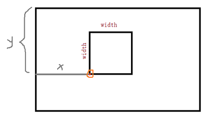
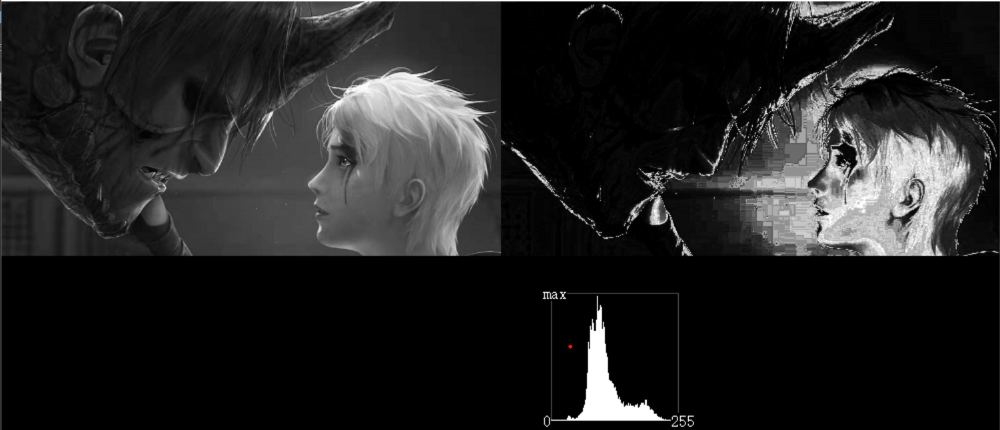

# 图像直方图渲染：

直方图渲染包括了：直方图均衡化，局部直方图均衡化，直方图规定化，直方图反投影，直方图查找阈值等。


## 获取分布直方图：

```c
void YMCV_Image_Hist_Get(CVIMAGE Imgin, int32* myHist, uint16 histSize, PIXChannelNum channel);//获取分布直方图
```

`Imgin`是输入图像（支持二值图CVBinaryType、灰度图CVGrayType、彩色图CVRgb16Type），`myHist`是待输出直方图数据(需要提前创建好该数组)。histSize是直方图长度（每个通道需要的长度为256，若Imgin是三通道彩色图，则histSize需为3×256）。channel为通道数，根据Imgin的通道数可选PIXChannelNum1或者PIXChannelNum3.


**实例**：获取灰度图myIMG的分布直方图：

```c
CVIMAGE myIMG = NULL；
.....
.....
//创建单通道直方图
int32 myIMGHist[1*256] = {0};
//获取图像直方图
YMCV_Image_Hist_Get(myIMG, myIMGHist, 1*256, PIXChannelNum1);
```

## 显示分布直方图：
```c
void LCDHistShow(int32* myHis, PIXChannelNum channelNum, int startx, int starty, int width);//显示直方图
```
该函数将以**矩形区域**绘制分布直方图，矩形起始坐标为(startx,starty)，矩形宽、高为width，`myHis`是待显示的直方图数组，`channelNum`是通道数(可选PIXChannelNum1或者PIXChannelNum3)。


## 直方图均衡化：
```c
void YMCV_Image_Hist_Equalize(CVIMAGE Imgin, CVIMAGE Imgout);//图像直方图均衡化
```
该函数将Imgin图像进行直方图均衡化后，输出到Imgout中。使用该函数时需提前创建好Imgout的缓存空间。


上述函数对于彩色图是通过三通道分离并做直方图均衡化完成的，如果希望通过灰度直方图进行均衡化（也支持彩色图），则可以使用下列函数
```c
void YMCV_Image_Hist_Equalize_UGray(CVIMAGE Imgin, CVIMAGE Imgout);//图像 依据灰度直方图进行均衡化
```
参数同上
## 局部直方图均衡化：
```c
CVIMAGE YMCV_Gray_Local_Hist_Equalize(CVIMAGE myimg, uint8 radius, YMCVPADDINGType padding);//局部直方图均衡
```
该函数对myimg灰度图像进行局部直方图均衡化后，输出到myimg中；radius是局部处理的半径（或者叫滤波核半径）；`padding`是边界填充值（若为`NOPadding`则不进行填充，若是`OutPaddingConst`则填充固定值`YMCV_PADDING_VAL`，填充前需要对该值进行设定）。

**实例**：对灰度图myIMG进行局部直方图均衡化，半径60，边界填充值为125，并进行直方图显示：

```c
CVIMAGE myIMG = NULL；
.....
.....
uint8 ker_r = 60;
YMCV_PADDING_VAL = 125;//设置填充值
//局部直方图均衡
CVIMAGE myImage2 = YMCV_Gray_Local_Hist_Equalize(myImage1, ker_r, OutPaddingConst);

//获取图像直方图与显示
int32 myImage2Hist[256];//直方图数组
YMCV_Image_Hist_Get(myImage2, myImage2Hist, 256, PIXChannelNum1);
LCDHistShow(myImage2Hist, PIXChannelNum1, 550, 420, 128);//由于大小放缩到128，经过转换形状可能不真实，可以用256观察真实直方图

```
## 直方图规定化：
```c
void YMCV_Image_Hist_MapTo(CVIMAGE Imgto, CVIMAGE Imgfrom);//直方图规定 
```
该函数将提取`Imgfrom`图像的直方图，然后对`Imgto`进行直方图修正，让它尽量变成`Imgfrom`图像的直方图的形状。

如果已经有一个目标直方图了，可以使用下面的函数
```c
void YMCV_Image_Hist_To(CVIMAGE Imgin, CVIMAGE Imgout, int32* myHist, uint16 histSize, PIXChannelNum channel);//图像直方图规定化
```
该函数将`Imgin`图像的直方图尽量变成`myHist`直方图的形状，`Imgout`是输出图像(使用前需创建好)，histSize是`myHist`直方图的长度(n个通道需要n×256)，channel是通道数(可选PIXChannelNum1或者PIXChannelNum3)。

## 直方图反向投影：
```c
void YMCV_GrayHist_BackProject(int32* myHist, uint16 histSize, CVIMAGE myimg);//灰度图直方图反向投影 
```
该函数将灰度直方图`myHist`，反向投影到灰度图`myimg`上，histSize是直方图长度。得到的结果输出到myimg中，这样使得直方图myHist中值较大的像素区间，`myimg`图上对应的像素点越亮，有点类似于将直方图作为图像的像素权重。



上图摘至demo3.6


## 图像直方图二值化：

在自动二值化（自动阈值化）中，最常用的方法就是通过统计直方图进行，常用的方法(`CVHistAutoThresh`)有8种，分别为    

```c
	CV_HistOtsu,//Otsu阈值
	CV_HistIterate,//迭代阈值
	CV_HistAver,//平均值
	CV_HistPTile,//百分比阈值，P-Tile
	CV_HistPeaksMin,//双峰谷底最小值
	CV_HistPeaksAver,//双峰平均值
	CV_HistMaxEntropy,//一维最大熵
	CV_HistTriangle,//三角阈值法
```

自动提取二值化阈值的函数如下
```c
uint8 YMCV_GrayHist_Get_AutoThresh(int32 myHist[256], CVHistAutoThresh threshType);//获取灰度统计直方图的阈值
```
myHist是灰度直方图，threshType是上面的方法参数。函数返回值即获取到的阈值


## 直方图波峰波谷查找：

```c
void YMCV_Hist_FindPeaks(int32* myHist, uint16 histSize, int8* peaksout);//峰值查找
```

`myHist`是输入的直方图（也可以是非图像的直方图，但必须是单通道直方图）。histSize是直方图长度，peaksout是输出信息（该数组和myHist的长度需一致），该函数将提取myHist的波峰和波谷(若`myHist[5]`是波峰位置，则`peaksout[5]`将为1；若`myHist[10]`是波谷位置，则`peaksout[10]`将为-1；否则，其余位置peaksout[x]都为0)

**实例**：查找myHist直方图的波峰和波谷：

```c
int32 myHist[1000]；
.....
.....
int8 peaksout[1000];//与myHist长度相等

//波峰波谷查找
YMCV_Hist_FindPeaks(myHist,1000,peaksout);

//打印输出
for(int i=0 ; i<1000; i++)
{
    if(peaksout[i] !=0)
    {
        switch(peaksout[i])
        {
            case 1:
            printf("位置%d是波峰",i);
            break;
            case -1:
            printf("位置%d是波谷",i);
            break;
        }
    }
}
```

## 直方图长度压缩：

```c
void YMCV_U16Hist_LenCompress_To255(int32 inHist_outPixMap[], uint16 maxIndex, uint32 tolnum);//数据长度压缩
```
该函数可以将长度大于256的直方图压缩到256（即[0-255]），inHist_outPixMap是统计直方图，tolnum是参与统计直方图运算的数据总个数，maxIndex是直方图区间最大索引(如长度是1000，即[0-999]，则最大索引值为999)。进行直方图压缩后，输出到inHist_outPixMap，有效区段为[0-255]。
