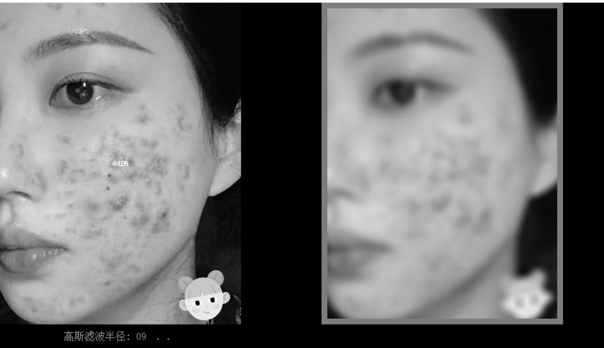
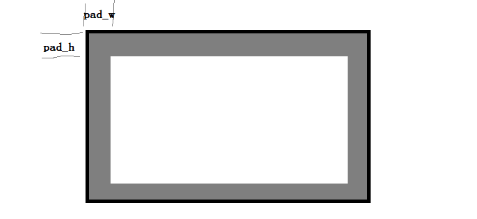
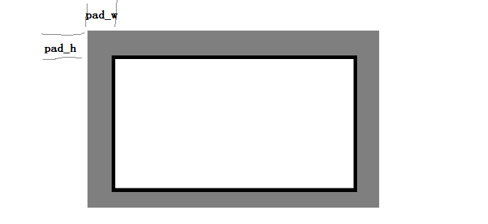
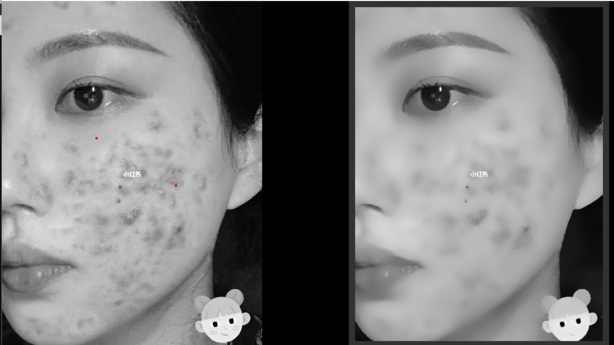

# 图像空间域操作：

图像空间域操作包括了：边界填充，图片高斯滤波，拉普拉斯-高斯滤波，双边滤波，局部均方差滤波，均值偏移滤波，均值、最小值、最大值，中值、众数、中点滤波等。

## 渲染器工作流程

**想要渲染器能正确工作，需要三步**：

1. 创建渲染器
2. 渲染器参数加载
3. 对图像进行渲染

**如果需要调整渲染参数，则需要重新进行参数加载**，渲染器才能用新的参数进行渲染。**若没有进行参数调整，无需重新进行参数加载**，以便批量处理图片时能达到高速运行。此外，使用完渲染器对象，则需要进行对象销毁。
## 边界填充
我们使用滤波核进行滤波时，图像通常会变小，下图摘自demo4.1，我们能看到右图外周有一圈灰色的框，那就是我们的填充值，如果不进行填充，得到的图像只有中间有效区那么大


不进行填充，我们的图像会随着滤波变得越来越小，进行边界填充以后我们就能使得图像保持大小不变。
```c
void YMCV_Image_Boundary_Padding_Const(CVIMAGE Imgio, uint16 pad_w, uint16 pad_h);

```
其中`Imgio`是我们需要填充的图像，`pad_w`是左右填充的宽度，`pad_h`是上下填充的高度，该函数会在图像周围填充上一圈的填充值，具体的填充值由`YMCV_PADDING_VAL`指定。

对于灰度图，也可以使用如下函数进行填充
```c
void YMCV_Gray_Image_Boundary_Padding_Const(uint8* datap, uint16 pad_w, uint16 pad_h, uint16 width, uint16 height);
```
其中datap是图像数据，width和height是图像宽度和高度。

对于复数图像(ComplexGray)则可以使用：
```c
void YMCV_ComplexGray_Image_Boundary_Padding_Const(float32* ak, float32* bk, uint16 pad_w, uint16 pad_h, uint16 width, uint16 height);
```
其中实部图数据`ak`和虚部图数据`bk`都将填充上`YMCV_PADDING_VAL`值。

当然如果不想使用`YMCV_PADDING_VAL`，想直接指定当前填充值，直接由函数传入，可以使用
```c
void YMCV_Gray_Image_Boundary_Padding_Val(uint8* datap, uint16 pad_w, uint16 pad_h, uint16 width, uint16 height, uint8 paddingval);
void YMCV_F32Gray_Image_Boundary_Padding_Val(float32* datap, uint16 pad_w, uint16 pad_h, uint16 width, uint16 height, float32 paddingval);
void YMCV_ComplexGray_Image_Boundary_Padding_Val(float32* ak, float32* bk, uint16 pad_w, uint16 pad_h, uint16 width, uint16 height, float32 val);
```


**实例**：对myIMG图片进行边界填充，边框填充宽度为5，高度为6，填充值为125：

```c
CVIMAGE myIMG；
.....
.....
YMCV_PADDING_VAL = 125；
uint8 pad_w = 5,pad_h = 6;
//边框填充
YMCV_Image_Boundary_Padding_Const(myIMG,pad_w,pad_h);
```

## 边界扩展
边界扩展和边界填充的区别在于，边界填充是从边界开始，向内填充，而边界扩展则是向外填充
```c
CVIMAGE YMCV_Image_Image_Padding(CVIMAGE Imgin, uint16 pad_w, uint16 pad_h, YMCVPADDINGFORM myform)
```
Imgin是需要进行扩展的图像，pad_w是扩展边界的宽，pad_h是扩展边界的高，myform是扩展类型（`CV_PaddingConst`是使用`YMCV_PADDING_VAL`填充，`CV_PaddingAutoSpace`是使用以边框为镜像的原始图填充，`CV_PaddingAutoPix`是直接使用图像边框上的像素进行填充）



## 空域滤波类型
空间滤波器类型`CVKERNELTYPE`有12种
```c
	CV_GaussFilter, //高斯滤波
	CV_LOGFilter,  //LOG滤波
	CV_BilFilter,//双边滤波
	CV_LMSEFilter, //局部均方差滤波  Local Mean Square Error Filter
	CV_MeanShiftFilter,//均值偏移滤波

	//不需要sigma参数进行初始化
	CV_AverFilter,  //均值滤波
	CV_MinFilter,//最小值滤波
	CV_MedFilter,//中值滤波
	CV_MaxFilter,//最大值滤波
	CV_ModeFilter,//众数滤波
	CV_MidPointFilter,//中点滤波

	//自定义滤波核，需要自己初始化
	CV_CustomFilter,
```
前面五种需要sigma参数进行初始化，后面的不需要，自定义的需要自己进行初始化
## 空域渲染器创建和销毁：

```c
CVKERN_RENDER YMCV_Creat_SpaceRender_Creat(CVKERNELTYPE rendform, PIXChannelNum channelnum, uint8 kernel_r, YMCVPADDINGType padding);//空间滤波渲染器创建
```
`rendform`为滤波类型（参考空域滤波类型），`channelnum`为待处理图像的通道数，`kernel_r`为滤波半径，`padding`为边界填充类型（可为`NOPadding`或者`OutPaddingConst`），使用`NOPadding`时将不进行边界填充，滤波后的结果图像将会比原图小，使用`OutPaddingConst`时则会使用`YMCV_PADDING_VAL`填充，滤波后的结果图像将会和原图等大。


使用完渲染器后，需要进行内存释放，可以采用下面函数
```c
void YMCV_Free_KERN_RenderFree(CVKERN_RENDER pthis);//CVKERN_RENDER 渲染器内存释放
```

实例：创建用于灰度图的高斯滤波的渲染器，滤波核半径为5，采用固定值125填充,使用完并销毁渲染器：

```c
CVKERN_RENDER myRender = YMCV_Creat_SpaceRender_Creat(CV_GaussFilter,PIXChannelNum1,5,OutPaddingConst)；
.....
YMCV_PADDING_VAL = 125;
.....
YMCV_Free_KERN_RenderFree(myRender);
```

## 空域滤波渲染器参数加载：

```c
void YMCV_Space_SingleKernel_Load(CVKERN_RENDER render, CV_kernel_1param* Param); //空间滤波器加载（初始化）
```

`render`是创建好的空域渲染器，`Param`是待加载的参数，需要根据你创建的滤波器类型选择相应的参数(也就是与滤波类型要相匹配，如果没有相应的可选参数，则说明无需参数加载)。


**实例**：为灰度图创建一个高斯滤波渲染器，设置高斯滤波sigma参数为1.0：

```c
//创建单通道高斯滤波器
CVKERN_RENDER myKernel = YMCV_Creat_SpaceRender_Creat(CV_GaussFilter, PIXChannelNum1, 5, NOPadding);
...
...
//设置渲染器参数，初始化为1.0
CV_kernel_1param myParam = { .gauss.sigma = 1.0f };

//将参数加载到渲染器，进行参数配置和初始化
YMCV_Space_SingleKernel_Load(myKernel, &myParam);

```

## 图像空域渲染：

```c
CVIMAGE YMCV_Image_Space_SigleKernel_Render(CVIMAGE myimg, CVKERN_RENDER render);
```

该函数是对`myimg`进行空间域滤波，空间滤波核为`render`，然后将处理结果返回为一张新的图片。使用前，需要先对`render`进行滤波参数设置。

**实例**：对灰度图myIMG进行高斯滤波，滤波半径为5，高斯σ为1.0，不进行边界填充，滤波完并释放内存：

```c
CVIMAGE myIMG = NULL；
...
...
...

//创建单通道高斯滤波器
CVKERN_RENDER myKernel = YMCV_Creat_SpaceRender_Creat(CV_GaussFilter, PIXChannelNum1, 5, NOPadding);
...
...
//设置渲染器参数，初始化为1.0
CV_kernel_1param myParam = { .gauss.sigma = 1.0f };

//将参数加载到渲染器，进行参数配置和初始化
YMCV_Space_SingleKernel_Load(myKernel, &myParam);

//使用空间渲染器进行渲染灰度图片
CVIMAGE resultImage = YMCV_Image_Space_SigleKernel_Render(myIMG, myKernel);

.....
.....
//用释放图像，避免下次用的时候导致内存泄漏
YMCV_Free_ImgFree(resultImage);

//释放空间渲染器
YMCV_Free_KERN_RenderFree(myKernel);
```

## 自定义空间渲染器滤波：

```c
CVIMAGE YMCV_Image_Space_CustomKernel_Render(CVIMAGE myimg, CVKERN_RENDER render);
```

其中myimg是源图像，render是自定义的空间滤波渲染器。该函数可以使用自定义的`N×N`大小的滤波核，对图像进行滤波。不过，使用该函数前，同样需要对渲染器进行参数加载


**实例**：将myIMG使用3×3的浮雕滤波核进行滤波：

```c
CVIMAGE myIMG；
...
 //创建自定义空间渲染器
uint8 kernel_r = 1;
uint8 Kernel_N = (2 * kernel_r + 1) * (2 * kernel_r + 1);
//注意：卷积模板大小取为正方形NxN，如r=1，则N=3。
CVKERN_RENDER myKernel = YMCV_Creat_SpaceRender_Creat(CV_CustomFilter, PIXChannelNum1, kernel_r, NOPadding);

//加载参数
float32 FDkernel[9] = { -1,-1, 0,  //浮雕滤波核
                         -1, 0, 1,
                          0, 1, 1 };  
//手动对渲染器进行参数加载
CV_memcpy(myKernel->data,FDkernel, Kernel_N*sizeof(float32));

//使用自定义空间渲染器进行渲染灰度图片
CVIMAGE resultImage  = YMCV_Image_Space_CustomKernel_Render(myIMG, myKernel);

...
//释放渲染器
YMCV_Free_KERN_RenderFree(myKernel);
//使用完图片，要释放图片内存
YMCV_Free_ImgFree(resultImage );
```

# 其他空域滤波函数：
除了上述常用的空域滤波算法，还提供了**图像引导滤波**，**图像均飘滤波**，**图像表面模糊滤波**，以及**图像形态学滤波**算法。

## 图像引导滤波
```c
CVIMAGE YMCV_Gray_Image_GuideFilter(CVIMAGE gray, CVIMAGE guid, YMCVPADDINGType padding, uint8 ker_r, float32 eta);
```
该函数使用时需要一张引导图，用做纹理的导向目标。它的作用便是将引导图的纹理按照一定的比例赋给原图。`gray`是源图像，`guid`是纹理引导图，`padding`是空域滤波的填充类型，`ker_r`是空域滤波的滤波半径，`eta`与引导比例有关，滤波完返回一张结果图像。源图纹理所占比例和$\frac{1}{eta}$有正相关的趋势，所以`eta`**必须是一个大于0的数**，其值越大，则引导图纹理对结果的影响越小。


## 图像均值偏移滤波

```c
CVIMAGE YMCV_Image_Space_MeanShift(CVIMAGE myimg, uint16 radius, uint16 threshold, uint16 maxIteration);
```
`myimg`是源图像（暂时只支持灰度图），`radius`空域滤波半径，`threshold`灰度相似阈值，`maxIteration`最大迭代次数，滤波完返回一张结果图像。该函数内部每次迭代时，每个像素的像素值会漂移到其邻域均值上，其邻域由空间域和灰度域共同决定。

## 图像表面模糊滤波

```c
CVIMAGE YMCV_Gray_SurfaceBlur(CVIMAGE gray, uint8 radius, uint8 threshold, YMCVPADDINGType padding);
```
`gray`是源图像，`radius`是空域滤波的滤波半径，`threshold`模糊阈值，`padding`是空域滤波的填充类型，滤波完返回一张结果图像。模糊滤波半径取值范围[1 - 100], 阈值[2 - 255]。

**实例**：对灰度图myIMG进行半径为9，阈值20的表面模糊滤波：

```c
CVIMAGE myIMG;
.....
 //使用表面模糊进行滤波
CVIMAGE myImage1 = YMCV_Gray_SurfaceBlur(myIMG, 9, 20, NOPadding);
```



上图摘自demo例程4.9运行结果，该算法常用来做美颜效果。

## 图像形态学滤波

```c
CVIMAGE YMCV_Binary_Morph_Hit_Cal(CVIMAGE myimg, CVFMAT morphMat,float32 hitRate);
```

`myimg`是源图像（暂时只支持二值图），`morphMat`是形态学滤波矩阵，`hitRate`是形态学击中率。滤波矩阵可以是长方形，也可以是正方形；击中率取值范围[1 - 99]，当击中率设置1时，即**形态学膨胀**，击中率设置为99时，即**形态学腐蚀**，若为50，即中值滤波，这个大家可以自己根据所需效果进行调整。

**实例**：对二值图myIMG进行形态学膨胀，滤波矩阵取4×4大小：

```c
CVIMAGE myIMG;
.....
//击中矩阵：需要击中的部分记为1，其余部分为0
float32 hmat = { 1,1,
                 1,1};

//创建滤波矩阵
CVFMAT myKernel = YMCV_Creat_FMAT_Creat(4, 4);

//计算形态学击中效果，输出击中率>1% 的结果，即膨胀效果
CVIMAGE myImage1 = YMCV_Binary_Morph_Hit_Cal(myImage0, myKernel,1);
       
```

# 卷积滤波函数：
这里的卷积实际上指的是使用滤波核对图像进行滤波操作，与信号处理中的卷积操作不是同一回事。这里提供了两种卷积操作，一种含边界自适应处理（将越界的像素都填充为0，然后进行滤波），另一种不含自适应处理，直接填充0（一旦有像素越界，输出直接为0）。

## 浮点 3×3滤波 
用于3×3滤波核滤波，含越界自适应处理
```c
void YMCV_GrayConvFker_3X3(float32* mykernel, CVIMAGE myimg, uint8* outp);
```
mykernel是滤波核，myimg是待处理的灰度图像，outp是输出数据的缓存，它必须和原图大小一致。
## int16 3×3滤波
用于3×3滤波核滤波，不含边界自适应处理
```c
void YMCV_GrayConvFker_3X3(float32* mykernel, CVIMAGE myimg, uint8* outp);
```
mykernel是滤波核，myimg是待处理的灰度图像，outp是输出数据的缓存，它必须和原图大小一致。
## 高斯分离卷积加速
使用3×3高斯滤波核的有两个，分别处理uint8和int16类型数据。
使用5×5高斯滤波核的有1个，用于处理uint8类型数据。
```c
void YMCV_GrayGaussConvIker_3X3(uint8* outp, uint16 width, uint16 height);//3x3高斯核快速计算 越界则输出为0
void YMCV_I16_GaussConvIker_3X3(int16* outp, uint16 width, uint16 height);//3x3高斯核快速计算 越界则输出为0
void YMCV_GrayGaussConvIker_5X5(uint8* outp, uint16 width, uint16 height);//5x5高斯核快速计算 越界则输出为0
```
`outp`是传入的图像，`width`、`height`是图像的宽和高。计算得到的结果将覆盖`outp`，即`outp`也作为输出结果使用。
## 高斯合并卷积加速
使用3×3高斯滤波核的有两个，分别处理uint8和float32类型数据。
使用5×5高斯滤波核的有1个，用于处理uint8类型数据。
```c
void YMCV_GrayGaussConvFker_3X3(uint8* inp, float32* outp, uint16 width, uint16 height);
void YMCV_F32_GaussConvFker_3X3(float32* inp, float32* outp, uint16 width, uint16 height);
void YMCV_GrayGaussConvFker_5X5(uint8* inp, float32* outp, uint16 width, uint16 height);
```
`inp`是传入的图像，`outp`是传出图像（两者数据个数要一致，以此确定输出缓存的长度），`width`、`height`是图像的宽和高。

## 彩色图渲染
虽然空域渲染大部分函数不直接支持彩色图，但有两种方法，可以用来对彩色图产生效果：

第一种方法是将彩色图分解为R、G、B三个单通道图像，每个图像当作灰度图进行空域渲染，然后再合并为彩色图。

而第二种方法直接将灰度图的灰度强度映射给彩色图，比第一种方法消耗的资源更少也更加简单
```c
void YMCV_Gray_ColorTo_Rgb16(CVIMAGE gray, CVIMAGE rgb);//将灰度强度映射给彩图
```
`gray`是空域滤波后的灰度图，`rgb`是原彩色图。输出结果直接覆盖到`rgb`上。
