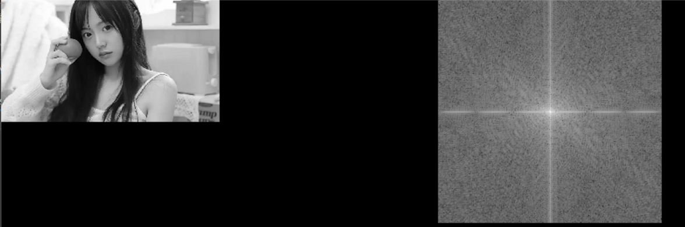
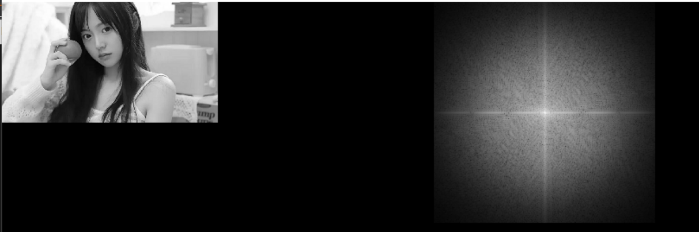

# 频域空间操作：
要对图片进行频域操作，首先要对其进行频域变换，将图片从空间域变换到频域。
## 渲染器工作流程

**想要渲染器（滤波器）能正确工作，需要三步**：

1. 创建渲染器
2. 渲染器参数加载
3. 对图像进行渲染

**如果需要调整渲染参数，则需要重新进行参数加载**，渲染器才能用新的参数进行渲染。**若没有进行参数调整，无需重新进行参数加载**，以便批量处理图片时能达到高速运行。此外，使用完渲染器对象，则需要进行对象销毁。

## 频域FFT变换器创建与销毁
```c
CVFFT2D_RENDER YMCV_Creat_FFT2D_Render_Creat(int16 width, int16 height);
```
`width`和`height`是待处理图像的宽和高。该函数基于1D-FFT滤波核创建，FFT2D由两个FFT1D构成（横向和纵向），并将这两个FFT1D处理数据的长度更新为渲染器内部参数。所以传入的`width`和`height`两个参数，和最终渲染器内部的`width`和`height`不一定一样，渲染器内部的width和height长度为$2^n$。

使用完频域FFT变换器，需要释放FFT变换器，可以使用下列函数：
```c
YMCV_Free_FFT2D_RenderFree(myKernel);
```

## FFT 与 IFFT
通过快速傅里叶变换（FFT），我们可以将图像从空间域变换到频域。通过IFFT，我们则可以将图像从频域变换到空间域。
```c
void YMCV_Gray_Image_FFT(CVFFT2D_RENDER render, CVIMAGE myimg, CVIMAGE imgc);
void YMCV_Gray_Image_IFFT(CVFFT2D_RENDER render, CVIMAGE myimg, CVIMAGE imgc);
```
`render`是创建的FFT变换器，`myimg`是空间域的灰度图像，`imgc`是频域图像(需要预先创建好)。其中`imgc`最好使用FFT变换器的宽高参数来创建，且类型必须complex类型；当然，若不使用FFT变换器的宽度和高度进行创建，图像大小也会自动重新规划大小，以满足滤波器需求。


对于复数图，则提供了如下两个函数进行变换：
```c
void YMCV_CGray_Image_FFT(CVFFT2D_RENDER render, CVIMAGE myimgc, CVIMAGE imgoc);//复数图fft
void YMCV_CGray_Image_IFFT(CVFFT2D_RENDER render, CVIMAGE myimgc, CVIMAGE imgc);
```
实例：将灰度图myIMG变换到频域，再逆变换回空域：

```c
CVIMAGE myIMG;
.....
//创建待处理图像的专属 fft变换器
CVFFT2D_RENDER transformer = YMCV_Creat_FFT2D_Render_Creat(myIMG->width, myIMG->height);

//输出图像预创建
CVIMAGE cgrayIMG = YMCV_Creat_Img_Creat(transformer->width, transformer->height,CVCGrayType);

//进行FFT变换
YMCV_Gray_Image_FFT(transformer, myIMG, cgrayIMG);//结果存在cgrayIMG

...
...
//进行iFFT变换
YMCV_Gray_Image_IFFT(transformer, myIMG, cgrayIMG);//结果存回myIMG

...
//使用完图片，要释放图片内存
YMCV_Free_ImgFree(cgrayIMG);

//释放FFT变换器
YMCV_Free_FFT2D_RenderFree(transformer);
```

## fftshift 与 ifftshift：

fft变换以后，还需要通过shift将频谱移到图像中心，以便后续做滤波。做完滤波以后，需要ishift将频谱位置还原，然后才能使用ifft。对于偶数宽高图像，shift与ishift操作实际上是相同的：

```c
void YMCV_CGray_Image_FFTshift(CVIMAGE imgc);
```
## 复数向量 与 模长和相位：
如果要查看频谱图，一般情况下会将将一个二维复数向量转化为幅度+相位进行表示，并且我们查看的时候，只查看幅度图，而不看相位图。
```c
void YMCV_CGray_Image_LogMag_AndPhase(CVIMAGE imgc);//频域图像计算模长(含log变换)和相位 
void YMCV_CGray_Image_expMag_ToComplex(CVIMAGE imgc);//频域图像模长(含exp变换)相位转复数图
```
上面两个函数，前者将复数图转为 模长+相位表示，后者将模长+相位表示 重新变换为复数图。
## LogMag 与 expMag：
我们对于图像的频谱幅度图查看时，一般取会取log，这样可以将范围很大的区间，压缩到较小的区间，使得频谱特征分布更加明显。而expMag则对应着log的逆操作：
```c
void YMCV_CGray_Image_LogMag_AndPhase(CVIMAGE imgc);//频域图像计算模长(含log变换)和相位 
void YMCV_CGray_Image_expMag_ToComplex(CVIMAGE imgc);//频域图像模长(含exp变换)相位转复数图
```


实例：对灰度图myIMG转FFT频域并进行shift，然后进行logMag操作，然后通过expMag还原未复数并进行ishift操作，然后进行IFFT：

```c
CVIMAGE myIMG;
.....
//创建待处理图像的专属 fft变换器
CVFFT2D_RENDER transformer = YMCV_Creat_FFT2D_Render_Creat(myIMG->width, myIMG->height);

//输出图像预创建
CVIMAGE cgrayIMG = YMCV_Creat_Img_Creat(transformer->width, transformer->height,CVCGrayType);

//进行FFT变换
YMCV_Gray_Image_FFT(transformer, myIMG, cgrayIMG);//结果存在cgrayIMG
//fftshift变换
YMCV_CGray_Image_FFTshift(cgrayIMG);
//先转幅度和相位
YMCV_CGray_Image_LogMag_AndPhase(cgrayIMG);
...
...
//由幅频图转回复数图
YMCV_CGray_Image_expMag_ToComplex(cgrayIMG);
//ifftshift变换
YMCV_CGray_Image_FFTshift(cgrayIMG);
//进行iFFT变换
YMCV_Gray_Image_IFFT(transformer, myIMG, cgrayIMG);//结果存回myIMG

...
//使用完图片，要释放图片内存
YMCV_Free_ImgFree(cgrayIMG);
//释放FFT变换器
YMCV_Free_FFT2D_RenderFree(transformer);
```


上图摘自demo例程5.1运行结果，如果没有进行logMag变换，则不会呈现出如此清晰明显的十字痕。

## DCT 与 IDCT
二维 DCT 变换器创建如下，其中参数width和height是待处理图像的大小。
```c
CVDCT2D_RENDER YMCV_Creat_DCT2D_Render_Creat(int16 width, int16 height);
```
DCT 变换器销毁如下:
```c
void YMCV_Free_DCT2D_RenderFree(CVDCT2D_RENDER pthis);
```
对图像进行DCT和IDCT函数如下
```c
void YMCV_Gray_Image_DCT(CVDCT2D_RENDER render, CVIMAGE myimg, CVIMAGE imgf);
void YMCV_Gray_Image_IDCT(CVDCT2D_RENDER render, CVIMAGE myimg, CVIMAGE imgf);
```
参数与fft变换中的功能类似，`render`是变换器，`myimg`是空间与的灰度图，`imgf`是频域图（需事先创建好，其大小由render的内部参数width和height确定）。
## DWT 与 ICWT
二维 DWT 变换器创建如下，其中参数width和height是待处理图像的大小。
```c
CVDWT2D_RENDER YMCV_Creat_DWT2D_Render_Creat(int16 width, int16 height);
```
DWT 变换器销毁如下:
```c
void YMCV_Free_DWT2D_RenderFree(CVDWT2D_RENDER pthis);
```
对图像进行DWT和IDWT函数如下
```c
void YMCV_Gray_Image_DWT(CVDWT2D_RENDER render, CVIMAGE myimg, CVIMAGE imgf);
void YMCV_Gray_Image_IDWT(CVDWT2D_RENDER render, CVIMAGE myimg, CVIMAGE imgf);
```
参数与dct变换中的功能类似，`render`是变换器，`myimg`是空间与的灰度图，`imgf`是频域图（需事先创建好，其大小由render的内部参数width和height确定）。
## 频域滤波类型
```c
    //FFT区
    CV_GaussHFilter, //高斯高通滤波
    CV_GaussLFilter, //高斯低通滤波
    CV_ButterWorthHFilter, //巴特沃斯高通滤波
    CV_ButterWorthLFilter, //巴特沃斯低通滤波
    CV_BandPassFilter, //带通滤波
    CV_BandStopFilter, //带阻滤波
    //HARR区
    CV_HarrThreshFilter, //哈尔小波硬阈值滤波
```
频域滤波类型又分两个区，fft的频域和harr的小波域。高通滤波也就让高频得以通过的滤波，通常效果就是能够提取边缘细节。低通滤波也就是通低频，通常效果是使得图像细节丢失，变得模糊。

## 频域滤波器创建与销毁：

```c
CVFREQ_RENDER YMCV_Creat_FreqKernel_Render_Creat(CVFREQTYPE kernlType, CVCOMPLEXTYPE ComplexType);
```

`kernlType`是频域滤波类型，`ComplexType`是频域图像的表示类型，为`CV_RealAndImag`则频域图以实部和虚部表示，若为`CV_RhoAndTheta`则频域图需以幅度+相位表示。

频域滤波器使用完，可以使用如下函数进行销毁：
```c
void YMCV_Free_FreqKernel_RenderFree(CVFREQ_RENDER pthis);
```
## 频域滤波器加载
创建好滤波器后，需要对其进行参数加载，才能使用滤波器进行滤波，参数加载可以使用如下函数

```c
void YMCV_Freq_Kernel_Load(CVFREQ_RENDER render, CV_freq_1param param);
```
`render`是滤波器，`param`是待加载的参数，它根据你的滤波的类型选择相应参数进行填充。

高斯低通滤波：
>$H(u,v)=e^{\frac{-D^2(u,v)}{2D_0}}$

高斯高通滤波：
>$H(u,v)=\frac{1}{1+(\frac{D(uv)}{D_0})^{2n}}$

巴特沃斯低通滤波：
>$H(u,v)=\frac{1}{1+(\frac{D_0}{D(uv)})^{2n}}$

巴特沃斯高通滤波：
>$H(u,v)=1-e^{\frac{-D^2(u,v)}{2D_0}}$

带阻滤波：
>$H(u,v) = \left\{ \begin{aligned}
>0 & & |D-D_0|<W \\
>1 & & |D-D_0|>W \\
>\end{aligned}\right.$

带通滤波：
>$H(u,v)= \left\{ \begin{aligned}
>1 & & |D-D_0|<W \\
>0 & & |D-D_0|>W \\
>\end{aligned}\right.$

式中$D$是$(u, v)$点到频率原点的距离。
## 图像频域核滤波渲染
```c
CVIMAGE YMCV_Gray_Image_Freq_Kernel_Render(CVIMAGE myimg, CVFREQ_RENDER render);
```
`myimg`是待处理的频域图，`render`是频域滤波器。需要注意，滤波类型要和频域图类型相匹配，如fft域的滤波，频域图是复数图，而dwt域的滤波，频域图为浮点图。

**实例**：对灰度图myIMG进行巴特沃斯低通滤波，参数D0取100，n取2：

```c
CVIMAGE myIMG;
.....
//创建待处理图像的专属 fft变换器
CVFFT2D_RENDER transformer = YMCV_Creat_FFT2D_Render_Creat(myIMG->width, myIMG->height);

//输出图像预创建
CVIMAGE cgrayIMG = YMCV_Creat_Img_Creat(transformer->width, transformer->height,CVCGrayType);

//进行FFT变换
YMCV_Gray_Image_FFT(transformer, myIMG, cgrayIMG);//fft结果存在cgrayIMG
YMCV_CGray_Image_FFTshift(cgrayIMG);//fftshift变换
YMCV_CGray_Image_LogMag_AndPhase(cgrayIMG);//先转幅度和相位
...

//创建特沃斯低通滤波,复数格式为幅度与相位
CVFREQ_RENDER freqKernl = YMCV_Creat_FreqKernel_Render_Creat(CV_ButterWorthLFilter, CV_RhoAndTheta);
//加载巴特沃斯滤波器参数
CV_freq_1param myparam = { .butterworth.D0 = 100,.butterworth.n = 2 };
YMCV_Freq_Kernel_Load(freqKernl, myparam);
//对幅度进行滤波
YMCV_Gray_Image_Freq_Kernel_Render(cgrayIMG, freqKernl);

...
//进行iFFT变换
YMCV_CGray_Image_expMag_ToComplex(cgrayIMG);//由幅频图转回复数图
YMCV_CGray_Image_FFTshift(cgrayIMG);//ifftshift变换
YMCV_Gray_Image_IFFT(transformer, myIMG, cgrayIMG);//ifft结果存回myIMG

...
//使用完图片，要释放图片内存
YMCV_Free_ImgFree(cgrayIMG);
//释放FFT变换器
YMCV_Free_FFT2D_RenderFree(transformer);
```

上图摘自demo例程5.5运行结果，如果没有进行logMag变换，则不会呈现出如此清晰明显的十字痕。

