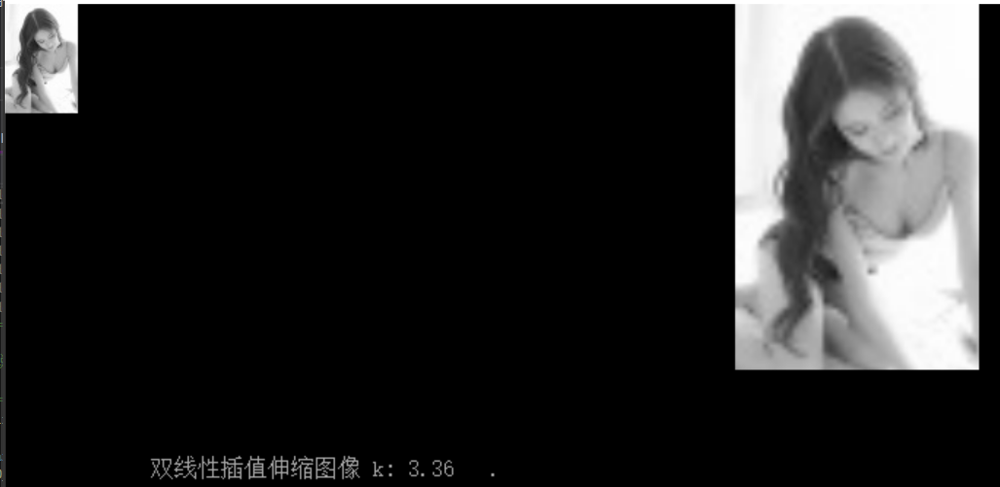

# 几何变换操作：
对图片进行几何操作，可以是平移、旋转、透视、伸缩、Polar变换。
## 渲染器工作流程

**想要渲染器能正确工作，需要三步**：

1. 创建渲染器
2. 渲染器参数加载
3. 对图像进行渲染

**如果需要调整渲染参数，则需要重新进行参数加载**，渲染器才能用新的参数进行渲染。**若没有进行参数调整，无需重新进行参数加载**，以便批量处理图片时能达到高速运行。此外，使用完渲染器对象，则需要进行对象销毁。

## 几何变换渲染器创建与销毁
```c
CVGEOM_RENDER YMCV_Creat_GeomRender_Creat(CVGEOMETHOD rendform);
```
`rendform`是变换的类型，有以下多种选项：
```c
	CV_Stretch,  //最邻近内插法 拉伸 | 压缩
	CV_StretchL2,//双线性内插法 拉伸 | 压缩

	CV_RotateWauto,//图像旋转变换 输出窗口自适应
	CV_RotateWconst,//图像旋转变换 固定窗口

	CV_LinerPolar,//图像线性极坐标变换
	CV_LogPolar,//图像对数极坐标变换
	CV_LinerPolar_Inverse,//线性极坐标 逆变换
	CV_LogPolar_Inverse,//对数极坐标 逆变换

	CV_Perspective,//透视变换
```

使用完几何渲染器，需要释放几何渲染器器，可以使用下列函数：
```c
void YMCV_Free_GEOM_RenderFree(CVGEOM_RENDER pthis);
```

## 几何渲染器参数加载
```c
void YMCV_GeomKernel_Load(CVGEOM_RENDER render, CV_geom_param* Param);
```
`render`是创建的几何渲染器，`Param`是配置的参数，它要与创建render时使用的参数（变换类型）相匹配。另外要注意的是，**每个几何渲染器的参数只能加载一次**，如果要重新加载参数，必须销毁该渲染器并重新创建一个。


## 几何渲染
```c
CVIMAGE YMCV_Image_Geom_RenderTo(CVIMAGE Imgin, CVGEOM_RENDER render);
```
`Imgin`是输入的图像（目前支持彩色图，灰度图，二值图，浮点灰度图等等），`render`是创建的几何渲染器，渲染完毕会返回一张图像。

实例：对myIMG进行几何放缩，宽度放缩0.8倍，高度放缩1.2倍：

```c
CVIMAGE myIMG;
.....
 //创建几何变换渲染器
CVGEOM_RENDER myRender1 = YMCV_Creat_GeomRender_Creat(CV_Stretch);

//初始化参数
CV_geom_param myParam = {.stretch.Imgin_w= myIMG->width, //输入图像的参数
                         .stretch.Imgin_h = myIMG->height};

myParam.stretch.out_w = myIMG->width * 0.8;//输出图像的参数
myParam.stretch.out_h = myIMG->height * 1.2;

//对几何渲染进行参数加载
YMCV_GeomKernel_Load(myRender1, &myParam);

//将目标图像的进行渲染
CVIMAGE myImage2 = YMCV_Image_Geom_RenderTo(myIMG,myRender1);

...
//释放渲染器
YMCV_Free_GEOM_RenderFree(myRender1);
//用释放图像，避免下次用的时候导致内存泄漏
YMCV_Free_ImgFree(myImage2);
```


上图摘自demo例程6.2运行结果，双线性插值放缩不会产生严重的锯齿感。

## 单应性变换 与 透视矩阵
在图像拼接中，我们能够收集两张图片相互匹配的特征点对，通过多个特征点对，我们就能找到两幅图像的坐标变换关系。
```c
CVFMAT YMCV_FindHomography_Ransac(CVVECTORS_U16 X2, CVVECTORS_U16 X1, float32 pConfidence, uint32 innerThreshPow2);
```
我们假设矩阵变换关系为：$X_2 = M_A * X_1$，参数`pConfidence`是ransac迭代后所求$M_A$矩阵的置信度，取值范围在[0.001 - 0.999]区间；`innerThreshPow2`是内点距离阈值的平方，内点距离代表着X1的某点通过该矩阵变换后的位置与实际X2位置的误差。经过一定次数的迭代，会返回一个变换矩阵。


得到上述单应性变换矩阵后，我们如果想通过该矩阵，对图像进行姿态调整，需要将其转为透视变换渲染器：
```c
CVGEOM_RENDER YMCV_HomographyMat_ToPerspective_GeomRender(CVFMAT myMat, uint16 Imgin_w, uint16 Imgin_h, CVWINSIZE wsize_type);//单应矩阵转透视渲染器
```

