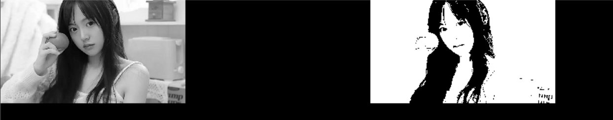
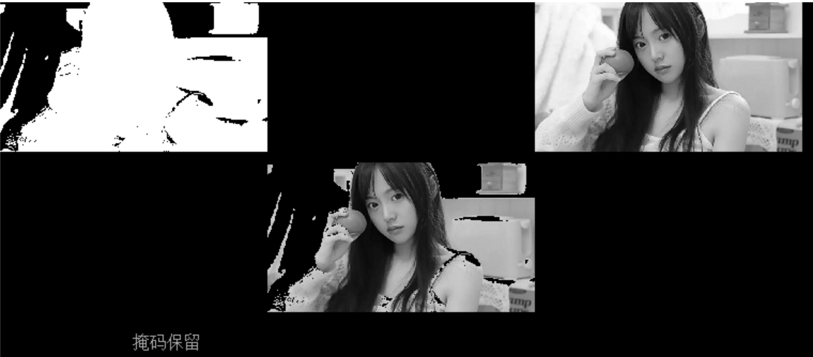
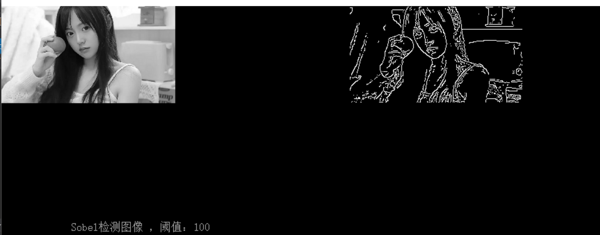
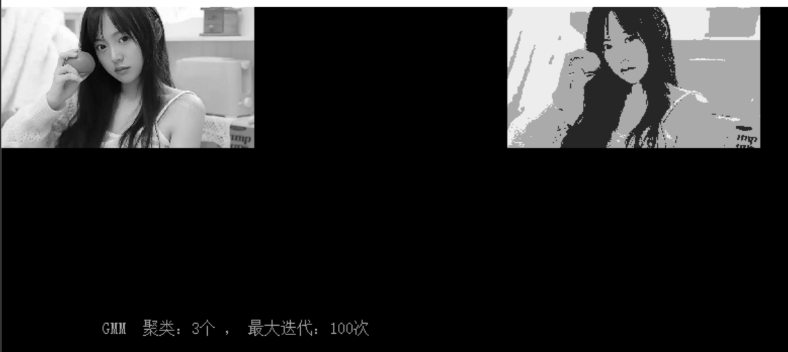
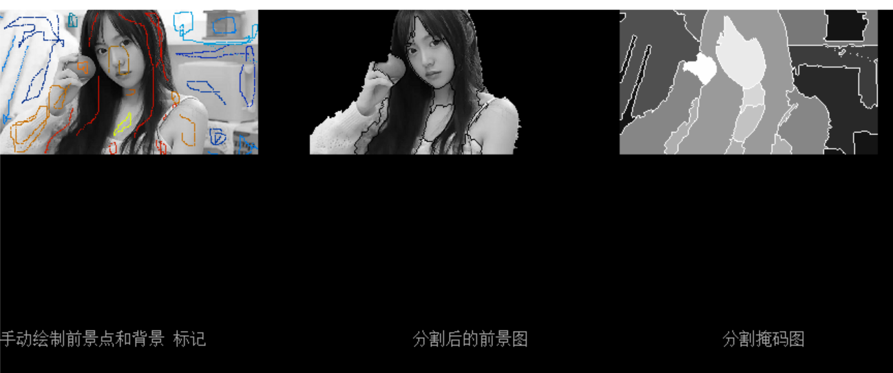

# 图像分割操作：

基本分割手段包括了三类：二值化分割，边缘分割，区域分割。

## 二值化渲染器创建与销毁：

二值化渲染器创建方法如下

```c
CVBINARY_RENDER YMCV_Creat_BinaryRender_Creat(CVThreshold rendform);
```

预设的二值化方式(`rendform`)有6种，分别为    

```c
    CV_SingleThreshold,//单阈值
    CV_DoubleThreshold,//双阈值
    CV_RGB2Threshold,//RGB双阈值
    CV_LAB2Threshold,//LAB双阈值
    CV_IntegralThreshold,//积分图二值化
    CV_HistThreshold,//直方图二值化
```

使用完二值化渲染器，可以用如下函数销毁

```c
void YMCV_Free_Binary_RenderFree(CVBINARY_RENDER pthis);
```

## 二值化渲染器参数加载

```c
void YMCV_BinaryKernel_Load(CVBINARY_RENDER render, CV_binary_param* Param);
```

`render`为二值化渲染器， `Param` 为待加载的参数，在设置Param参数时，需要和render的二值化类型相匹配。

## 二值化渲染

```c
void YMCV_Image_ThreshTo_Binary(CVIMAGE Imgin, CVIMAGE Imgout, CVBINARY_RENDER render)
```

`Imgin`是输入图像，`Imgout`是输出的二值图像，它需要事先创建好，大小与输入图像相同，`render`是二值化渲染器。

实例：对灰度图myIMG进行单阈值分割：

```c
CVIMAGE myIMG;
.....
//创建输出二值图像
CVIMAGE BinaryImg = YMCV_Creat_Img_Creat(myIMG->width, myIMG->height,CVBinaryType);//二值图
...

//创建二值变换渲染器
CVBINARY_RENDER binaryRender = YMCV_Creat_BinaryRender_Creat(CV_SingleThreshold);

//初始化渲染器参数
CV_binary_param myParam = { .gray_single_t.thresh=127};
//对渲染器加载参数
YMCV_BinaryKernel_Load(binaryRender, &myParam);

//将目标图像的进行二值化渲染，结果放置于BinaryImg
YMCV_Image_ThreshTo_Binary( myIMG, BinaryImg, binaryRender);

...
...

//释放渲染器
YMCV_Free_Binary_RenderFree(binaryRender);
```


上图摘至demo例程7-1.1，二值化效果。

## 二值图逻辑运算

有时对两幅二值图，我们可能还需要求交集（逻辑与），并集（逻辑或），或补集（逻辑非），这样后续才能得到相关完整的特征。

```c
void YMCV_Image_Binary_Logic_Cal(CVIMAGE Imgin, CVIMAGE Imginout, CVLOGIC LogicCalType);
```

`Imgin`，`Imginout`是输入的两幅二值图，`LogicCalType`是逻辑运算类型，计算结果将覆盖到`Imginout`。

`LogicCalType`的类型如下

```c
    CV_And,//逻辑与
    CV_Or,//逻辑或
    CV_Not,//逻辑非
```

## 二值图面积过滤

有时，我们不能直接对两幅二值图做逻辑运算，需要事先过滤一些噪点

```c
void YMCV_Binary_AreaFilter(CVIMAGE myimg, uint32 minArea);//二值图面积过滤
```

`myimg`是输入的二值图，`minArea`是最小的保留面积，面积（该连通域的像素总数）低于该值的白色区域都将被过滤消除，结果将覆盖到myimg中。

## 图像掩码保留

我们可以将二值图作为掩码覆盖到原图上，让二值图中白色的点得到保留，黑色的点被剔除。

```c
void YMCV_Image_BinaryMask_Cal(CVIMAGE Imgin, CVIMAGE BinaryMask);
```

`Imgin`是输入的二值图，`BinaryMask`是掩码图，掩码结果直接覆盖`Imgin`。

上图摘至demo例程7-1.8，掩码保留效果。

## 边缘检测

基于边缘分割的方法中，最重要的就是边缘检测

```c
void YMCV_Gray_EdgeDetect(CVIMAGE Imgin, CVIMAGE Imgout, CV_Edge_Param edgeParam);
```

其中`Imgin`是输入的灰度图像，`Imgout`是输出的边缘图像（二值图），`edgeParam`是执行边缘检测的参数。`edgeParam`内部有两个参数，一个是边缘检测的类型`EdgeType`，另一个是对应边缘检测类型的阈值`Thresh`。其中类型`EdgeType`如下

```c
    //输出原始图
    CV_Sobel_0,
    CV_Log_0,
    CV_Laplace_0,
    //只保留边界
    CV_Sobel,//sobel
    CV_Log,//log
    CV_Laplace,//laplace，一般用于二值图边缘检测
    CV_Canny,//canny
    CV_Sobel_Connect,//sobel + 局部相似连接
```

其中`CV_Sobel_0`等，执行的是传统意义上的sobel边缘检测，只对图像进行sobel滤波，然后输出一个灰度图（梯度图）。需要注意的是，虽然我们传入的`Imgout`是二值图，在进行传统边缘检测时它会自动被修改为灰度图格式。

如果使用`CV_Sobel`等，输出的才是二值图（边界图），它在传统sobel的基础上增加了非极大值抑制等等方法，并只保留了边界。

实例：对灰度图myIMG进行sobel边缘检测：

```c
CVIMAGE myIMG;
.....
//创建输出二值图像
CVIMAGE edgeImg = YMCV_Creat_Img_Creat(myIMG->width, myIMG->height, CVBinaryType);//二值图
...

//初始化边缘检测参数
CV_edge_param myParam = { .EdgeType = CV_Sobel ,.Thresh.sobel.minT=100 };

//进行边缘检测
YMCV_Gray_EdgeDetect(myIMG, edgeImg, &myParam);
```


上图摘至demo例程7-2.1，边缘检测效果。

## 区域生长

```c
CVIMAGE YMCV_Gray_Region_Growing8(CVIMAGE myimg, uint16 w, uint16 h, uint8 Detathreshold);
```

`myimg`是待生长的图片，`w`、`h`是种子点在myimg图中的坐标，`Detathreshold`是生长停止的阈值，种子点处像素值±`Detathreshold`即边界的像素值。

## 区域分裂与合并

```c
CVIMAGE YMCV_Gray_Region_Splitand(CVIMAGE myimg, uint8 thresh);//区域分裂
CVIMAGE YMCV_Gray_Region_Merge(CVIMAGE myimg, uint8 thresh);//区域合并
```

`myimg`是待处理的灰度图，`thresh`是两个区域分裂or合并的阈值。

## KMeans聚类

```c
CVIMAGE YMCV_Gray_KMeans_Clustering(CVIMAGE myimg, uint8 K_Num, uint16 maxIteration);//kmeans聚类分割
```

`myimg`是待处理的灰度图，`K_Num`是设置的像素类别总个数，`maxIteration`是kmeans算法最大迭代次数，最终返回一张结果图像，每一类的像素都取该类像素均值作为类的结果。

## GMM聚类

```c
CVIMAGE YMCV_Gray_GMM_Clustering(CVIMAGE myimg, uint8 ClusterNum, uint16 maxIteration);//GMM聚类分割
```

`myimg`是待处理的灰度图，`ClusterNum`是设置的像素类别总个数，`maxIteration`是kmeans算法最大迭代次数，最终返回一张结果图像，每一类的像素都取该类像素 高斯期望值$\mu$ 作为类的结果。

上图摘至demo例程7-3.4，高斯混合模型（GMM）分割效果。

## 距离变换

```c
CVIMAGE YMCV_Binary_Distance_Transform(CVIMAGE myimg);//距离变换
```

`myimg`是待处理的二值图，进行距离变换后，将返回一张灰度图作为结果。

## TriMap图生成

TriMap又称为三色图，这里的三色不是指三种颜色，而是指分前景色，中间色（或待定色），以及背景色。其中前景色取值范围[`CVTriMapMinVl` ~ `CVTriMapMidle`]，中间色`CVTriMapMidle`，背景色取值范围[`CVTriMapMidle` ~ `CVTriMapMaxVl`]。

可以**由前景和背景的掩码图生成**三色图：

```c
CVIMAGE YMCV_BinaryTo_TriMap(CVIMAGE foreground_Binary, CVIMAGE background_Binary);
```

`foreground_Binary`是前景区域的二值掩码图，`background_Binary`是背景区域的二值掩码图，返回结果为一张三色图，掩码图中只属于前景区域的地方，TriMap标为前景色，只属于背景区域的地方被标为背景色，其他区域（重叠后者都不属于）则被标为中间色。

当然，三色图也可以**直接手动创建出三色图空图像**，然后再用如下方式进行初始化

```c
void YMCV_TriMap_Init(CVIMAGE TriMapMarkers);//TriMap手动初始化为 Midle 值
```

TriMapMarkers是传入的三色图空图像，这种方式常用于前景区域要分为很多个区域，背景区域可能也要分为很多个区域。比如在图像分水岭中，可能需要设置多个区域的种子点，而种子点又可以分属前景区域与背景区域。

## TriMap边界图获取

使用TriMap进行（分水岭算法等）分割图像后，在分割的两类区域之间会有产生一个边界，此时TriMap中会增加一类边界值`CVTriMapEdgev`,它不属于任何一类。TriMap的边界图，可以由下列方法获取

```c
CVIMAGE YMCV_TriMap_GetEdge(CVIMAGE TriMapMarkers);//获取Trimap的边界
```

## 图像分水岭

```c
void YMCV_Gray_Watershed(CVIMAGE myimg, CVIMAGE TriMapMarkers);//分水岭
```

`myimg`是待分割图像，`TriMapMarkers`是三色标记图，需要标记好前景色与背景色，前景色可以标记多个，背景色也可以标记多个。分割结果会放在`TriMapMarkers`中。

## 图像掩码区提取

```c
CVIMAGE YMCV_Image_Mask(CVIMAGE mask, CVIMAGE image)
```

`mask`为掩码图（支持TriMap或者二值图），`image`为待提取的图像（暂只支持灰度图）。提取结果将作为一张新的图像返回。



上图摘自demo例程7-3.7运行结果。

## GrabCut分割

```c
void YMCV_Gray_GrabCut(CVIMAGE myimg, CVIMAGE TriMapMarkers, int iterCount);
```

`myimg`是待分割的图像，`TriMapMarkers`是三色标记图，`iterCount`是maxflow的迭代次数。该算法速度较慢，但优点只需对前景区域的范围进行粗略标记，它能对前景背景标记区进行自动调整。使用该算法时，可以尝试将图像进行缩小然后在分割，再将分割结果放大。该算法常用于自动抠图，可以将前景物体从图像中抠出来。

## Snake轮廓

```c
void  YMCV_Gray_Snake(CVIMAGE myimg, 
    uint16* xs, uint16* ys, uint16 xynums,//点坐标，点个数
    uint8 search_r, uint16 max_iter,//搜索半径，最大迭代次数
    float32 alpha, float32 beta, float32 gamma, //Esnake=αEcont+βEcurv+γEext
    float32 w_l, float32 w_e);//Eext=Eimage= -(w_l*image + w_e*gradient)
```

`myimg`是输入灰度图，`xs`、`ys`、`xynums`是点集的横纵坐标以及个数；`search_r`是搜索半径，`max_iter`是最大迭代次数，`alpha`、`beta`、`gamma`是snake能量的参数，`w_l`、`w_e`是外部能量的参数，`w_l`越大，则朝着亮的区域跑，`w_e`越大则朝边缘跑。

## 投影直方图分割

```c
void YMCV_Binary_Proj_Hist_Seg(CVVECTORS_U16 myhist, uint16 segMax, uint8 clear_shortLenMax);
```

`myhist`是统计直方图，`segMax`是分割的参考阈值，如果存在点大于`segMax`，该段直方图会作为一个独立区域被分割出来，`clear_shortLenMax`是最短有效长度，如果分割出来的区段长度小于该值，则会被当作噪声滤除。

该方法在简易字符提取中会用到，实例可参考Demo例程7-3.10
