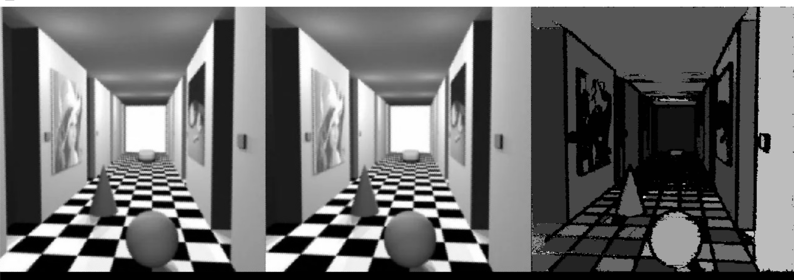

# 特征提取

特征提取是将图像以一种更简短的抽象方式进行描述，特征根据实际需求，常用的有色块特征、线条特征、形状特征、HOG、LBP、直线特征、骨架特征、边界特征、特征点、特征描述子等等。

## 色块查找

```c
CVVECTORS_U16 YMCV_Image_ColorBox_Find(CVIMAGE myimg, CVcolor minVal, CVcolor maxVal, uint32 minArea, uint8 showSeg);/
```

`myimg`是输入图像（支持二值图，三色图，灰度图，彩色图），它内部使用的是双阈值分割，像素值在[`minVal`~`maxVal`]范围内的颜色像素会被分割出来，然后进行区域块的特征信息提取（位置、面积、外接矩形框等等），`minArea`是最小面积，当区域块面积小于该值则会被当成噪点被过滤，`showSeg`是决定是否要显示分割图，如果该值为真（非零），则分割图会调整为`myimg`的同类型，并覆盖`myimg`。

函数会返回一个向量，其元素由 `CVblob*` 构成。该方法更多用于自定义二值化分割后得到二值图，然后使用该方法得到二值图的区块信息。

## 多色块分割器工作流程

**想要渲染器（分割器）能正确工作，需要三步**：

1. 创建渲染器
2. 渲染器参数加载
3. 对图像进行渲染

**如果需要调整渲染参数，则需要重新进行参数加载**，渲染器才能用新的参数进行渲染。**若没有进行参数调整，无需重新进行参数加载**，以便批量处理图片时能达到高速运行。此外，使用完渲染器对象，则需要进行对象销毁。

## 多色块分割器创建与销毁

```c
CVBLOB_SEG_RENDER YMCV_Creat_BlobSegRender_Creat(CVThreshold rendform);//blob分割渲染器创建
```

`rendform`是二值化类型，常用的有

```c
    CV_SingleThreshold,//单阈值
    CV_DoubleThreshold,//双阈值
    CV_RGB2Threshold,//RGB双阈值
    CV_LAB2Threshold,//LAB双阈值
```

使用完分割器后，可以用如下方式销毁

```c
void YMCV_Free_BlobSegRender_Free(CVBLOB_SEG_RENDER pthis);
```

## 多色块分割器参数加载

```c
void YMCV_BlobSegKernel_Load(CVBLOB_SEG_RENDER render, CV_binary_param* Param, uint8 paramArrayNum);
```

`render`是多色块分割器，`Param`是二值化参数数组，这个要与`render`设置的二值化类型相匹配，`paramArrayNum`是二值化参数数组的元素个数，最多可同时支持8组二值化同时分割。

## 多色块查找

```c
CVVECTORS_U16 YMCV_Image_Find_ColorBlobs(CVIMAGE myimg, CVBLOB_SEG_RENDER blob_render,  uint32 minArea, uint8 showSegX);
```

`myimg`是待提取色块特征的图像，`blob_render`是多色块分割器，`minArea`是最小面积，当区域块面积小于该值则会被当成噪点被过滤，`showSeg`是决定显示第几组参数的分割图，如果该值0，则不显示分割图，如果为1，则将第一组参数下的分割图调整为`myimg`同类型的图像，并覆盖到`myimg`。

实例：对灰度图myIMG同时进行两组双阈值分割，并提取色块信息，同时提取出第二组参数的分割图：

```c
CVIMAGE myIMG;
.....
//创建二值化分割渲染器
CVBLOB_SEG_RENDER blob_seg_render = YMCV_Creat_BlobSegRender_Creat(CV_DoubleThreshold);

CV_binary_param myParam[2];
//设置参数
myParam[0].gray_double_t.thresh_min = 0; //第一组
myParam[0].gray_double_t.thresh_max = 20;
myParam[1].gray_double_t.thresh_min = 25;//第二组
myParam[1].gray_double_t.thresh_max = 55;
//对渲染器加载2组参数
YMCV_BlobSegKernel_Load(blob_seg_render, myParam,2);

//色块查找
uint8 minArea = 50;
uint8 showSegX = 2;//显示第二组数据的分割图
CVVECTORS_U16 blobs = YMCV_Image_Find_ColorBlobs(myIMG, blob_seg_render, minArea, showSegX);

...
 //显示提取blob的信息
for (int i = 0; (blobs != NULL) && (i < blobs->dataNum); i++)
{
    CVblob* blobp = blobs->datap + i * blobs->dim;//blobp= &data[i]
    uint8 label = blobp->label;//用作框的颜色标签
    //选择绘制部分box
    if((label+1 == showSegX) || (showSegX == 0))
    LCD_Draw_Rect(300 + blobp->box.x, blobp->box.y, blobp->box.w, blobp->box.h, YMCV_HeatPalette[label*36]);
}
...
...
//释放blob内存 和渲染器内存
YMCV_Free_Vector_U16_Free(blobs);
//释放多色块分割器
YMCV_Free_BlobSegRender_Free(blob_seg_render);
```


上图摘自demo例程8.2运行结果，可以根据需求调整各组二值化参数。

## blobs 筛选提取

通过上面的色块得到blob集合，如果要根据blob的长宽参数进行筛选，提取所需的blob集合，如

```c
CVVECTORS_U16 oldBlobs; //旧的blobs
....

CVVECTORS_U16 newBlobs = YMCV_Creat_Vector_U16((sizeof(CVblob) / sizeof(uint16)), oldBlobs->dataNum);//预创建一个同样大小的集合
int newNumi = 0;

//筛选旧的blobs放入新的blos集合中
for (int i = 0; (oldBlobs!= NULL) && (i < oldBlobs->dataNum); i++)
{
    CVblob* oldBlobp = oldBlobs->datap + i * oldBlobs->dim;//blobp= &data[i]
    //自定义筛选条件
    if((oldBlobp->box.w >20) && (oldBlobp->box.h >20))
    {
        CVblob* newBlobp = &newBlobs->datap[newNumi * newBlobs->dim];
        (* newBlobp) = (* oldBlobp); //赋值给新的集合
        newNumi ++;//新集合的元素个数更新
    }
}

newBlobs->dataNum = newNumi;//重置新集合的元素个数
```

## 蠕虫线条查找

```c
CVVECTORS_U16 YMCV_WormFindLines(CVIMAGE edgebinary, float32 dir_update_k, int minLen,uint8 useStride);//直线检测
```

`edgebinary`是边缘二值图，这个可以由边缘检测产生，`dir_update_k`是方向更新速度，方向更新的越慢，检测出来线条越接近直线，`minLen`是最短距离，若线条长度比该值低，则被当作噪声滤除，`useStride`是是否开启跳跃选项，若开启了跳跃选项，则当线条上有噪点，如中间断开一个像素的距离，会自动跳过噪点将线条连到一起。

该方法返回的数组元素是 线条的两个端点，当方向更新速度很小时可以作为直线检测的方法，该方法速度比其他方法速度更快且能生成干净的直线，但用于直线检测时最好有比较明显的直线特征。**该方法对竖线的效果检测最佳**。

上图摘自demo例程8.4运行结果，可以看到很多弯曲的线条都变成一条干净的直线。

## ED边缘链码提取

```c
CVCHAINS_U16 YMCV_Fast_EdgeDrawing(CVIMAGE gray, CVGraidentType gtype, uint16 gradMinLimit, CVIMAGE edge);
```

`gray`是灰度类型，`gtype`是梯度类型，`gradMinLimit`是梯度最小值，梯度低于该值则认为不可能是边缘，`edge`是边缘检测图像，**返回结果是链码集合**。`gtype`可选类型如下

```c
    CV_Prewitt_Graident,//Prewitt
    CV_Sobel_Graident,//Sobel
    CV_Scharr_Graident,//Scharr
```

实例：提取灰度图myIMG的Sobel边缘链码：

```c
CVIMAGE myIMG;
.....
//创建输出二值图像
CVIMAGE edgeImg = YMCV_Creat_Img_Creat(myIMG->width, myIMG->height, CVBinaryType);//二值图
......

//边缘绘制链码
CVCHAINS_U16 chains = YMCV_Fast_EdgeDrawing(myImage0, CV_Sobel_Graident, 5, edgeImg);
......

//提取链码集合中的每个链码进行处理
for (int i = 0; i < chains->cNum; i++)
{
    CVVECTORS_U16 pixles = chains->chain[i];
    //当前链码的像素点集合
    for (int pi = 1; pi < pixles->dataNum; pi++)
    {
        CV_ed_point pxy;
        CV_memcpy(&pxy, &pixles->datap[pi * pixles->dim], sizeof(CVpoint));
        ....
        pxy.pos.x;
        pxy.pos.y;
        ....
    }
}

......

//2D链码缓存清理
YMCV_Free_Chains_U16_Free(chains);
//使用完图片，要释放图片内存
YMCV_Free_ImgFree(edgeImg);
```


## ED形状识别

得到链码后，我们可以通过环形链码（链码首位相连），获取链码的凸角个数，从而完成形状识别

```c
CVVECTORS_U16 YMCV_Fast_EdgeDrawing_ChainsCornerNum(CVCHAINS_U16 chains,int skipShorterNum);
```

`chains`是提取到的链码集合，`skipShorterNum`是跳过的短链长度，当某个链码的长度（像素个数）低于该值时，则会自动跳过该链码。

## ED直线查找

如果要进行直线检测（查找线段两个端点），该方法是一个不错的选择。

```c
CVVECTORS_U16 YMCV_Fast_EdgeDrawing_Lines(CVCHAINS_U16 chains, float line_error, int min_line_len);//直线查找
```

`chains`是提取到的链码集合，`line_error`是最小直线拟合误差，如果链码上的点直线拟合误差超过该值，将增加一条直线，`min_line_len`是线段最小长度，低于该长度的线段会被过滤。返回的结果是线段集人体合。

## HOG特征图

HOG特征是把图像划分为多个区域，求每个区域的梯度分布直方图，用直方图作为图像特征。

```c
CVVECTORS_F32 YMCV_Gray_Find_Hog_Describe(CVIMAGE myimg);//hog描述符提取
```

`myimg`是输入的灰度图像，返回的是一组梯度直方图向量。
向量的显示可以使用如下函数：

```c
void LCDHogHistShow(CVVECTORS_F32 hogdescrible, int startx, int starty, int invers);//hog特征描述显示
```

`hogdescrible`是hog特征向量，`startx`、`starty`是LCD上的原点偏移，`invers`是梯度直方图的显示方向，可以选横向或者纵向（0或1）。该函数不属于YMCV，它属于LCD，您也可以参考它实现自己的显示函数。


上图摘自demo例程8.8运行结果，hog特征显示方向为1。

## 人脸LBP直方图

它是将人脸分为多个区块（7×7），统计每个人脸lbp特征直方图联合成向量，每个区块不能超过16×16大小，所以传入的人脸图像大小不得大于112×112。

```c
CV_FACE_LBP_DESC YMCV_Face_UniformLBP_Describe(CVIMAGE faceImage);
```

`faceImage`是传入的人脸图像，其大小不得超过112×112。返回的是人脸LBP特征，可以用如下函数进行特征显示：

```c
void LCDLbpHistShow(CV_FACE_LBP_DESC lbpdescrible, int startx, int starty);//lbp特征直方图描述面试
```

`lbpdescrible`是人脸lbp特征向量，`startx`、`starty`是LCD上的原点偏移。该函数不属于YMCV，它属于LCD，您也可以参考它实现自己的显示函数。

## 直线参数提取（直线回归）

对于二值图，可以进行直线回归，得到直线的参数。

```c
CVline YMCV_BinaryMax25x25_Regression_Line(CVIMAGE myimg, CVregress_type Regress_Type);//二值图像素回归
```

`myimg`是传入的二值图，`Regress_Type`是回归类型，返回的是一条直线。`Regress_Type`有如下可选类型

```c
    CVRegress_LSE,// LSE(least square estimator )//最小二乘估计
    CVRegress_TSE,// TSE(Theil-Sen estimator) //泰尔-森 估计
    CVRegress_RANSAC,// Ransac估计
```

该函数并不是直接对图像进行直线回归，而是先将其放缩到不超过25×25大小的图像，然后再进行直线回归，最后将所求方程还原到原始图像上。

上图摘自demo例程8.10运行结果，可以看到相对于真实的直线，结果缩放所求的直线可能存在一点坐标偏移，但方向是没问题的。

## 骨架细化 与 剪枝

```c
void YMCV_Image_Binary_Bone_Thin(CVIMAGE myimg);//二值图骨架细化
```

`myimg`是传入的二值图，进行骨架细化后，骨架图将覆盖`myimg`。得到骨架后，骨架上可能出现毛刺，可以由下面函数进行剪枝剔除毛刺

```c
void YMCV_Image_Binary_Bone_Cut(CVIMAGE myimg, uint16 LenThreshold);//骨架剪枝
```

`myimg`是传入的骨架图，`LenThreshold`是骨架线的长度阈值，如果从骨架线的**端点到交叉点**的线长度小于该值，则被认为是毛刺，然后被剔除出骨架。


## 二值图轮廓跟踪

```c
CVCHAINS_U16 YMCV_Image_Binary_Edge_Trace(CVIMAGE myimg, CVVECTORS_U16 blobs);//二值图边界跟踪
```

`myimg`是传入的二值图，`blobs`是需要进行边界跟踪的白色色块信息，返回的是色块的边界链码。实际上，所求的是外轮廓的链码，如果二值图存在空洞，那么其内部的空洞区域的边界链码会被忽略。

**实例**：对灰度图myIMG进行色块提取，过滤面积小于100的区域，并对其二值图进行轮廓跟踪

```c
CVIMAGE myIMG;
.....
//灰度色块提取
CVcolor minVal, maxVal;
minVal.gray = 200;
maxVal.gray = 255;

CVVECTORS_U16 blobs = YMCV_Image_ColorBox_Find(myIMG, minVal, maxVal, 100, 1);//面积阈值100，将二值图结果覆盖到myIMG

//二值图边界跟踪
CVCHAINS_U16 edgeChains = YMCV_Image_Binary_Edge_Trace(myIMG, blobs);//得到各个blobs的边界链码

......

//处理与使用边界链码
for (int i = 0; i < edgeChains->cNum; i++)
{
    CVVECTORS_U16 pixles = edgeChains->chain[i];
    //处理链码所有像素
    for (int pi = 0; pi < pixles->dataNum; pi++)
    {
        CVpoint* pxy = &pixles->datap[pi * pixles->dim];
        ...
    }
}

......
//销毁对象
YMCV_Free_Chains_U16_Free(edgeChains);//2D链码存储清理
YMCV_Free_Vector_U16_Free(blobs);//释放blob内存
```


上图摘自demo例程8.12运行结果，得到的图像外轮廓，内轮廓被忽略。

## 特征图

```c
CVIMAGE YMCV_Image_FeatureMap_Detect(CVIMAGE myimg, CVFeatureMapType type);
```

`myimg`是输入图像（类型可以是二值图或灰度图），`type`是特征类型，返回的结果是一张特征灰度图。`type`类型有如下三种

```c
    CV_FeatMap_LBP,//传统LBP
    CV_FeatMap_MRLBP,//最小循环LBP
    CV_FeatMap_USAN,//核值相似区
```

## 特征点

```c
CVVECTORS_U16 YMKV_FeaturePoint_Find(CVIMAGE myimg, CV_featpoint_param* param);
```

`myimg`是输入的灰度图，`param`是特征点参数。`param`有两个参数，一个是类型参数`type`，有如下几种

```c
    CV_FeatPoint_SUSAN,//
    CV_FeatPoint_Fast,// Fast- 9 - 16 是susan的改进算法
    CV_FeatPoint_AGAST,// 最快的
    CV_FeatPoint_Harris,//Harris
```

另一个是类型对应的阈值参数`thresh`，取值范围[1~255]。

**实例**：对灰度图myIMG进行fast角点检测。

```c
CVIMAGE myIMG;
.....
//特征点参数
CV_featpoint_param myparam;
myparam.type = CV_FeatPoint_Fast;
myparam.param.fast.thresh = 20;

//特征点检测
CVVECTORS_U16 featpoints = YMKV_FeaturePoint_Find(myIMG, &myparam);

//处理特征点
if(featpoints != NULL)
{
    //遍历特征点
    for (int i = 0; (i < featpoints->dataNum); i++)
    {
        CVpoint* pp = featpoints->datap + i * featpoints->dim;//point= &data[i]
        ....
    }
}

...
//内存释放
YMCV_Free_Vector_U16_Free(featpoints);
```


上图摘自demo例程8.14运行结果。

## 特征描述子

特征描述子是用来**描述特征点处的特征**的，它可以是以特征点为中心的局部范围内的特征图，也可以是特征直方图等等。如下函数则提供了特征点处rotate-brief特征描述的获取

```c
CVVECTORS_U16 YMCV_FeatureDescribe_RotateBrief_Cal(CVIMAGE myimg, CVVECTORS_U16 featpoints);
```

`myimg`是输入的灰度图，`featpoints`是特征点集合，返回的是对应特征描述子的集合。

**实例**：对灰度图myIMG进行agast角点检测，并提取对应点的特征描述。

```c
CVIMAGE myIMG;
.....
//特征点参数
CV_featpoint_param myparam;
myparam.type = CV_FeatPoint_AGAST;
myparam.param.fast.thresh = 20;

//特征点检测
CVVECTORS_U16 featpoints = YMKV_FeaturePoint_Find(myIMG, &myparam);

//获取对应的特征描述
 CVVECTORS_U16 featdesc = YMCV_FeatureDescribe_RotateBrief_Cal(myIMG, featpoints);

//处理特征点
if(featpoints != NULL)
{
    //遍历特征点
    for (int i = 0; (i < featpoints->dataNum); i++)
    {
        //获取特征点
        CVpoint* pp = featpoints->datap + i * featpoints->dim;//point= &data[i]
        //获取特征描述
        CV_featdesc_type* desc = featdesc->datap + i * featdesc->dim;
        ....
    }
}

...
//内存释放
YMCV_Free_Vector_U16_Free(featpoints);
YMCV_Free_Vector_U16_Free(featdesc);
```


上图摘自demo例程8.14运行结果。

## Hough变换

对二值图进行霍夫变换，可以得到ρ-θ表：

```c
CVIMAGE YMCV_Binary_To_Hough(CVIMAGE myimg, uint8 theta_shift_step);
```

`myimg`是输入的二值图，`theta_shift_step`是角度的跳跃幅度，如果该值为1，则θ一共有180个：[0,1,2,3,...179]；如果该值为2，则θ一共有180个：[0,2,4,6,...178]。返回的是一张int类型的图像，其用来记录$\rho - \theta$表的统计值。$\rho - \theta$表中的每个点，都代表着一条直线：

虽然$\rho - \theta$表的θ个数由`theta_shift_step`参数决定，但ρ的个数由图像大小决定，其范围为[-$\rho_{max}，...0，...\rho_{max}$]，所以一共有2×$\rho_{max}$+1个数。其中$\rho_{max}=ceil(\sqrt{w^2+h^2})$。w和h是图像的宽和高，ceil是向上取整函数。

## Radon正逆变换

```c
CVIMAGE YMCV_Gray_Radon_Convert(CVIMAGE myimg, uint8 theta_shift_step, uint8 usehough);//拉东变换
```

`myimg`是输入的灰度图，`theta_shift_step`是角度的跳跃幅度，含义与Hough变换相同。`usehough`参数代表是否使用霍夫变换来实现，如果使用霍夫变换实现（参数取1），则速度非常快，但精度也会下降。返回的图像也是一个$\rho - \theta$表。

其逆变换函数如下：int

```c
CVIMAGE YMCV_Gray_Radon_IConvert(CVIMAGE myimg, uint8 theta_shift_step);//拉东反变换
```

`myimg`是由radon变换产生的$\rho - \theta$表，`theta_shift_step`是角度的跳跃幅度。返回的是一张int类型的灰度图，需要将其转为普通的灰度图才能显示，具体可参考图像格式转换。


## 双目视差图

```c
CVIMAGE YMCV_Gray_Stereo_LineMatching(CVIMAGE left, CVIMAGE right, uint8 searchWidth, uint8 mergeThresh);//立体匹配
```

`left`和`right`是双目的左右图，`searchWidth`是视差匹配时的搜索宽度，`mergeThresh`是区域的视差合并阈值，当临近的区域视差小于该值，会被合并为同一个区域，并具有相同的视差。


## 二值图xy轴投影直方图

```c
CVVECTORS_U16 YMCV_Binary_XY_Axis_Proj(CVIMAGE myimg, uint8 axis_0x_1y);//二值图x,y轴投影
```

`myimg`是输入的二值图，`axis_0x_1y`参数指明投影到哪个轴，参数为0时投影到x轴，参数为1时投影到y轴。然后返回投影直方图。

## 二值图缩放到M×M

```c
CVIMAGE YMCV_Binary_MaxPooling_ScaleSizeTo_MxM(CVIMAGE myimg, uint8 sizeM);//缩放图像大小为M×M，采用最大值池化法缩放
```

`myimg`是输入的二值图，`sizeM`参数指明图像大小缩放至sizeM×sizeM。

## 16x16的二值图像特征提取

该方法可用于数字（0，1，2...9）图像的特征提取，将数字缩放到16x16大小后，利用该方法提取出数字的特征

```c
CVVECTORS_U16 YMCV_Binary_Number16x16_ProjHist16(CVIMAGE myimg);//16x16的图像特征提取
```

`myimg`是输入的二值图，大小为16x16。返回的是图像的特征描述向量。

## 人脸特征点分布基向量

```c
CV_facefpoint_train YMCV_FacePoint_Train_Bases(CVVECTORS_F32 Xpts);//求特征分布基向量
```

`Xpts`是多个特征点分布集合，每个维度`dim`存储着一个特征点分布，该分布由多个特征点构成。内部计算了该特征点分布集合的基向量（或者说是特征点的标准分布模型）与非刚性形变矩阵，两者构成了一个联合分布矩阵，放置于特征点训练器中返回，可用于后续的训练。

## 人脸特征点特征描述提取

```c
void YMCV_FacePoint_Train_Patch(CV_facefpoint_train* trans, CVIMAGE grayimg, uint16 xypoints[], uint16 pointsNum, uint16 totalTranTimes);//特征点patch描述提取
```

`trans`是特征点训练器，`grayimg`是用于训练特征描述的灰度图像，`xypoints`是当前输入图像的特征点分布坐标集合，`pointsNum`是特征点个数，`totalTranTimes`是特征点训练器总共需要训练次数，如果你有50个特征点分布，每个分布训练一次，那么该值取值即为50。

## 人脸特征点绑定人脸检测器

训练出的分布和我们使用不同的人脸检测器会有一个统计偏差，所以还需要进行绑定。

```c
void YMCV_FacePoint_Train_bindingFaceDector(CV_facefpoint_train* trans, CVrect* faceRect, uint16 xypoints[], uint16 pointsNum, uint16 totalTranTimes);//绑定人脸检测器
```

`trans`是特征点训练器，`faceRect`是当前图像的人脸检测窗口，`xypoints`是当前图像的人脸特征点分布坐标集合，`pointsNum`是特征点个数，`totalTranTimes`含义同上，是特征点训练器总共需要训练次数，如果你有50个特征点分布，每个分布训练一次，那么该值取值即为50。
