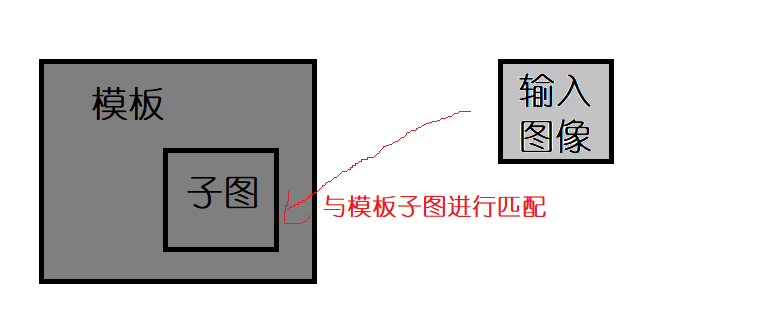
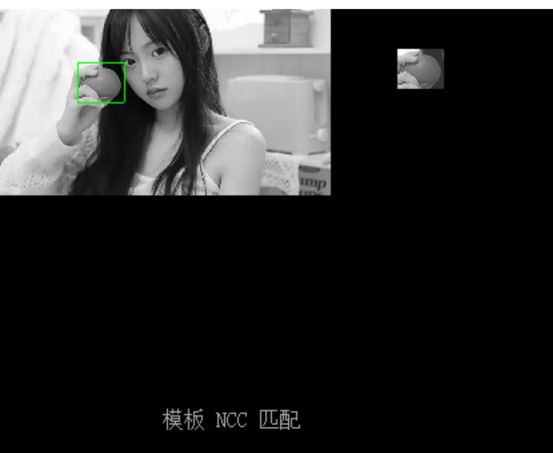
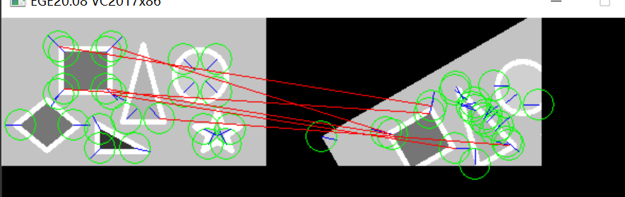
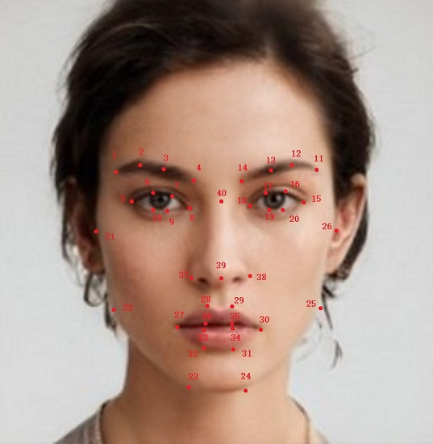
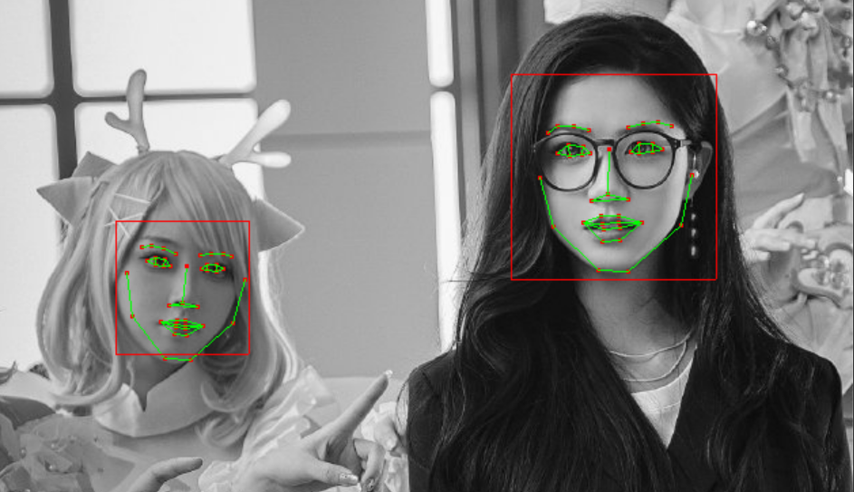

# 目标匹配

目标匹配准确来说，应该是目标的特征匹配。这个特征可以是原始图像的整体像素分布，也可以是通过特征提取获得的特征空间描述。

## SSIM结构相似性计算
```c
float32 YMCV_Image_Gray_SSIM_Cal(CVIMAGE myimg1, CVIMAGE myimg2);//结构相似性计算
```
`myimg1` 、 `myimg2` 是输入的灰度图像，返回的是两幅图像的结构相似度，取值范围[0.0 ~ 1.0]。结构相似度对光线一定程度上并不敏感，可以去除一定程度的光线影响。

## 模板匹配
该函数需要一个标准模板，然后他将从标准模板中找到一块子图，该子图能与输入图像形成最佳匹配，然后返回子图的位置。

```c
CVrect YMCV_Gray_Matching_Template(CVIMAGE temp, CVIMAGE myimg1, CV_TemplateType type, uint8 skipStep, uint8 error_max);//模板匹配
```

`temp`是模板，`myimg1`是输入图像，`type`是模板匹配类型，`skipStep`是匹配跳过的幅度，如果该参数是2，匹配的xy坐标位置即[0,2,4,6...]，`error_max`是允许的最大像素误差，准确来说这个所谓的误差是像素平均误差，如该值为1时，将图像像素整体减1时仍旧能够匹配成功。 返回的是模板中子图的外接矩形位置。`type`常用的类型如下：
```c
	CV_Template_MAD,//平均绝对差算法
	CV_Template_SSDA,//序贯相似性检测算法
	CV_Template_NCC,//归一化积相关算法
```
`MAD`计算的是像素误差绝对值，`SSDA`是先移除均值再计算像素误差，`NCC`是先移除均值再计算图像相似度。



**实例**：尝试将myIMG匹配到模板tempImg的正确位置，使用MAD方法进行匹配，
```c
CVIMAGE myIMG = NULL；//输入图像
CVIMAGE tempImg = NULL；//模板图
.....
CVrect result = YMCV_Gray_Matching_Template(tempImg, myIMG, CV_Template_MAD, 1, 20); //若返回的宽高是0，则说明不存在

//处理匹配结果
if(result.w!=0 && result.h!=0)
{
    ......
}
```

上图摘自demo例程9.2运行结果。YMCV中是使用输入图像与模板进行匹配，而不是为输入图像查找合适的模板（模板查找）。

## CasCade人脸检测
由于人脸检测器已经固化到了YMCV库内部，所以无需进行对象创建和销毁，只需将其加载出来就可以使用了。加载人脸检测器可以使用如下函数
```c
void YMCV_Load_HaarCascade(CV_cascade* cascade, const char* detctype);//加载检测器
```
`cascade`是检测器载出地址，`detctype`是检测器的名称，目前暂时只支持 `"frontface"`参数，即正脸检测。加载完毕后，就可以使用如下函数进行人脸检测了：
```c
CVVECTORS_U16 YMCV_HaarCascade_Detect_Objects(CVIMAGE myimg, CV_cascade* cascade, float  reserved_rate);//对象检测
```
`myimg`是输入的灰度图图像，`cascade`是haar检测器地址，`reserved_rate`是保留率，取值范围[0 ~ 1.0]，保留率越低，误差大的人脸被过滤的越多。返回的是矩形框的集合。

**实例**：对myIMG使用人脸检测，人脸保留率为1.0：

```c
CVIMAGE myIMG = NULL；
.....
//加载 正面(朝前) 人脸检测器
CV_cascade facedect;
YMCV_Load_HaarCascade(&facedect, "frontface");

//进行人脸检测
CVVECTORS_U16 result = YMCV_HaarCascade_Detect_Objects(myIMG, &facedect, 1.0f);
.....
//处理人脸框
if(result != NULL) 
{
    //遍历矩形框
    for (int i = 0; i < result->dataNum; i++)
    {
        CVrect* recp = &result->datap[i * result->dim];
        ...
    }
}
```

## LBP特征分类
获得人脸后，可以通过提取人脸LBP特征进行人脸识别（分类），YMCV库提供了卡方检验距离计算
```c
float32 YMCV_Face_LBP_Hist_X2_Distance(CV_FACE_LBP_DESC lbp0, CV_FACE_LBP_DESC lbp1);
```
`lbp0`、`lbp1`是两幅人脸图像的LBP特征描述，人脸LBP特征提取方法可以参考`特征提取`章节。返回的距离值越接近0，则匹配结果越好。
## ID3决策树分类

决策树的创建与销毁：
```c
//决策树创建
CV_DECISION_TREE YMCV_DecisionTree_Creat();
//决策树销毁
void YMCV_DecisionTree_Free(CV_DECISION_TREE pthis);
```
决策树模型的保存与加载
```c
//保存决策树
void YMCV_DecisionTree_Save(CV_DECISION_TREE pthis);
//加载决策树
void YMCV_DecisionTree_Load(CV_DECISION_TREE cur_node, uint8* model);
```
保存时，会使用printf将模型以字符串打印到输出端（PC端则是控制台的屏幕上）。加载时，`model`是决策树模型（之前打印出来的字符串），`cur_node`是待加载模型的决策树。
```c
//决策树训练
void YMCV_DecisionTree_ID3_Trains(CV_DECISION_TREE cur_node, CVVECTORS_U16 datavecp, uint8* lable);
//计算数据决策标签
void YMCV_DecisionTree_Classify(CVVECTORS_U16 sample, uint8* label, CV_DECISION_TREE ID3_Dstree);
```
训练时，`cur_node`是待训练的决策树，`datavecp`是数据集，每个`dim`是一个样本数据，`label`是标签集合，标签个数不能小于样本数据个数。
分类时，`sample`是待分类的样本数据集，`label`是用于输出标签的数组，数组长度不能小于样本数据个数相同，`ID3_Dstree`是用于分类的决策树。

实例可参考demo例程11.7和9.5。
## 相位相关匹配
```c
void YMCV_Image_Gray_PhaseCorrelate(CVIMAGE imageTemp, CVIMAGE myimg2, float32* moveX, float32* moveY);//相位相关匹配
```
`imageTemp`是参考模板，`myimg2`是输入图像，它与参考模板的偏移量将放置于`moveX`、`moveY`中。该方法可以用做平动的光流计算。

## 特征描述符匹配
提取出两幅图像的特征点和特征描述子后，还需要对两幅图像的特征描述子进行匹配，可以用如下方法
```c
void YMCV_FeatureDescribe_Match(CVVECTORS_U16 tempFeatDesc, CVVECTORS_U16 myFeatDesc, uint16* resultID, uint8* matched, uint8 matchThreshold);//特征描述符匹配
```
`tempFeatDesc`是参考模板的特征描述集；`myFeatDesc`是输入图像的特征描述集；`resultID`是`myFeatDesc`对应描述子在`tempFeatDesc`匹配到的ID，所以`resultID`数组元素个数不得小于`myFeatDesc`描述子个数；`matched`是`resultID`是否成功匹配的标识，其元素个数与`resultID`相同，若描述子成功匹配，其对应的`matched`元素为1，否则为0；`matchThreshold`是匹配阈值，取值范围[0~100]，两个描述子匹配程度超过该阈值，则认为匹配成功。



上图摘自demo例程9.7运行结果，但实际上图像选取的不太好，像正方形睡个觉的特征描述大体上相同，容易出现错匹配。大家可以换成其他图像，如`mm00_gray`等等相同尺寸的图片。

## MeanShift跟踪
首先需要创建跟踪器
```c
CV_TARGET_TRACK YMCV_Creat_TargetTrack_Creat(CVIMAGE image, CVrect* myroi);
```
`image`是用于初始化待跟踪特征的图像，`myroi`是待跟踪的区域矩形框，跟踪器根据该矩形框内的图像创建出跟踪特征，然后返回一个跟踪器。可以用该跟踪器进行图像跟踪，其要求是下一幅图像中，跟踪目标的位置不能变化太快

```c
void YMCV_Gray_MeanShift_Match(CV_TARGET_TRACK track, CVIMAGE image, uint16 maxIter);//MeanShift匹配（跟踪）
```
`track`是之前创建的跟踪器，`image`是待跟踪的图像，`maxIter`是最大的迭代次数。

使用完跟踪器可以用如下方式销毁
```c
void YMCV_Free_TargetTrack_Free(CV_TARGET_TRACK pthis);
```

## 粒子滤波跟踪
创建粒子跟踪器
```c
CV_PARTICLE_TRACK YMCV_Creat_ParticleTrack_Creat(CVIMAGE image, CVrect* myroi, uint16 particleNum, float32 velocity_delta, float32 scale_delta)
```
`image`是用于初始化待跟踪特征的图像，`myroi`是待跟踪的区域矩形框，`particleNum`是创建的粒子个数，`velocity_delta`是移动速度的扰动幅值，单位为像素，`scale_delta`是尺度变换速度扰动幅度。跟踪器根据该矩形框内的图像创建出用于跟踪的粒子，然后返回一个粒子跟踪器。

```c
uint8 YMCV_GrayParticleTracking(CV_PARTICLE_TRACK track, CVIMAGE image);
```
`track`是之前创建的粒子跟踪器，`image`是待跟踪的图像。如果目标丢失，则返回0，否则返回1。

使用完跟踪器可以用如下方式销毁
```c
void YMCV_Free_ParticleTrack_Free(CV_PARTICLE_TRACK pthis);
```
## 40个人脸特征点检测
这是我自己标定的40个人脸特征点训练出来的模型，人脸数据集放在路径`图片素材/GAN-Face`中，人脸数据全部由GAN网络生成。我设置的人脸特征点标记序列如下图


由于YMCV内置了该模型，所以需要进行特征点检测时只需要将其载出即可，与人脸检测器一样不需要创建和销毁检测器。
```c
void YMCV_Load_FacePointDector(CV_facefpoint_dector* dector, const char* detctype);//加载检测器
```
`dector`是用于载出人脸特征点检测器地址，`detctype`是检测器名称，当前仅支持参数`"frontfacepoint"`。加载完毕后，就可以使用如下函数进行40个人脸特征点检测了：

```c
CVVECTORS_U16 YMCV_FacePoint_Detect_Objects(CVIMAGE myimg, CV_facefpoint_dector* dector, CVrect* facerect, uint8 search_r, int maxIter);//人脸特征点检测
```
`myimg`是待检测的图像，`dector`是之前的人脸特征点检测器地址，`facerect`从人脸检测器识别到的人脸矩形框地址，`search_r`是特征点搜索半径，`maxIter`是最大迭代次数。


上图摘自demo例程9.10运行结果，目前仅支持正面的脸，大家如果为了检测效果好，也可以自己采集数据标定然后重新训练。

