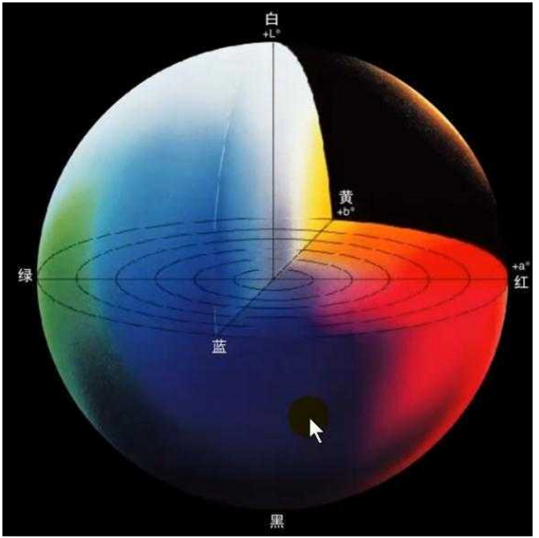

# 人脑功能概述

大脑主要有两个功能：控制肌肉运动产生有用的行为，以及调节身体内环境。为了完成这两个功能，就需要知道内外环境发生了什么，感觉系统就是提供这部分信息的。我们通过感受器（一种感觉神经元）获取环境信息，各种环境刺激作用于感受器，引起细胞膜电位变化，将感觉事件转化为细胞膜电位变化，我们称这个过程为**感觉换能**。大多数感受器缺乏轴突，由胞体部分膜结构和其他神经元树突形成突触，从而传递电信号。

# 视觉感知与光谱

各种动物具有不同的可见光谱，对于人类来说只有380纳米~760纳米间的光线才能被看到，而蜜蜂能看见花朵反色的紫外线。当然，不同波长的光波并没有区别，我们人能看见各种颜色，本质上代表的是对于不同光谱的分辨能力。光波的振动频率或者说光波波长，被我们感知为**色调**，实际上也就是不同频率的光波在我们眼中颜色是不一样的。而电磁波(光波)的强度(振幅)则被我们感知为**明度**，电磁波强度越大，光线的明度也越高。当我们看到只有一种波长的光波，则说他的纯度越高，实际上也就是**饱和度**最高，它代表着光的相对纯度，或者说相对强度，即某种主要波长电磁波占其他波长的比例；如果各种频率的电磁波同时存在，强度相当不分主次，则我们将感知不到任何颜色，俗称白色。

|  |  |
| ------------------------- | --------------------------- |

我们常用HSV颜色模型便是来源于此，H表示色调，S表示饱和度，V表示明度。根据我们先前的介绍，很容易能得到它与RGB的转化公式(下式中，R，G，B取值默认[0.0，1.0]范围)

令$Cmax = max(R,G,B)$，$Cmin = min(R,G,B)$，$\Delta = Cmax - Cmin$，则有
$ H=\left\{
\begin{array}{rcl}
0°       &      & {\Delta=0}\\
60°×(\frac{G-B}{\Delta})+0° & & {Cmax = R}\\
60°×(\frac{B-R}{\Delta})+120° & & {Cmax = G}\\
60°×(\frac{R-G}{\Delta})+240° & & {Cmax = B}\\
\end{array} \right. $

$ S=\left\{
\begin{array}{rcl}
0       &      & {Cmax=0}\\
\frac{\Delta}{Cmax} &      & {Cmax ≠0}
\end{array} \right. $

$ V=
\begin{array}{rcl}
Cmax 
\end{array}$

> 上式都是很显然的，我们只需要分析其中一部分即可轻易理解，如对H式进行分析：
> 当 ${Cmax = R}$ 时，有 $H = 60°×(\frac{G-B}{\Delta})+0°$，我们知道G-B的范围肯定是$[-\Delta,\Delta]$之间，所以该H的取值范围就是[-60°,60°]了。

# 视觉系统结构

我们看东西时，会使得图像焦距于视网膜上，然后视网膜将信号传给大脑，我们直觉上会认为视网膜和其他感受器(如皮肤上的)是同类型的神经元，但其实眼睛上的视网膜是大脑的一部分，视网膜和视神经均属于中枢神经系统而非周围神经系统。

## 眼睛结构

|  |  |
| ------------ | -------------- |

**眼外肌**一端附着在外侧一层白色坚韧结构(**巩膜**)上，控制眼球运动。正常情况我们看不到别人的眼外肌，是因为它被覆盖在眼睑内侧的一层粘膜(**结膜**)挡住了，也正是因为这层膜我们戴隐形眼镜时不至于滑倒眼珠后面。
   

眼球外侧大部分都是巩膜，它是不透光的；眼球前面是**角膜**，角膜后面有一个环形有色肌肉(**虹膜**)；瞳孔是虹膜上的开口，光线进入眼睛多少由瞳孔调节；虹膜背后是**晶状体**，由一组透明呈洋葱样排列的层状结构组成，其形状由附着于其上的**睫状肌**调节，形状的改变使远处或近处物体能聚焦到视网膜上；光线穿过晶状体进入后面的玻璃状的无色胶体(**玻璃体**)，它填充了视网膜和晶状体之间的空间；光线穿过玻璃体最后到达**视网膜**，视网膜上有两种细胞，根据形状分别命名为**视杆细胞**和**视锥细胞**，统称光感受器。

## 视网膜结构

视网膜结构如下，主要由视觉感受器(视锥细胞和视杆细胞)、双极细胞，神经节细胞，以及水平细胞和无长突细胞构成

|  |  |
| -------- | ------- |

人的视网膜上约有1.2亿个视杆细胞和600万个视锥细胞，**视锥细胞**在白天为我们提供视觉，他能提供环境的细节特征，保证视觉清晰度(视敏度)，主要位于视网膜中央，另外他还提供了色觉(R,G,B颜色感知)；色觉让灵长类获得了判断果实是否成熟的能力，三种视锥细胞及其视色素非常适合分辨绿叶背景下的红色和黄色果实。
   

色觉由三种视锥细胞负责，其能感受的光由细胞膜上的视蛋白决定，不同视蛋白吸收不同波长的光。三种类型的视锥细胞吸收的峰值分别位于420纳米(蓝-紫)，530纳米(绿)，560纳米(黄-绿)处。由于晶体状吸收了部分短波光，所以短波长的视锥细胞最大吸收峰应该在440纳米左右。为求方便，人们通常将短(S)，中(M)，长(L)三种波长的视锥细胞分别叫做蓝(B)，绿(G)，红(R)视锥细胞。

> 所以红色盲患者不能分辨红色和绿色，绿色盲患者也是如此，但由于红色和绿色盲患者的视敏度都是正常的，这说明他们视网膜上并不缺乏“红”，“绿”视锥细胞，只不过红色盲的“红”视锥细胞里填充的是“绿”视锥蛋白，而绿色盲的“绿”视锥细胞里填充的是“红”视锥蛋白。

> 但蓝色盲患者与红绿色盲不同，他是缺失了“蓝”视锥细胞；因为正常情况人的“蓝”视锥细胞所占比例本来就很小，所以对视敏度实际影响也并不大。实际上成人的“蓝”视锥细胞只占据了视锥细胞总数的10%左右，而“红”和“绿”则共同占据了近90%。
> 

另一方面，根据上述三种颜色视锥细胞光谱响应，国际照明协会（CIE）在1931年对137位受试者进行的彩色匹配实验，最终确定了三种基色红、绿、蓝波长分别是 700.0、546.1、435.8 纳米，并提出了CIE RGB模型，标准化了RGB的数学表示，奠定了彩色显示器RGB颜色基础。

最终得到各个波长的光对应的R，G，B的量，绘制成曲线如下

> 从上面我们看到负值，是因为待匹配的单色光饱和度很高，三基色混合后饱和度必然降低，无法和待配色实现匹配，为了实现匹配，在实验中就将三基色之一移到待配色一侧，两者混合从而使得色光的饱和度相匹配
> 所以匹配方程由原来的**C=r(R)+g(G)+b(B)** 变成了C+r(R)=b(B)+g(G)，所以C=-r(R)+g(G)+b(B)

出现了负值也就是说rgb三基色实际上是人脑虚构的产物，为了避免出现负值，CIE构建了标准三基色X(红)，Y(绿)，Z(蓝)，称为CIE-XYZ表色系统

这里给出CIE-RGB转CIE-XYZ模型的公式，由于XYZ是标准色，所以很多时候进行颜色模型转换，我们都会先将其他颜色模型变换到标准色XYZ坐标系下，然后再转其他颜色模型：
$
\begin{bmatrix}
   X \\
   Y \\
   Z
  \end{bmatrix}  =
 \begin{bmatrix}
   2.7689 & 1.7517 & 1.1302 \\
   1.0000 & 4.5907 & 0.0601 \\
   0.0000 & 0.0565 & 5.5943
  \end{bmatrix} 
  \cdot
  \begin{bmatrix}
   R \\
   G \\
   B
  \end{bmatrix}
$

>根据CIE XYZ模型，彩色显示器厂商们取了很多的RGB色域，如微软与惠普共同制订的sRGB色域，CIE xy 颜色坐标系中，红色位于 [0.64, 0.33]、绿色位于 [0.30, 0.60]、蓝色位于 [0.15, 0.06]，D65是白色

回到视觉系统中，我们的**视杆细胞**则负责在夜间为我们提供视觉，但他没有颜色感知，因此我们在夜间便会沦为色盲，只能感知黑白信息；

> 并且由于视杆细胞主要分布在视网膜周围，所以当我们若是仔细盯着远处昏暗的星星，可能反而会看不到它。

视锥细胞和视杆细胞都由内段和外段构成，外段含有数以百计的**小盘**(由细胞膜内褶形成的结构)，内含视色素。这些感光色素由两部分构成：视蛋白和视黄醛。

> 视黄醛的前身是维生素A，所以吃胡萝卜(富含维生素A)有益视力是有点道理的。另外视蛋白也是有多种形式的，之前提到过。

视杆细胞的感光色素叫视紫红素，暴露于光线后则被分解为视杆视蛋白和视黄醛，同时颜色由玫瑰色变为灰黄色。它的分解使得细胞膜电位发生变化，导致释放谷氨酸(一种神经递质)的频率改变，继而改变了**双极细胞**的放电频率，从而将信息传递给**神经节细胞**。

视网膜主要由三层构成：神经节细胞层，双极细胞层，感光细胞层；不过好在前两层是透明的，光线才能穿过他们到达感光层。此外还有一些**水平细胞**和**无长突细胞**，他们沿着视网膜表面平行方向传递信息。和感光层连接的是水平细胞，和节细胞连接的是无长突细胞，他们的主要作用都是抑制周围神经元激活，使得一个范围内只有输入最大的神经元才能被激活。

当光照到某个感光器上，与之相连的神经元才会被激活，神经元能感受的那部分视野被我们称为**感受野**，只有光落在感受野上神经元才会被激活。从图中我们还能看到，一个双极细胞通常只对应一个视锥细胞，而却可能同时对应多个视杆细胞，然后信息汇聚于一个神经节细胞。实际上，**一个节细胞通常也只对应一个视锥细胞**，这样一一对应很好的解释了为什么只有视锥细胞能提供细节信息，而视杆细胞只能模糊的感知，又或者说明了中央视野的精度高于周围视野。

在节细胞层面，Daw和Gouras在1968年发现其特异性响应成对的颜色，其中**红色和绿色**一对，**蓝色和黄色**一对。于是，节细胞层由三色编码系统被对立色系统取代。实际上视网膜上共有两种颜色敏感性节细胞，**红-绿**细胞和**黄-蓝**细胞。

> 灵长类动物的视网膜大约有55种神经元，1种视杆细胞，3种视锥细胞，2种水平细胞，10种双极细胞，24 ~ 29种无长突细胞以及5 ~ 10种神经节细胞。节细胞的特点由不同的水平细胞、双极细胞和无长突细胞决定，其中水平细胞和无长突细胞的作用是**侧抑制**。例如可能存在一种节细胞，感受野中心被能被红色激活，被绿色抑制，红光激活了“红”视锥细胞，引起红-绿细胞兴奋，绿色激活了“绿”视锥细胞，进而抑制红-绿细胞。这也解释了我们为什么没见过发红的绿色或者发蓝的黄色。

对颜色不敏感的节细胞也能接收视锥细胞输入，但不同波长对他们而言没有差异，他们只是相当于**黑-白**探测器

| |  |  |
| -------| ----- | ----- |

基于此CIE 1976年提出了**LAB颜色模型**，L为亮度分量，以及两个颜色分量A与B来表示颜色的。其中A分量代表由绿色到红色的光谱变化，而B分量代表由蓝色到黄色的光谱变化，由RGB888转LAB最终得到：L的取值范围是[0,100]，A和B分量的取值范围均为[-128,127]。 

>数字电视输出标准决定了我们数字图像的色域，如常见的BT709规范(即$RGB_{709}$色域)，我们先将其转到CIE-XYZ模型下,这里要用到我们之前提到的xyz颜色模型，不过之前给出的是CIE-RGB转XYZ，这里给出的是$RGB_{709}$转XYZ，(式中默认r,g,b取值范围[0.0,1.0])：
$
\begin{bmatrix}
   X \\
   Y \\
   Z
  \end{bmatrix}  =
 \begin{bmatrix}
   0.4124 & 0.3576 & 0.1805 \\
   0.2126 & 0.7152 & 0.0722 \\
   0.0193 & 0.1192 & 0.9505
  \end{bmatrix} 
  \cdot
  \begin{bmatrix}
   R \\
   G \\
   B
  \end{bmatrix}_{BT709}
$

 CIE1931-XYZ转CIE1976-LAB :
 $ f(x)=\left\{
\begin{array}{rcl}
x^{\frac{1}{3}} &  & {x>(\frac{24}{116})^3}\\
\frac{1}{3}(\frac{116}{24})^2x+\frac{16}{116} & & {others}
\end{array} \right. $

$L = 116 f(Y/Y_n) - 16$
$A = 500[f(X/X_n) - f(Y/Y_n)]$
$B = 200[f(Y/Y_n) - f(Z/Z_n)]$
>式中，$X_n,Y_n,Z_n$分别是0.95047，1.000，1.08883，归一化系数，即矩阵中各行系数之和。根据采集设备或者显示设备的不同，大家若不是采用BT709，则可以将rgb转xyz的矩阵换成对应色域的转换矩阵，相应的，转成LAB时，底下的系数也应该做相应调整。

>CIE1976的LAB空间是常用的空间，标准写法是CIE-LAB或者L* A* B*。如果只写LAB，是不对的，LAB是指Hunter1948 LAB，这是一个用的比较少的颜色空间，不过大多数地方为了方便会把CIE-LAB直接简写为LAB，例如本系列文章中若出现LAB简写都指CIE-LAB，请读者不要误解。

# 其他颜色模型

LAB采用了对立色来表示颜色，并且是模仿人类视觉；但对于机器而言，这个转换过于复杂了。我们来介绍一下机器中方便使用的对立色系统YUV，其中Y表示亮度(Luminance，流明)，U和V表示的则是色度，描述着色彩及饱和度，常见的YCbCr4:2:2等都是YUV格式。

Cb和Cr表示当前颜色对蓝色(blue)和红色(red)的偏移程度，如果只有Y的话，只能表明亮度了(如黑白电视的效果)。下面我们介绍一下$RGB_{BT601}$转$YUV$公式：

$
\begin{bmatrix}
   Y \\
   U \\
   V
  \end{bmatrix}  =
 \begin{bmatrix}
   0.299 & 0.587 & 0.114 \\
  -0.169 & -0.331 & 0.500 \\
   0.500 & -0.419 & -0.081
  \end{bmatrix} 
  \cdot
  \begin{bmatrix}
   R \\
   G \\
   B
  \end{bmatrix}_{BT601}
$

实际上，还可以更简单的表示为：

 $Y=R×0.299+G×0.587+B×0.114$

 $U=\frac{B-Y}{1.772}$

 $V=\frac{R-Y}{1.402}$

**Y项**表示明亮度，或者说灰阶，常用于RGB转灰度图，被称为流明(Luminance或Luma)公式，也被称为**灰度心理学公式**。
>大家需要注意，采用不同的RGB标准，转换公式也是有些差别的，具体可以参考相关规范。另外说明一下，以前YUV特指模拟信号，而YCbCr特指数字信号；但现在说法已经没有那么严格，基本都指同一个东西。

# 三原色和三基色
很多地方会将三种视锥细胞识别的颜色叫做三原色，我们要注意一点这里的三原色和初中物理所学的三原色的区别

物理上光的合成与分解我们称为**加法三原色**，而美术上颜料的混合我们称为**减法三原色**，本质上这是因为颜料混合是光经过颜料，特定波长被吸收，相应波长的光减少，剩余波长才反射进人眼；而发光体则是增加对应波长的光。人们眼中的颜色取决于进入眼睛的光对应波长是多少

>其实我们常说的**三基色**指的就是加法三原色，而**三原色**常指减法三原色。三基色模型，我们称为RGB模型，而三原色模型我们称为CMY模型，他门刚好是互补的。

数学上RGB可以表示一组向量(张量)进行描述：(r,g,b)，其中r,g,b代表三种颜色的比例，如纯绿色为(0,1,0)。

>所谓张量可以从线性空间的张成空间去类比理解，“张”的含义相当于扩张，一个颜色比如红色，被扩张为使用三个量去描述。当然张量并不一定是扩张为一个向量，一个点有时候也可以扩张为使用矩阵去描述。

在颜色立方体中，我们能看到三个轴，红(1,0,0)，绿(0,1,0)，蓝(0,0,1)，由他们构成了全体颜色，或者说张成了颜色空间。

>如果我们问 (0,0,1)的补是什么，你肯定能够立马说(1,1,0)，只要将原来的1变成0，0变成1不就行了，实际上我们不足不觉中运用了集合论 $A+\bar A = 1$的特性。所以补集$\bar A = 1 - A$

RGB的补色模型，也就是CMY模型(减法三原色)，分别是：青(0,1,1)，品红(1,0,1)，黄(1,1,0)。
>CMY是减色系统，刚好和RGB互补，我们如果要得到(r,g,b)的补色，可以计算如下：
$
\begin{bmatrix}
   C \\
   M \\
   Y
  \end{bmatrix}  =
 \begin{bmatrix}
   1 \\
   1 \\
   1 
  \end{bmatrix} -
  \begin{bmatrix}
   R \\
   G \\
   B
  \end{bmatrix}
$
即：补色 = 白光 - 当前颜色。

**CMYK颜色模型**，常用来做印刷调色(油墨混合)使用。其中K代表黑色(black)，之所以不用B是怕和蓝色(blue)混淆了。
>理论上来说，只要CMY三种油墨就够了，浓度为100%的三种油墨加一起就可以得到黑色，但用于目前工艺并不能造出高纯度的油墨，CMY相加得到的其实是灰黑色(**灰色**)，并且黑墨的价格比其他的三种油墨低，所以如果等量的CMY相加，就会用相应浓度的黑墨进行替换。

如果我们将RGB立方体沿着对角线压一压，压平了，成为一个面，那就得到HSV模型了，这个模型我们之前也提到过

这样，对立的互补色也就非常明显了，对角的就是互补色，至于其他的，在前面都有介绍
>色调h沿着六边形可以指向不同的6种颜色的，饱和度s表明颜色的相对纯度，s越小则颜色的白光分量越多，明度v越大，说明颜色越亮。
