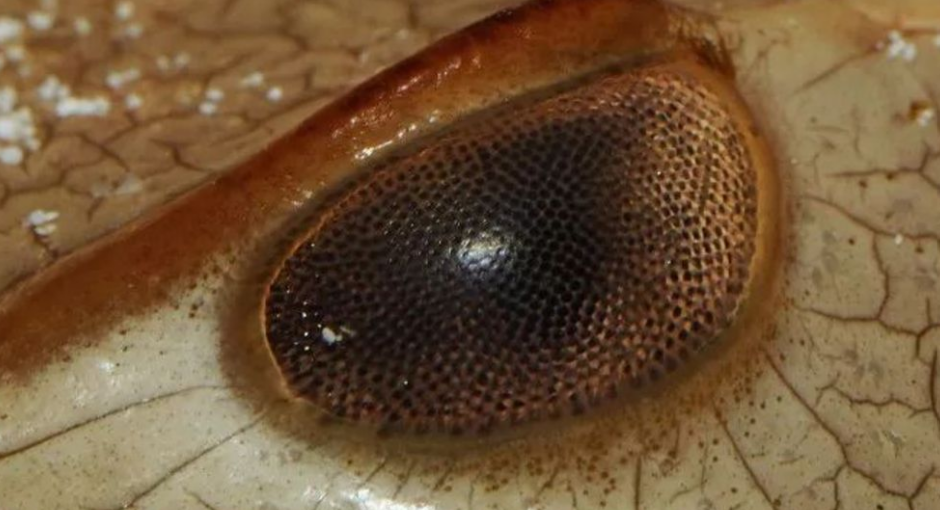
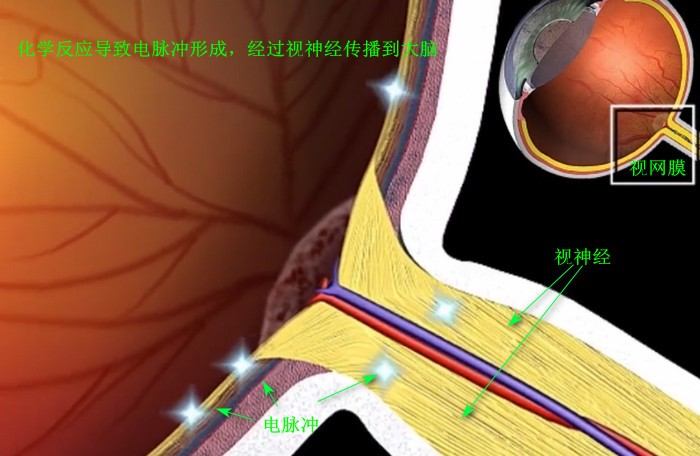

# 视网膜功能
前面我们提到了神经节上的对立色系统，在这里我们将更详细的介绍机理，以下内容将以以**黑白对立色**为例进行展开。这涉及到 Hartline 等人在对鲎(hòu)视觉进行电生理实验时发现的侧抑制现象。
>由于侧抑制在神经系统的信息处理中起到重要的作用，因此凡是与人的感官有关的科学技术（电视、广播、图像处理等）、模拟人的智力活动的研究领域（如模式识别等），以及近年来发展迅猛的神经网络的研究及应用，都可以考虑并利用这个原理。

>对鲎视觉系统的研究表明，侧抑制网络在信息预处理中主要功能有以下几个方面:
>1. 高通滤波器，可以突出边缘，增加反差。
>2. 亮度自适应作用，可以将很大的输入变化范围压缩到网络本身的动态范围之内；
>3. 可以对图像的细微间断处进行拟合，具有明显的聚类作用。

## 侧抑制
在某个神经元受到刺激而产生兴奋时，再刺激相近的神经元，则后者所发生的兴奋对前者产生的抑制作用。也就是说，侧抑制是指相邻的感受器之间能够互相抑制的现象。
>1868年E.马赫发现马赫带效应，提出了有关视网膜神经元相互作用的理论。

当观察两块亮度不同的区域时，边界处亮度对比加强，使轮廓表现得特别明显，由此推断人类的视觉系统有增强边缘对比度的机制。

>1932年H.K.哈特兰和C.H.格雷厄姆在鲎眼（含有近1000个小眼的复合眼）上，用微电极记录了单根神经纤维的脉冲。**当光照鲎眼上的一个小眼A而引起兴奋时，再用光照射邻近的小眼B，小眼A的脉冲发放频率就下降**。这是由于小眼B的兴奋抑制了邻近的小眼A的兴奋，同样情形，刺激小眼A也会抑制小眼B的兴奋。并且侧抑制作用的大小依赖于两小眼之间的空间距离：**当间距加大时，抑制作用便减弱**，同时，只有当邻近小眼B的**兴奋水平达到一定值时，才可能对小眼A产生侧抑制作用**;而且这种作用会随着小眼B受到刺激的强度增大而加强；受照的邻近小眼数增多，它们所产生的抑制作用也增强。另外，当小眼B对小眼A产生抑制作用时，再光照另一个小眼C（小眼C远离A而邻近B），则小眼B对小眼A的抑制便减弱了，这叫做去抑制现象。

在视网膜上，感受器的侧抑制是由水平细胞实现的，水平细胞横向与许多视锥细胞通过突触相连，接收兴奋性递质，然后通过抑制性突触连接将抑制性信号反馈给感光细胞的突触前末梢，从而减少谷氨酸(神经递质)的释放，完成负反馈调节。
>水平细胞有两个作用：
一是对感光细胞输出的视觉信号进行亮度调节，实现视觉的亮度自适应
二是通过中心-周边拮抗反应，增强视像边缘的对比度，突出景物的轮廓线条。

侧抑制作用在许多动物的视觉系统里都能表现出来。
>在昆虫的视网膜第一级单极神经元上，在脊椎动物视网膜的双极细胞上，在神经节细胞的感受野里，在外侧膝状体以及视皮层细胞中都能产生侧抑制。侧抑制有利于视觉从背景中分出对象，尤其在看物体的边角和轮廓时会提高视敏度，使对比的差异增强。在色觉方面，由于具有不同光谱感受性的神经元之间的相互抑制作用，可能形成颜色的拮抗效应（红和绿，黄和蓝的成对拮抗效应）。在其他感觉系统里，侧抑制也发生作用。例如，在听觉系统中，耳蜗神经纤维的侧抑制可以加强对音高的辨认。在皮肤上，侧抑制有助于触点的定位。
## ON和OFF细胞
Kuffler于1952年发现，猫视网膜上的神经节细胞的**感受野由一个近似圆环的中心部和一个环形外周部组成**，刺激中心部和外周部会产生相反效应：ON节细胞被照射在中心部的亮光激活，被照射在外周部的光线抑制；而OFF细胞刚好相反。

视网膜上，它还有一个特征性结构(**视盘**)，在这里神经节细胞都轴突汇聚在一起，通过**视神经**离开眼球，所以在视盘处没有任何感光细胞，就形成了一个视野的盲点。

> 我们平常说的神经，是由聚集成束的神经纤维构成的，而神经纤维本身则是由神经元的轴突被神经胶质细胞形成的髓鞘包覆盖形成的。
