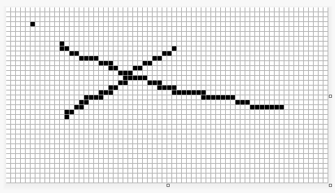
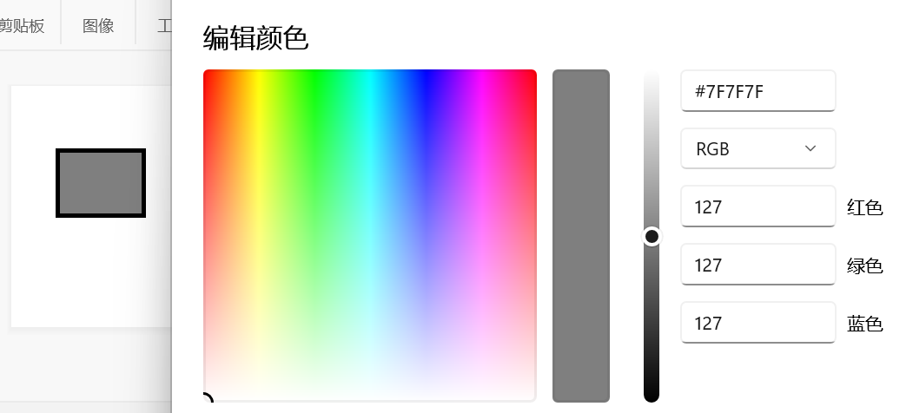
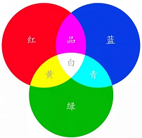
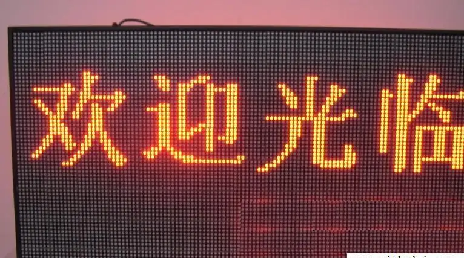
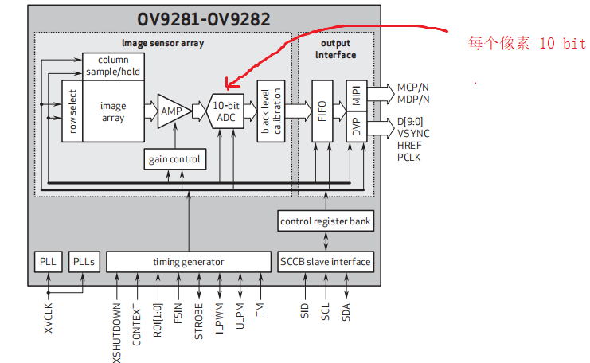

# 数字图像简介
## 图像格式
我们现在计算机上处理的一般都是数字图像，常见格式有jpg、png、bmp等格式。根据特性，图像分为两类 —— **位图**(bitmap)和**矢量图**，在数字图像处理中，我们一般处理的均为位图，数字摄像头拍摄得到的图像，也是位图。



## 像素
图像由N行M列的**矩阵**(数组)构成，每个元素代表一个像素，对于**灰度图**，一个像素只用一个值(**单通道**)表示，并且该值取值范围通常是[0,255]。对于**彩色图**，一个像素用三个值(**三通道**分别为R,G,B)，每个值的取值范围也是[0,255]。



由于我们的显示器都是彩色的，当r,g,b三通道取值相等时，也就显示为灰度图了。当然，这其实遵循了三基色的颜色合成原理



## 分辨率
虽然图像是由像素组成的，但是我们的显示需要使用显示器，显示器的物理尺寸将会影响显示效果。



我们可以看到，LED显示屏上一个LED灯就只能显示一个像素的颜色，这意味着如果单位物理尺寸（如 $1cm^2$）上的LED灯越多，这个屏幕的显示的就越精细，效果就越好。而**分辨率**就是衡量这种效果的指标，其被描述为单位物理尺寸上包含的像素点数目。

## 灰度图
之前我们说到灰度图是一种单通道的图像，每个像素的取值范围通常是[0,255]，即8 bit；
>但这也并不绝对，其实很多摄像头采集到的原始数据范围可能是[0,65535]，也就是16 bit，根据我们实际需求只接收其高8 bit的数据。



如上图(一种灰度摄像头的内部框图)，每个原始像素是10 bit，但为了方便处理，我们也只取8 bit的数据。
特殊的，如果当我们每个原始像素是1 bit时，我们称为**二值图**；

>不过，为了方便算法处理，一般小于8 bit的数据，我们都用8bit来表示，所以实际上，二值图的像素一般取值是0和255，而不是0和1。

## 彩色图
我们前面提到彩色图是三通道图，每个通道取值范围都是[0,255]，即r,g,b三个通道都是8 bit，也称rgb888格式；
>这其实也并不绝对，有些摄像头(如ov5640等)的输出是rgb565格式，即r通道5 bit，g通道6 bit，b通道5 bit。当然，有些彩色显示屏(如ILI9341等)也是rgb565格式。

习惯上为了便于算法处理，不论是rgb565还是其他rgb格式，我们都会转为rgb888格式进行处理。

## 其他格式图像
除了bmp这种位图格式是直接存储每个像素的像素值，其他格式的位图都是对bmp位图进行数据压缩。比如常用的方法有**调色板**(Palette)，或者叫**颜色查找表**(Look Up Table)，它把图像中出现的像素种类记在一张表上：
```c
 uint8_t RGB_LUT[256][3]={ {10,25,30} ,...};
 ```
 这样图像中的每个颜色，直接用LUT的索引来替代，可以极大的减少图像数据量。
 >使用LUT的前提是图像像素比较多，而颜色的种类比较少，如果每个像素直接存储颜色，那么单个像素就有3×8 bit，使用LUT以后，每个像素可能只需要8 bit存储空间。这不但减小了存储负担，也减小了图像数据传输的压力。

 一般来说，调色板中都少于256种颜色，如果调色板中颜色过多，如$≥65536$种，就失去了压缩的效果。

 另外，对于纯黑色背景下的图像，由于大多数像素只都是0(稀疏矩阵)，我们可以采样简单描述非零元素的位置和值来代替位图的描述，这将会大大减少数据量。

 # 数字图像处理
 不论数字图像处理、图像分析还是图像识别，其核心都是对数字图像包含的信息进行提取和过滤。但他们又有一些细微的差别。
## 图像处理
它提取和过滤的信息，通常来说是面向于人眼的，如对照片进行PS，各种美颜等，主要目的就是改善图像的外观。**输入的是图片，输出也是图片**
>当然，由于人眼可分辨那么机器肯定也可以分辨，所以很多时候也会作为图像预处理，以便于机器进行特征分析。

## 图像分析
它提取的信息通常是面向于机器的，如直线检测，长度测量等等，以便于机器的运动或者其他工作使用，它是将图像转为另一种非图像的抽象信息。**输入的是图片，输出的是特征的描述**

## 图像识别
它研究是各种特征的组合或者相互关系，目的是识别对象的类别从而理解图像含义，如文字识别(OCR)，人脸识别等等，它是一个降低抽象信息的信息熵的过程，或者说提炼有效数据过程。**输入的是一组图像的特征描述，输出的是特征类别**
>图像识别通常归于模式识别，它输入的各种特征组合，输出的是特征的模式种类。

# 计算机视觉
也称为机器视觉(Machine Vision)，他将图像处理、分析、识别结合起来，试图为机器人提供类似人类世界的功能。
>不过，我们通常说的图像处理，通常指广义的概念，包含了图像处理、分析；并且对于机器视觉和图像识别概念不加以区分。

# 计算机图形学
我们将图像转为图像特征描述的过程称为图像分析，如直线提取。而将图像特征描述转为图像的过程，称为计算机图形学，他俩是在某种意义上是互逆的过程。
>例如CAD中，我们绘制一条直线，实际上我们是通过鼠标确定了一条线段的两个端点，计算机图形学的作用便是将由两个端点描述的直线在屏幕中绘制出来，这个过程便将直线的特征描述转为了图像。