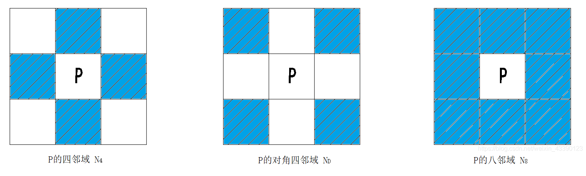
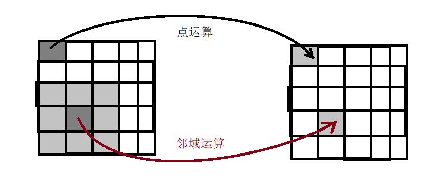

# 图像处理中的基础概念
图像作为一个二维平面，它的像素与像素有许多关系，我们在图像处理中会用到，这里做一些总结。
## 邻域
邻域描述的是某个像素P的所有邻居有哪些，我们常见的邻域有三种：

当然，上述的邻域只是在空间位置上，我们认为P的邻居都有哪些。
## 相似
相邻的像素，我们通常认为他们是相似的，像素的邻接性度量了其相似度。在空间位置上，我们认为邻域像素都是相似的，一般称为**位置相似**。如果换到像素值上，比如P的像素值是200，那么它的邻域便是199和201两个值了，我们称此为**像素值相似**。

>我们将邻接性分为空间位置的邻接性和像素值的邻接性，有时我们考虑两个像素是否相似，不仅考虑位置上是否相邻，还会考虑像素值是否相邻。

## 连通性
它建立在邻接的概念基础上，我们认为相似的像素是连通的。
>若我们认为像素值属于某个集合的像素（如 {199,200,201} ），具有像素相似性。那么P位置的邻域中，满足该集合的像素与P便是连通的。

如果P和P+1相似，P+1和P+2相似，.. P+(n-1)和P+n相似，那么我们称这个序列 [P,P+1,...P+n] 是一条**通路**，当然如果P+n和P是同一个，则该通路是闭合通路。
>如果一个集合中的任意两个像素之间都具有连通性，则称该集合为**连通集**

## 区域
区域是定义在连通集的基础上的，图像中的一个像素子集，若为连通集，则该集合是一个区域。
## 边界
边界是相对于区域而言是，一个像素P的邻域中，若存在1个不属于该区域的像素，则此像素是该区域的边界点。
>比如，我们一副图像是M行N列，则图像矩形框上的点都是边界点，即位于首行、末行、首列、末列这四处的点。

一个集合中，若所有点都为边界点，则该集合称为边界。

## 边缘
边缘是指图像中特性(如像素灰度、纹理等)分布的不连续的地方，即图像周围特性有阶跃变化或屋脊状变化的那些像素集合。
>在某种意义上，定义了适当的区域集合，那么边界也可以退化为边缘。

# 距离度量
这个和邻接性相似，可以分为空间位置上的距离，还有像素值上的距离，不过本质上是一样的，不论空间位置还是像素值，本质上都是两个向量之间的距离度量。
## 距离条件
满足下列三个条件的函数D，都可以用来作为距离的度量：
① $D(P,Q)≥0$，当且仅当P=Q时，有$D(P,Q)=0$
② $D(P,Q)=D(Q,P)$
③ $D(P,Q)≤D(P,R)+D(R,Q)$
## 常用距离公式
假设两个向量P=$(x_p,y_p)$，Q=$(x_q,y_q)$，则其距离可由下列函数度量。

① **欧式距离**
$D_e(P,Q)=\sqrt{(x_p -x_q)^2+(y_p -y_q)^2}$
>P中心半径为R的像素构成一个圆形，这是最常用的距离公式

② D4距离(街区距离，也称**曼哈顿距离**)
$D_4(P,Q)=|x_p -x_q|+|y_p -y_q|$
>P中心半径为R的像素构成一个菱形，形态学或者某些滤波中会使用该距离

③ D8距离(棋盘距离，也称**切比雪夫距离**)
$D_8(P,Q)=max\{|x_p -x_q|,|y_p -y_q|\}$
>P中心半径为R的像素构成一个方形，形态学中可能使用该距离

有的地方该公式也写为$D(P,Q)=lim_{k\to∞}(\sum_{i=1}^n{|a_i -b_i|^k})^{\frac{1}{k}}$
>我们知道，展开以后便是$C=\sum_{i=1}^n{|a_i -b_i|^k}$开k次方，C的取值便是以最大的$|a_i -b_i|$为主导，当k趋于∞时，这种趋势越发明显，故有$lim_{k\to∞}(\sum_{i=1}^n{|a_i -b_i|^k}) = max\{|x_p -x_q|^k,|y_p -y_q|^k\}$，开k次方后则退变为$max\{|x_p -x_q|,|y_p -y_q|\}$

④ 闵可夫斯基距离(也称**闵氏距离**)
这是一种通用公式，根据k取值不同退变为①，② ，③式的距离公式
$D(P,Q)=(\sum_{i=1}^n{|a_i -b_i|^k})^{\frac{1}{k}}$
>当k取1时，为街区距离，k取2时为欧式距离，k取∞时为棋盘距离。

⑤ **标准化欧式距离**
闵氏距离的缺点是默认向量各维度量纲相同，若是向量其中一个维度表示身高，波动范围是[20,180]，另一个维度表示中值长度，波动范围是[5,18]，很明显用欧式距离等去度量就会出问题，我们不会认为中指长度增加1cm和身高增加1cm是等价的。我们的做法是首先将各维度数据都**标准化**到均值和方差都相等：
$x'_i=\frac{x_i-μ_i}{\sigma_i}$
对于单点的距离，我们就可以求了：
$D(P)=\sqrt{\sum_{i=1}^n{|\frac{x_i -μ_i}{\sigma_i}|^2}}$
两个点之间的欧式距离(或者其他闵氏距离)，我们也可以求了
$D(P,Q)=\sqrt{\sum_{i=1}^n{|\frac{a_i -b_i}{\sigma_i}|^2}}$

⑥ **马氏距离**
标准化欧式距离虽然解决了量纲(尺度)不同的问题，但若若数据之间有相关性，还是会出问题的。马氏距离则解决了上述问题。
单点距离：$D(P)=\sqrt{(x -μ)^T \Sigma^{-1}(x -μ)}$
>其中$\Sigma^{-1}$即协方差矩阵的逆，若数据不相关时，则退化为标准化欧式距离了。不相关时$\Sigma^{-1}$如下：
$\Sigma^{-1} =\left[\begin{matrix}
\frac{1}{\sigma_0^2} & 0 & ... & 0\\
0 & \frac{1}{\sigma_1^2} & ... & 0\\
... & ... & ... & ...\\
0 & 0 & ... & \frac{1}{\sigma_n^2}
\end{matrix}\right]$

两个点之间的距离，我们也可以求了
$D(P,Q)=\sqrt{(a -b)^T \Sigma^{-1}(a -b)}$

⑦ **余弦距离**(角度距离)
通常用于衡量两个向量之间的夹角大小
$cos(P,Q)=\frac{P^T Q}{|P|\cdot|Q|}$

⑧ **杰卡德距离**
两个集合之间的相似性，我们可以用交集在并集的占比来衡量：
$J(A,B)=\frac{|A∩B|}{|A∪B|}$
则距离可以用不在交集的元素与并集的占比来衡量
$D(A,B)=1-J(A,B)=\frac{|A∪B|-|A∩B|}{|A∪B|}$

# 基本图像运算类型

## 点运算与邻域运算
按照参与运算的范围不同，可以分为**点运算**和**邻域运算**。前者是逐个像素进行灰度变换运算，取一个位置的像素点，经过灰度变换又放回该位置；后者是取每个像素的邻域范围内所有像素进行灰度变换运算，然后结果放回中心像素位置。

## 线性操作和非线性操作
设H为一个算子，若对图像$F_1$、$F_2$和任意标量a,b有如下关系:
$H(aF_1+bF_2)=aH(F_1)+bH(F_2)$
则称H为线性算子，常用的均值滤波，高斯滤波，梯度锐化等都属于线性算子。
>不满足上式的都是非线性算子，如中值滤波等。虽然非线性算子通常也能提供较好的性能，但由于具有不可预测性使得在军事或者医学图像处理中难以获得广泛应用。

## 空间域和频域运算
空间域和频域是图像在两个不同坐标系下的表示，我们直观能分辨的原始图像便是空间域的图像表示，借助傅里叶变换我们能将其变换到频域去表示，借助傅里叶逆变换则能对图像进行重建，并不会丢失任何细节。
>空间域和频域滤波可以视为同一种滤波问题的殊途同归的两种解决方式，例如频域的高斯滤波和空间域的高斯滤波本质上是相同的。但有些滤波问题会更适合在空间域完成，有些则适合在频域完成，根据实际需求，必要时可以在频域和空间域中进行转换。
